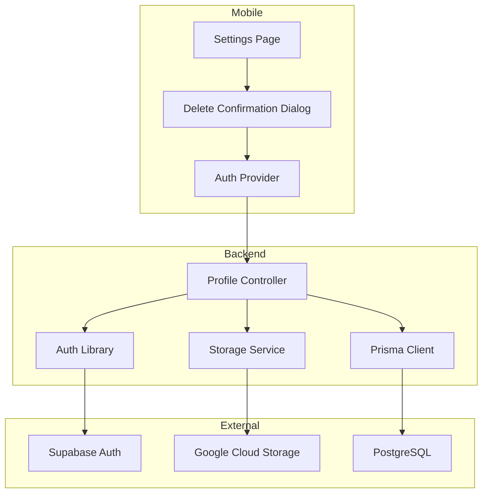
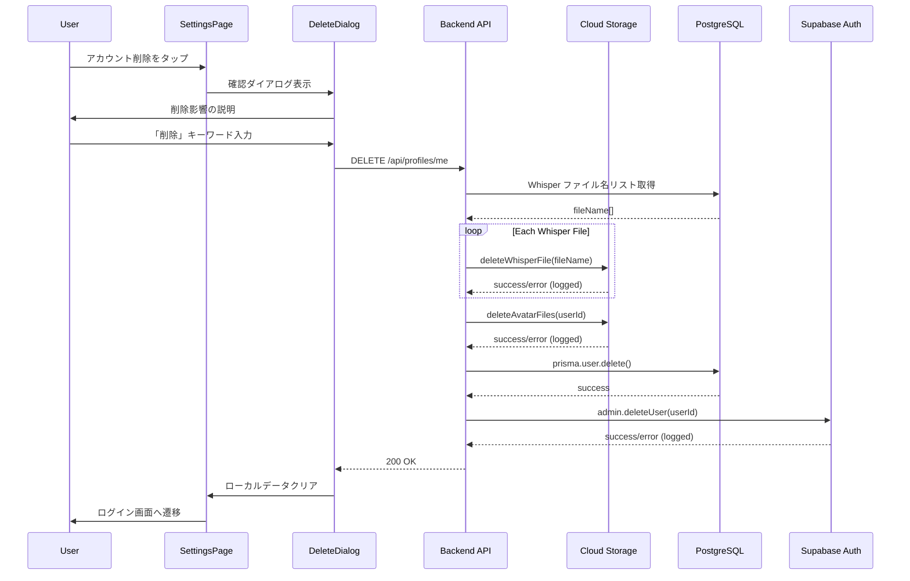

# Design Document: account-hard-delete

## Overview

**Purpose**: ユーザーがアカウントを完全に削除し、すべての関連データ（DB レコード、Cloud Storage ファイル、認証プロバイダー情報）を物理削除できる機能を提供する。

**Users**: 退会を希望するユーザーが、モバイルアプリの設定画面からアカウント削除を実行する。

**Impact**: 既存の `DELETE /api/profiles/me` エンドポイントを拡張し、Cloud Storage / Supabase Auth の削除処理を追加する。

### Goals
- ユーザーデータの完全削除（GDPR「忘れられる権利」準拠）
- 誤削除防止のための多段確認 UI
- 部分失敗時も削除処理を完了させる堅牢なエラーハンドリング

### Non-Goals
- 削除猶予期間（30 日間の復元可能期間など）は今回のスコープ外
- 再認証要求は将来の拡張として除外
- 削除処理中の他 API ブロック（競合防止）は初期実装では対応しない

## Architecture

### Existing Architecture Analysis

- **既存エンドポイント**: `DELETE /api/profiles/me` が存在し、DB 削除のみ実装済み
- **Prisma Cascade Delete**: 全関連テーブルに `onDelete: Cascade` 設定済み
- **Storage Service**: `deleteAvatarFiles(userId)` 既存、`deleteWhisperFile(fileName)` 既存
- **Auth Library**: Supabase クライアント（service_role_key）初期化済み

### Architecture Pattern & Boundary Map



**Architecture Integration**:
- **Selected pattern**: ハイブリッドアプローチ（既存モジュールへの関数追加）
- **Domain boundaries**: auth.ts（認証）、storage.ts（ストレージ）、controller（オーケストレーション）
- **Existing patterns preserved**: Controller-Service パターン、Prisma トランザクション
- **New components rationale**: 設定画面（Mobile）のみ新規作成
- **Steering compliance**: TypeScript strict mode、Zod validation、Feature-first structure

### Technology Stack

| Layer | Choice / Version | Role in Feature | Notes |
|-------|------------------|-----------------|-------|
| Mobile | Flutter 3.10+ / Riverpod | 設定画面 UI、削除フロー状態管理 | 既存パターン踏襲 |
| Backend | Fastify 5 / TypeScript | DELETE API オーケストレーション | 既存 controller 拡張 |
| Data | Prisma / PostgreSQL 16 | ユーザー削除（Cascade） | 既存設定活用 |
| Storage | @google-cloud/storage | Whisper / Avatar ファイル削除 | 既存 storage.ts 拡張 |
| Auth | @supabase/supabase-js | Auth ユーザー削除 | 既存 auth.ts 拡張 |

## System Flows

### Account Deletion Flow



**Key Decisions**:
- Storage 削除 → DB 削除 → Auth 削除の順序（DB からファイルパス取得が必要なため）
- Storage / Auth 削除失敗はログ記録して続行（ベストエフォート）

## Requirements Traceability

| Requirement | Summary | Components | Interfaces | Flows |
|-------------|---------|------------|------------|-------|
| 1.1 | 認証済みユーザー自身のみ削除許可 | ProfileController | DELETE API | Account Deletion |
| 1.3 | 単一トランザクション内で実行 | ProfileController, PrismaClient | - | Account Deletion |
| 2.1-2.7 | DB レコード物理削除 | PrismaClient | - | Account Deletion |
| 3.1 | Whisper 音声ファイル削除 | StorageService | deleteWhisperFiles | Account Deletion |
| 3.2 | Avatar 画像削除 | StorageService | deleteAvatarFiles | Account Deletion |
| 3.3-3.4 | Storage 削除エラーハンドリング | StorageService, ProfileController | - | Account Deletion |
| 4.1-4.3 | Supabase Auth 削除 | AuthLib | deleteAuthUser | Account Deletion |
| 5.1 | 設定画面に削除オプション表示 | SettingsPage | - | Account Deletion |
| 5.2-5.3 | 確認ダイアログとキーワード入力 | DeleteDialog | - | Account Deletion |
| 5.4-5.5 | 成功時 / 失敗時の UI 処理 | AuthProvider, SettingsPage | - | Account Deletion |
| 6.1-6.3 | ログ記録 | ProfileController | - | Account Deletion |

## Components and Interfaces

| Component | Domain/Layer | Intent | Req Coverage | Key Dependencies | Contracts |
|-----------|--------------|--------|--------------|------------------|-----------|
| ProfileController | Backend/Controller | 削除 API オーケストレーション | 1.1, 1.3, 6.1-6.3 | StorageService (P0), AuthLib (P0), PrismaClient (P0) | API |
| StorageService | Backend/Service | Cloud Storage ファイル削除 | 3.1-3.4 | @google-cloud/storage (P0) | Service |
| AuthLib | Backend/Lib | Supabase Auth ユーザー削除 | 4.1-4.3 | @supabase/supabase-js (P0) | Service |
| SettingsPage | Mobile/UI | 設定画面 | 5.1 | go_router (P1) | State |
| DeleteDialog | Mobile/UI | 削除確認ダイアログ | 5.2-5.5 | - | State |
| AccountDeletionProvider | Mobile/Provider | 削除状態管理 | 5.4-5.5 | ApiClient (P0), AuthProvider (P0) | State |

---

### Backend / Service

#### StorageService (拡張)

| Field | Detail |
|-------|--------|
| Intent | Whisper 音声ファイルの一括削除機能を追加 |
| Requirements | 3.1, 3.3, 3.4 |

**Responsibilities & Constraints**
- ユーザーの全 Whisper ファイルを並列削除
- 個別ファイル削除失敗はログ記録して続行
- 既存の `deleteAvatarFiles` パターンに準拠

**Dependencies**
- External: @google-cloud/storage — GCS 操作 (P0)

**Contracts**: Service [x]

##### Service Interface

```typescript
/**
 * 複数の Whisper 音声ファイルを一括削除
 * @param fileNames 削除対象のファイル名配列
 * @returns 削除結果（成功/失敗件数）
 */
export async function deleteWhisperFiles(
  fileNames: string[]
): Promise<{ succeeded: number; failed: number }>;
```

- Preconditions: fileNames は有効なファイル名の配列
- Postconditions: 存在するファイルは削除される（存在しないファイルは無視）
- Invariants: 部分失敗時も他ファイルの削除は継続

---

#### AuthLib (拡張)

| Field | Detail |
|-------|--------|
| Intent | Supabase Auth からユーザーを削除する機能を追加 |
| Requirements | 4.1, 4.2, 4.3 |

**Responsibilities & Constraints**
- Supabase Admin API を使用してユーザーを物理削除
- service_role_key を使用（サーバーサイド専用）
- 削除失敗時はエラーを返す（呼び出し元でログ記録）

**Dependencies**
- External: @supabase/supabase-js — Supabase Auth Admin API (P0)

**Contracts**: Service [x]

##### Service Interface

```typescript
/**
 * Supabase Auth からユーザーを削除
 * @param userId 削除対象のユーザーID
 * @returns 成功時は void、失敗時は Error
 */
export async function deleteAuthUser(
  userId: string
): Promise<{ success: true } | { success: false; error: string }>;
```

- Preconditions: userId は有効な UUID
- Postconditions: Supabase Auth からユーザーが削除される
- Invariants: service_role_key が必要

---

### Backend / Controller

#### ProfileController (拡張)

| Field | Detail |
|-------|--------|
| Intent | DELETE /api/profiles/me エンドポイントを完全削除対応に拡張 |
| Requirements | 1.1, 1.3, 2.1-2.7, 6.1-6.3 |

**Responsibilities & Constraints**
- 削除処理のオーケストレーション（Storage → DB → Auth）
- 認証済みユーザー自身のアカウントのみ削除許可
- 各フェーズのログ記録

**Dependencies**
- Inbound: Mobile App — API 呼び出し (P0)
- Outbound: StorageService — ファイル削除 (P0)
- Outbound: AuthLib — Auth 削除 (P0)
- Outbound: PrismaClient — DB 削除 (P0)

**Contracts**: API [x]

##### API Contract

| Method | Endpoint | Request | Response | Errors |
|--------|----------|---------|----------|--------|
| DELETE | /api/profiles/me | - | `{ message: string }` | 401, 500 |

**Response Schema**:
```typescript
// 成功時
{ message: "アカウントを削除しました" }

// エラー時
{ message: string }
```

**Implementation Notes**
- Integration: 既存の `profiles/me/controller.ts` の DELETE ハンドラを拡張
- Validation: `authenticate` preHandler で認証済みユーザーを検証
- Risks: 部分失敗時の孤立データ（ログ監視で対応）

---

### Mobile / UI

#### SettingsPage (新規)

| Field | Detail |
|-------|--------|
| Intent | 設定画面を提供し、アカウント削除オプションを表示 |
| Requirements | 5.1 |

**Responsibilities & Constraints**
- 設定項目の一覧表示
- アカウント削除セクションへの導線
- 既存の profile_drawer から遷移

**Dependencies**
- Outbound: go_router — 画面遷移 (P1)
- Outbound: DeleteDialog — 削除確認フロー (P0)

**Contracts**: State [x]

##### State Management

```dart
// 設定画面のルート定義
GoRoute(
  path: '/settings',
  builder: (context, state) => const SettingsPage(),
)
```

**Implementation Notes**
- Integration: `profile_drawer.dart` の「設定」メニューから遷移
- UI パターン: 既存の `profile_page.dart` スタイルに準拠

---

#### DeleteDialog (新規)

| Field | Detail |
|-------|--------|
| Intent | アカウント削除の確認フローを提供 |
| Requirements | 5.2, 5.3, 5.4, 5.5 |

**Responsibilities & Constraints**
- 削除影響の説明表示
- 「削除」キーワード入力による最終確認
- 削除 API 呼び出しと結果処理

**Dependencies**
- Outbound: AccountDeletionProvider — 削除実行 (P0)

**Contracts**: State [x]

##### State Management

```dart
/// 削除確認ダイアログの状態
sealed class DeleteDialogState {}

class DeleteDialogInitial extends DeleteDialogState {}
class DeleteDialogConfirming extends DeleteDialogState {
  final String inputText;
}
class DeleteDialogDeleting extends DeleteDialogState {}
class DeleteDialogSuccess extends DeleteDialogState {}
class DeleteDialogError extends DeleteDialogState {
  final String message;
}
```

**Implementation Notes**
- Validation: 入力値が「削除」と完全一致した場合のみ削除ボタン有効化
- UI: 既存の `showDestructiveConfirmDialog` パターンを参考に実装

---

#### AccountDeletionProvider (新規)

| Field | Detail |
|-------|--------|
| Intent | アカウント削除の API 呼び出しと状態管理 |
| Requirements | 5.4, 5.5 |

**Responsibilities & Constraints**
- DELETE API 呼び出し
- 成功時: ローカルデータクリア、ログイン画面遷移
- 失敗時: エラー状態の管理

**Dependencies**
- Outbound: ApiClient — HTTP 通信 (P0)
- Outbound: AuthProvider — ログアウト処理 (P0)

**Contracts**: State [x]

##### Service Interface

```dart
/// アカウント削除プロバイダー
final accountDeletionProvider =
    StateNotifierProvider<AccountDeletionNotifier, AsyncValue<void>>((ref) {
  return AccountDeletionNotifier(ref);
});

class AccountDeletionNotifier extends StateNotifier<AsyncValue<void>> {
  AccountDeletionNotifier(this._ref) : super(const AsyncValue.data(null));

  final Ref _ref;

  /// アカウントを削除
  Future<void> deleteAccount() async;
}
```

**Implementation Notes**
- Integration: `AuthProvider.signOut()` パターンを参考にローカルデータクリア
- Risks: ネットワークエラー時のリトライ UI 提供

---

## Data Models

### Domain Model

既存のデータモデルに変更なし。Prisma Cascade Delete により以下のテーブルが自動削除される:

- `users` → 削除対象
- `whispers` → Cascade
- `follows` → Cascade
- `follow_requests` → Cascade
- `whisper_views` → Cascade
- `reward_ad_usages` → Cascade
- `legal_consents` → Cascade

### Logical Data Model

**削除処理のデータフロー**:

1. `whispers` テーブルから `userId` で `fileName` リストを取得
2. `users` テーブルから `avatarPath` を取得
3. Cloud Storage から (1), (2) のファイルを削除
4. `users` テーブルのレコードを削除（関連テーブルは Cascade）

## Error Handling

### Error Strategy

| Phase | Error Type | Response | Recovery |
|-------|------------|----------|----------|
| Storage 削除 | GCS エラー | ログ記録、続行 | 孤立ファイルは定期クリーンアップ |
| DB 削除 | Prisma エラー | 500 エラー返却 | ロールバック（Storage は復元不可） |
| Auth 削除 | Supabase エラー | ログ記録、成功返却 | 手動対応 |

### Error Categories and Responses

**User Errors (4xx)**:
- 401 Unauthorized — 認証トークン無効または期限切れ

**System Errors (5xx)**:
- 500 Internal Server Error — DB 削除失敗

### Monitoring

- `fastify.log.info` — 削除開始・完了
- `fastify.log.warn` — Storage / Auth 削除失敗
- `fastify.log.error` — DB 削除失敗

## Testing Strategy

### Unit Tests
- `deleteWhisperFiles` — 複数ファイル削除、部分失敗ケース
- `deleteAuthUser` — 成功 / 失敗ケース
- `AccountDeletionNotifier` — 状態遷移

### Integration Tests
- DELETE /api/profiles/me — 正常削除フロー
- DELETE /api/profiles/me — 未認証ユーザー（401）
- DELETE /api/profiles/me — Storage 削除失敗時の継続動作

### E2E Tests
- 設定画面からアカウント削除完了までのフロー
- キーワード入力バリデーション
- エラー時のリトライフロー

## Security Considerations

- **認証**: JWT トークンによる認証済みユーザーのみアクセス可能
- **認可**: 自分自身のアカウントのみ削除可能（userId の検証）
- **データ保護**: 削除は物理削除のため復元不可
- **監査**: 削除操作はログに記録（userId, timestamp, result）

## Supporting References

詳細な調査結果と意思決定の経緯は [research.md](./research.md) を参照。

- [Supabase Auth Admin deleteUser API](https://supabase.com/docs/reference/javascript/auth-admin-deleteuser)
- [Supabase Admin API Overview](https://supabase.com/docs/reference/javascript/admin-api)
