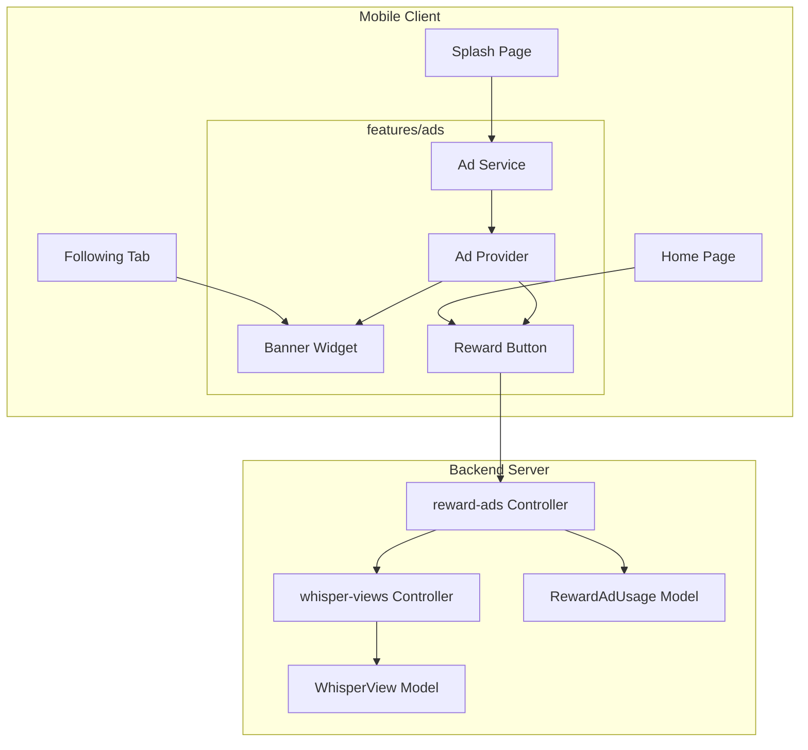
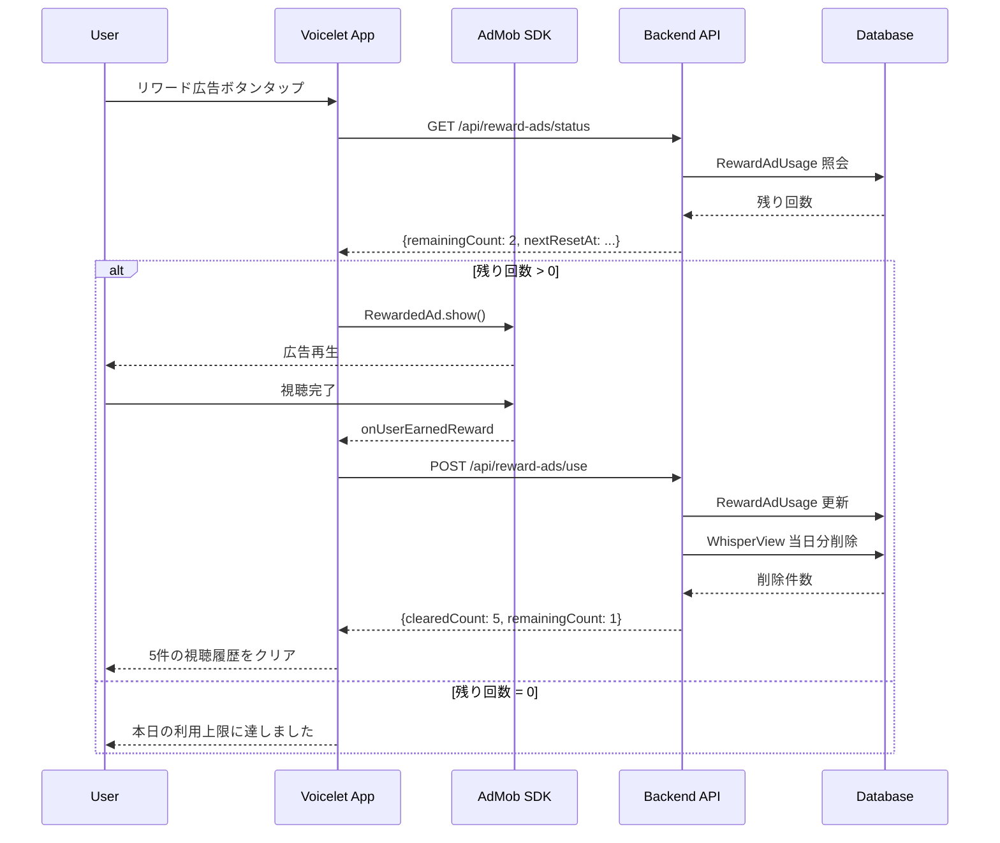
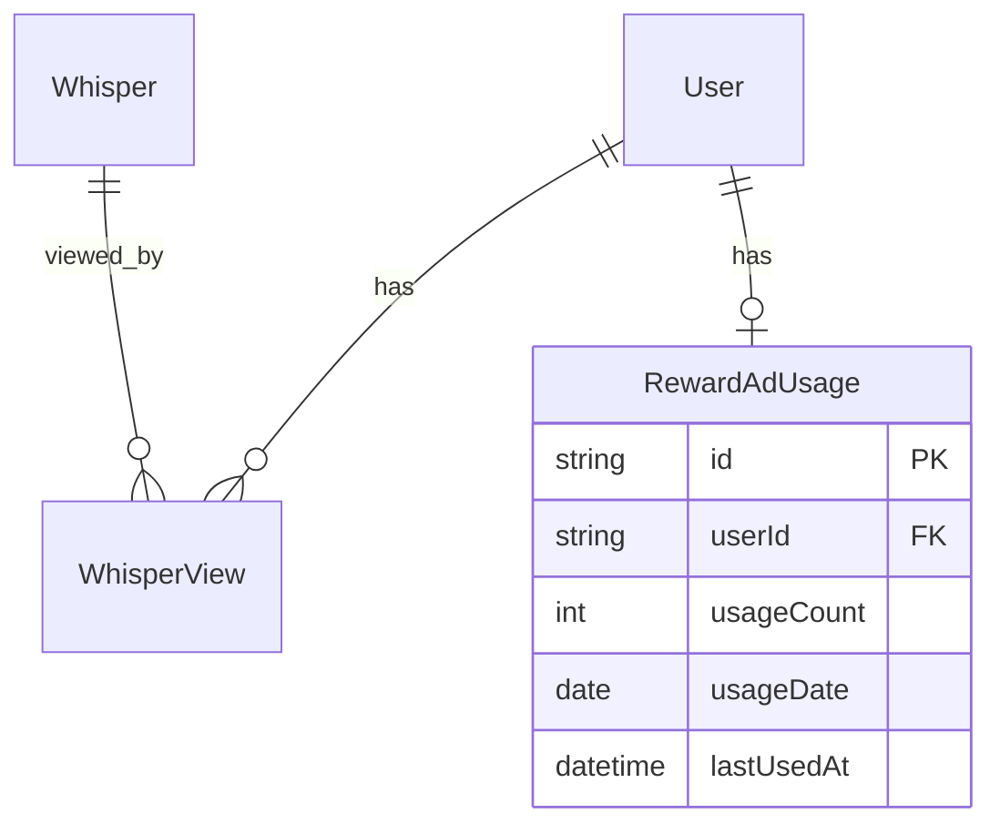

# Design Document: AdMob Integration

## Overview

**Purpose**: VoiceletアプリにAdMob広告を導入し、バナー広告による収益化とリワード広告による視聴履歴クリア機能を提供する。

**Users**: 全ユーザーがバナー広告を閲覧し、リワード広告を視聴することで当日の視聴履歴をクリアして投稿を再視聴できる。

**Impact**: ホーム画面（FollowingTab）にバナー広告を配置し、リワード広告機能とバックエンドの使用回数管理・視聴履歴削除APIを追加する。

### Goals
- AdMob SDKを統合してバナー広告とリワード広告を表示
- リワード広告視聴による当日視聴履歴クリア機能を実装
- 1日3回・午前5時リセットの使用回数制限をサーバー側で管理
- iOS ATT対応を含むプライバシー要件を満たす

### Non-Goals
- インタースティシャル広告（現時点では対象外）
- 広告非表示の有料プラン（将来検討）
- GDPR/UMP完全対応（EEA向け、v2で検討）

---

## Architecture

### Existing Architecture Analysis

**現行システム**:
- モバイル: Feature-first構成、Riverpod状態管理
- バックエンド: Controller-Service-Modelパターン、Prisma ORM
- 視聴履歴: `WhisperView` モデルでupsertのみ（削除APIなし）

**統合ポイント**:
- `home_page.dart`: バナー広告配置
- `whisper-views/controller.ts`: 削除エンドポイント追加
- `splash_page.dart`: SDK初期化

### Architecture Pattern & Boundary Map



**Architecture Integration**:
- **Selected pattern**: Feature Module + 既存拡張のハイブリッド
- **Domain boundaries**: 広告機能は `features/ads/` に分離、視聴履歴は既存拡張
- **Existing patterns preserved**: Riverpod状態管理、Freezedモデル、Zodスキーマ
- **New components rationale**: AdMob SDKラッパーと使用回数管理の独立性確保
- **Steering compliance**: Feature-first構成、Controller-Service-Modelパターン維持

### Technology Stack

| Layer | Choice / Version | Role in Feature | Notes |
|-------|------------------|-----------------|-------|
| Mobile SDK | google_mobile_ads ^7.0.0 | AdMob広告表示 | Flutter 3.27.0+ 推奨 |
| Mobile SDK | app_tracking_transparency ^2.0.0 | iOS ATT対応 | iOS 14+ 必須 |
| Backend | Fastify + Prisma | API / DB | 既存スタック |
| Database | PostgreSQL | RewardAdUsage保存 | 既存DB拡張 |

---

## System Flows

### リワード広告フロー



**Key Decisions**:
- 広告表示前にサーバーで残り回数を確認（不正防止）
- 視聴完了コールバック後にサーバーで履歴削除を実行
- クライアントは結果を受け取って表示を更新

---

## Requirements Traceability

| Requirement | Summary | Components | Interfaces | Flows |
|-------------|---------|------------|------------|-------|
| 1.1 | バナー広告表示 | BannerAdWidget, AdService | BannerAd API | - |
| 1.2 | 読み込み中レイアウト維持 | BannerAdWidget | onAdLoaded callback | - |
| 1.3 | 失敗時非表示 | BannerAdWidget | onAdFailedToLoad callback | - |
| 1.4 | 視聴体験を妨げない配置 | FollowingTab | - | - |
| 2.1 | リワード広告表示 | RewardAdButton, AdService | RewardedAd API | リワード広告フロー |
| 2.2 | 視聴完了で履歴クリア | RewardAdsController | POST /api/reward-ads/use | リワード広告フロー |
| 2.3 | 読み込み失敗エラー | RewardAdButton | onAdFailedToLoad | - |
| 2.4 | 途中離脱時クリアなし | AdService | onAdDismissed | リワード広告フロー |
| 2.5 | 読み込み中ローディング | RewardAdButton | isLoading state | - |
| 3.1 | 1日3回制限 | RewardAdsController, RewardAdUsage | GET /api/reward-ads/status | リワード広告フロー |
| 3.2 | 3回目で無効化 | RewardAdButton, adStatusProvider | remainingCount | - |
| 3.3 | 午前5時リセット | RewardAdsController | nextResetAt | - |
| 3.4 | 残り回数表示 | RewardAdButton | remainingCount | - |
| 3.5 | 0回時無効+リセット時刻表示 | RewardAdButton | nextResetAt | - |
| 4.1 | 当日分のみ削除 | WhisperViewsController | JST 5時基準クエリ | - |
| 4.2 | 前日以前除外 | WhisperViewsController | viewedAt範囲 | - |
| 4.3 | クリア件数通知 | RewardAdButton | clearedCount | - |
| 4.4 | 履歴なし時メッセージ | RewardAdButton | clearedCount = 0 | - |
| 5.1 | AdMob SDK使用 | AdService | MobileAds.instance | - |
| 5.2 | 環境別広告ID | AdConfig | dart-define | - |
| 5.3 | 起動時初期化 | SplashPage | initialize() | - |
| 5.4 | ATT対応 | SplashPage | requestTrackingAuthorization | - |

---

## Components and Interfaces

### Component Summary

| Component | Domain/Layer | Intent | Req Coverage | Key Dependencies | Contracts |
|-----------|--------------|--------|--------------|------------------|-----------|
| AdService | ads/services | AdMob SDK ラッパー | 5.1, 5.3 | google_mobile_ads (P0) | Service |
| AdConfig | ads/config | 環境別広告ID管理 | 5.2 | - | - |
| adStatusProvider | ads/providers | リワード状態管理 | 3.1-3.5 | API (P0), AdService (P0) | State |
| BannerAdWidget | ads/widgets | バナー広告表示 | 1.1-1.4 | AdService (P0) | State |
| RewardAdButton | ads/widgets | リワード広告トリガー | 2.1-2.5, 3.2-3.5, 4.3-4.4 | adStatusProvider (P0) | State |
| RewardAdsController | backend/controller | 使用回数・履歴削除API | 2.2, 3.1, 3.3, 4.1-4.2 | Prisma (P0) | API |
| WhisperViewsController | backend/controller | 視聴履歴削除 | 4.1-4.2 | Prisma (P0) | API |

---

### Mobile Layer

#### AdService

| Field | Detail |
|-------|--------|
| Intent | AdMob SDKの初期化とリワード広告のロード・表示を管理 |
| Requirements | 5.1, 5.3, 2.1, 2.3, 2.4, 2.5 |

**Responsibilities & Constraints**
- MobileAds SDK の初期化（アプリ起動時に1回）
- RewardedAd のプリロードとキャッシュ
- 広告ライフサイクルイベントのハンドリング

**Dependencies**
- External: google_mobile_ads — AdMob SDK (P0)
- External: app_tracking_transparency — iOS ATT (P1)

**Contracts**: Service [x]

##### Service Interface
```dart
abstract class AdService {
  /// SDK初期化（起動時に1回呼び出し）
  Future<void> initialize();

  /// リワード広告をプリロード
  Future<void> preloadRewardedAd();

  /// リワード広告を表示し、視聴完了を待つ
  /// Returns: true if user earned reward, false if dismissed early
  Future<bool> showRewardedAd();

  /// リワード広告がロード済みか
  bool get isRewardedAdReady;

  /// リワード広告のロード状態ストリーム
  Stream<RewardedAdState> get rewardedAdState;
}

enum RewardedAdState {
  initial,
  loading,
  ready,
  showing,
  completed,
  dismissed,
  failed,
}
```
- Preconditions: `initialize()` は `showRewardedAd()` より前に呼び出す
- Postconditions: `showRewardedAd()` 後は自動で再ロード開始
- Invariants: 同時に1つの広告のみ表示

**Implementation Notes**
- Integration: SplashPage の initState で `initialize()` を呼び出し
- Validation: `isRewardedAdReady` が false なら表示ボタン無効化
- Risks: 広告在庫切れ時は `RewardedAdState.failed` を返す

---

#### AdConfig

| Field | Detail |
|-------|--------|
| Intent | 環境（開発/本番）に応じた広告IDを提供 |
| Requirements | 5.2 |

**Responsibilities & Constraints**
- dart-define または .env から環境を判定
- テスト広告ID（開発）と本番広告IDを切り替え

```dart
class AdConfig {
  static const bool isProduction = bool.fromEnvironment('PRODUCTION', defaultValue: false);

  static String get bannerAdUnitId {
    if (isProduction) {
      return Platform.isAndroid
          ? 'ca-app-pub-XXXXX/banner-android'
          : 'ca-app-pub-XXXXX/banner-ios';
    }
    // Test IDs
    return Platform.isAndroid
        ? 'ca-app-pub-3940256099942544/6300978111'
        : 'ca-app-pub-3940256099942544/2934735716';
  }

  static String get rewardedAdUnitId {
    if (isProduction) {
      return Platform.isAndroid
          ? 'ca-app-pub-XXXXX/rewarded-android'
          : 'ca-app-pub-XXXXX/rewarded-ios';
    }
    // Test IDs
    return Platform.isAndroid
        ? 'ca-app-pub-3940256099942544/5224354917'
        : 'ca-app-pub-3940256099942544/1712485313';
  }
}
```

---

#### adStatusProvider

| Field | Detail |
|-------|--------|
| Intent | リワード広告の使用状態をサーバーから取得・管理 |
| Requirements | 3.1, 3.2, 3.3, 3.4, 3.5 |

**Contracts**: State [x]

##### State Management
```dart
@freezed
class RewardAdStatus with _$RewardAdStatus {
  const factory RewardAdStatus({
    required int remainingCount,
    required int clearedCount,
    required DateTime nextResetAt,
    required bool isLoading,
    String? error,
  }) = _RewardAdStatus;
}

// Riverpod Provider
final adStatusProvider = StateNotifierProvider<AdStatusNotifier, AsyncValue<RewardAdStatus>>(
  (ref) => AdStatusNotifier(ref),
);
```

- State model: remainingCount (0-3), nextResetAt (JST 5:00), clearedCount (直近のクリア件数)
- Persistence: サーバーが信頼源、クライアントはキャッシュのみ
- Concurrency: API呼び出し中は isLoading = true

---

#### BannerAdWidget

| Field | Detail |
|-------|--------|
| Intent | AdMob バナー広告を表示するウィジェット |
| Requirements | 1.1, 1.2, 1.3, 1.4 |

**Contracts**: State [x]

##### State Management
```dart
class BannerAdWidget extends StatefulWidget {
  const BannerAdWidget({super.key});
}

// States: loading, loaded, failed
// - loading: Container with fixed height (50dp)
// - loaded: AdWidget
// - failed: SizedBox.shrink() (非表示)
```

**Implementation Notes**
- Integration: FollowingTab の GridView 下部に配置
- Validation: 広告ロード失敗時は高さ0で非表示
- Risks: 広告ロード遅延時のレイアウトジャンプを防ぐため固定高さ維持

---

#### RewardAdButton

| Field | Detail |
|-------|--------|
| Intent | リワード広告視聴ボタンと状態表示 |
| Requirements | 2.1, 2.5, 3.2, 3.4, 3.5, 4.3, 4.4 |

**Implementation Notes**
- 残り回数0でボタン無効化 + 次のリセット時刻表示
- 広告ロード中はローディングインジケーター表示
- 視聴完了後はクリア件数をSnackBarで通知

---

### Backend Layer

#### RewardAdsController

| Field | Detail |
|-------|--------|
| Intent | リワード広告の使用回数管理と視聴履歴クリア |
| Requirements | 2.2, 3.1, 3.3, 4.1, 4.2 |

**Contracts**: API [x]

##### API Contract

| Method | Endpoint | Request | Response | Errors |
|--------|----------|---------|----------|--------|
| GET | /api/reward-ads/status | - | RewardAdStatusResponse | 401 |
| POST | /api/reward-ads/use | - | RewardAdUseResponse | 400, 401, 429 |

```typescript
// GET /api/reward-ads/status Response
interface RewardAdStatusResponse {
  remainingCount: number;  // 0-3
  nextResetAt: string;     // ISO 8601 (JST 5:00)
  todayClearedCount: number;
}

// POST /api/reward-ads/use Response
interface RewardAdUseResponse {
  success: boolean;
  clearedCount: number;
  remainingCount: number;
  nextResetAt: string;
}

// Error: 429 Too Many Requests
interface ErrorResponse {
  message: string;
  remainingCount: 0;
  nextResetAt: string;
}
```

**Implementation Notes**
- Integration: 認証必須（authenticate middleware）
- Validation: 残り回数0の場合は429エラー
- Risks: 午前5時境界での同時リクエストはサーバー側でアトミックに処理

---

#### WhisperViewsController (拡張)

| Field | Detail |
|-------|--------|
| Intent | 視聴履歴の当日分一括削除 |
| Requirements | 4.1, 4.2 |

**Contracts**: API [x]

##### API Contract

| Method | Endpoint | Request | Response | Errors |
|--------|----------|---------|----------|--------|
| DELETE | /api/whisper-views/today | - | DeleteResponse | 401 |

```typescript
// DELETE /api/whisper-views/today Response
interface DeleteResponse {
  deletedCount: number;
}
```

**Implementation Notes**
- JST午前5時を日付境界として当日分のみ削除
- `viewedAt >= todayStart AND viewedAt < tomorrowStart` でクエリ

---

## Data Models

### Domain Model



### Physical Data Model

#### RewardAdUsage (新規)

```prisma
model RewardAdUsage {
  id         String   @id @default(uuid())
  userId     String   @unique @map("user_id")
  usageCount Int      @default(0) @map("usage_count")
  usageDate  DateTime @map("usage_date") @db.Date
  lastUsedAt DateTime @map("last_used_at")

  user User @relation(fields: [userId], references: [id], onDelete: Cascade)

  @@index([userId])
  @@index([usageDate])
  @@map("reward_ad_usages")
}
```

- `usageDate`: JST午前5時基準の「アプリ日付」
- `usageCount`: 0-3（最大3回）
- ユニーク制約: 1ユーザー1レコード（日付でリセット判定）

---

## Error Handling

### Error Categories and Responses

**User Errors (4xx)**:
- 401 Unauthorized: 認証トークンなし/無効 → ログイン画面へ
- 429 Too Many Requests: 本日の利用上限 → 次のリセット時刻を表示

**System Errors (5xx)**:
- 広告ロード失敗 → エラーメッセージ + リトライボタン
- API通信失敗 → オフラインメッセージ

**Business Logic Errors**:
- 当日視聴履歴なし → 「クリアする履歴がありません」メッセージ

---

## Testing Strategy

### Unit Tests
- AdService: initialize, preloadRewardedAd, showRewardedAd のモック
- AdConfig: 環境別ID切り替え
- RewardAdUsage: 午前5時リセットロジック

### Integration Tests
- POST /api/reward-ads/use → WhisperView削除連携
- 使用回数カウントとリセットタイミング
- ATT許可/拒否時の広告表示動作

### E2E/UI Tests
- バナー広告表示とロード失敗時の非表示
- リワード広告視聴完了 → クリア件数通知
- 残り回数0時のボタン無効化

---

## Security Considerations

- 広告視聴完了の検証はクライアント側コールバックに依存（サーバー側検証はSSVオプションだが初期実装ではスキップ）
- リワード使用回数はサーバー側で管理し、クライアント改ざんを防止
- 本番広告IDは dart-define で注入し、リポジトリにハードコードしない

---

## Optional: Native Configuration

### iOS Info.plist 追加項目
```xml
<key>GADApplicationIdentifier</key>
<string>ca-app-pub-XXXXX~YYYYY</string>
<key>NSUserTrackingUsageDescription</key>
<string>パーソナライズされた広告を表示するために使用します</string>
<key>SKAdNetworkItems</key>
<!-- Google SKAdNetwork IDs -->
```

### Android AndroidManifest.xml 追加項目
```xml
<meta-data
    android:name="com.google.android.gms.ads.APPLICATION_ID"
    android:value="ca-app-pub-XXXXX~YYYYY"/>
```
