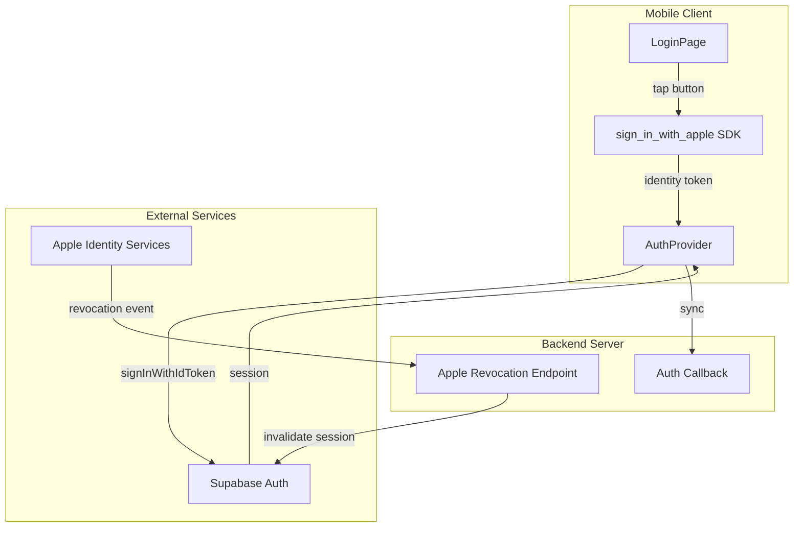
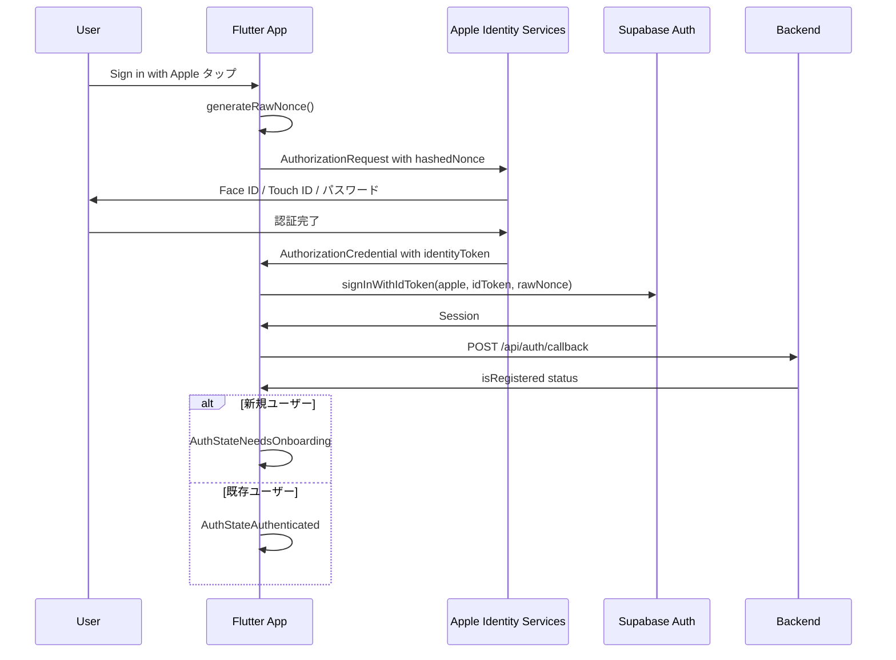
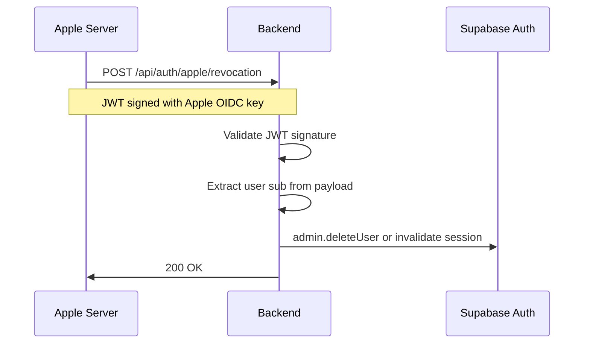

# Design Document: Apple認証

## Overview

**Purpose**: この機能はiOSユーザーにネイティブのSign in with Apple体験を提供し、Appleアカウントを使用したVoiceletへの認証を可能にする。

**Users**: iOSユーザーがApple IDを使用してアカウント作成・ログインのワークフローで利用する。

**Impact**: 既存のSupabase Auth認証システムを拡張し、新たな認証プロバイダーとしてAppleを追加。モバイルクライアントの`auth_provider.dart`とログインUIを変更し、バックエンドにServer-to-Server通知用エンドポイントを新設する。

### Goals
- iOSネイティブのApple認証ダイアログを使用したシームレスな認証体験
- 既存のGoogle認証と同様のパターンでの実装による保守性の確保
- Apple設定からの認証取り消しに対応したセッション管理

### Non-Goals
- Android向けSign in with Apple対応（将来検討）
- 独自JWT発行（Supabase Auth管理を継続）
- アカウント統合機能（同一メールでの複数認証プロバイダー連携）

---

## Architecture

### Existing Architecture Analysis

現在のVoicelet認証システムはSupabase Authを中核として構築されている。

| コンポーネント | 役割 | 変更の影響 |
|--------------|------|-----------|
| `auth_provider.dart` | 認証状態管理、OAuth処理 | 拡張が必要 |
| `/api/auth/callback` | トークン検証、登録状態確認 | 変更不要（Supabase経由） |
| `lib/auth.ts` | バックエンド認証ミドルウェア | 変更不要 |

**既存パターン**: `signInWithIdToken` + `/api/auth/callback` による同期フロー（Google認証で確立済み）

### Architecture Pattern & Boundary Map



**Architecture Integration**:
- **Selected Pattern**: 既存認証フローの拡張（ハイブリッドアプローチ）
- **Domain Boundaries**: 認証フローは`AuthProvider`に集約、通知処理は独立エンドポイント
- **Existing Patterns Preserved**: `signInWithIdToken` → `_syncWithBackend` フロー
- **New Components Rationale**: Server-to-Server通知は非同期Webhookのため独立エンドポイントが適切
- **Steering Compliance**: Controller-Service-Modelパターン、Feature-firstディレクトリ構成を維持

### Technology Stack

| Layer | Choice / Version | Role in Feature | Notes |
|-------|------------------|-----------------|-------|
| Mobile | `sign_in_with_apple: ^6.0.0` | ネイティブApple認証SDK | 新規依存関係 |
| Mobile | `supabase_flutter: ^2.8.0` | セッション管理、`signInWithIdToken` | 既存 |
| Backend | `jose: ^5.0.0` | JWT検証（Server-to-Server通知） | 新規依存関係 |
| Backend | Fastify 5 + Zod | エンドポイント定義、バリデーション | 既存 |

---

## System Flows

### Apple認証フロー（iOS）



**Key Decisions**:
- nonce生成: Supabase提供の`generateRawNonce()`を使用（SHA256ハッシュ化してAppleに送信）
- キャンセル処理: `AuthorizationErrorCode.canceled`を検出し、静かにログイン画面に戻る

### Server-to-Server通知フロー



**Key Decisions**:
- セッション無効化のみ実施（アカウント削除はしない）
- JWKSはキャッシュして再利用（パフォーマンス最適化）

---

## Requirements Traceability

| Requirement | Summary | Components | Interfaces | Flows |
|-------------|---------|------------|------------|-------|
| 1.1 | Apple認証フロー開始 | AuthProvider, LoginPage | signInWithApple() | Apple認証フロー |
| 1.2 | Identity Token送信 | AuthProvider | signInWithIdToken() | Apple認証フロー |
| 1.3 | キャンセル処理 | AuthProvider | - | Apple認証フロー |
| 1.4 | ボタンデザイン準拠 | LoginPage | SignInWithAppleButton | - |
| 2.1-2.5 | トークン検証 | Supabase Auth | signInWithIdToken() | Apple認証フロー |
| 3.1-3.5 | アカウント作成・連携 | AuthProvider, Backend | _syncWithBackend() | Apple認証フロー |
| 4.1-4.4 | セッション管理 | Supabase Auth | Session | Apple認証フロー |
| 5.1-5.4 | エラーハンドリング | AuthProvider, LoginPage | AuthState | Apple認証フロー |
| 6.1-6.3 | 認証取り消し対応 | AppleRevocationController | POST /revocation | Server-to-Server通知フロー |

---

## Components and Interfaces

### Component Summary

| Component | Domain/Layer | Intent | Req Coverage | Key Dependencies | Contracts |
|-----------|--------------|--------|--------------|------------------|-----------|
| AuthProvider | Mobile/State | Apple認証状態管理 | 1.1-1.3, 3.1-3.4, 4.1-4.4, 5.1-5.4 | sign_in_with_apple (P0), Supabase (P0) | State |
| LoginPage | Mobile/UI | Apple認証ボタン表示 | 1.1, 1.4 | AuthProvider (P0) | - |
| AppleRevocationController | Backend/Controller | 認証取り消し通知処理 | 6.1-6.3 | jose (P0), Supabase Admin (P0) | API |

---

### Mobile / State

#### AuthProvider

| Field | Detail |
|-------|--------|
| Intent | Apple認証フローの実行と状態管理 |
| Requirements | 1.1, 1.2, 1.3, 3.1, 3.2, 3.3, 3.4, 4.1, 4.4, 5.1, 5.2, 5.3, 5.4 |

**Responsibilities & Constraints**
- Apple Identity Tokenの取得とSupabase認証
- nonce生成・管理
- 認証状態の遷移管理（Loading → Authenticated / NeedsOnboarding / Error）
- iOSプラットフォーム限定（Platform.isIOSチェック）

**Dependencies**
- Inbound: LoginPage — 認証トリガー (P0)
- Outbound: Supabase Auth — セッション管理 (P0)
- External: sign_in_with_apple — ネイティブSDK (P0)

**Contracts**: State [x]

##### State Management

```dart
// 既存のAuthStateに変更なし
sealed class AuthState {
  const AuthState();
}

class AuthStateLoading extends AuthState {}
class AuthStateUnauthenticated extends AuthState {}
class AuthStateNeedsOnboarding extends AuthState { final User user; }
class AuthStateAuthenticated extends AuthState { final User user; final Profile profile; }
class AuthStateError extends AuthState { final String message; }
```

##### Service Interface

```dart
abstract interface class AppleAuthService {
  /// Sign in with Apple ネイティブ認証を実行
  ///
  /// Preconditions: iOS platform only
  /// Postconditions: AuthState is updated (Authenticated | NeedsOnboarding | Error | Unauthenticated)
  /// Errors: AuthException, AppleSignInException
  Future<void> signInWithApple();
}

// Implementation in AuthNotifier
Future<void> signInWithApple() async {
  // 1. Generate nonce
  // 2. Request Apple credential with hashed nonce
  // 3. Call signInWithIdToken with raw nonce
  // 4. Sync with backend
}
```

**Implementation Notes**
- Integration: 既存`signInWithApple`メソッドをネイティブSDK方式に置換
- Validation: Platform.isIOSでプラットフォームチェック（Android非対応）
- Risks: Apple Developer Console設定ミスによる認証失敗

---

### Mobile / UI

#### LoginPage

| Field | Detail |
|-------|--------|
| Intent | Sign in with Appleボタンの表示 |
| Requirements | 1.1, 1.4 |

**Responsibilities & Constraints**
- Apple Human Interface Guidelines準拠ボタン表示
- ローディング状態中のボタン無効化
- iOSのみボタン表示（Platform.isIOSチェック）

**Dependencies**
- Inbound: -
- Outbound: AuthProvider — 認証トリガー (P0)
- External: sign_in_with_apple — SignInWithAppleButton widget (P0)

**Implementation Notes**
- Integration: 既存ログインフォームの下部にAppleボタンを追加
- Validation: `SignInWithAppleButton`ウィジェット使用でHIG準拠を保証

---

### Backend / Controller

#### AppleRevocationController

| Field | Detail |
|-------|--------|
| Intent | Apple Server-to-Server通知の受信と処理 |
| Requirements | 6.1, 6.2, 6.3 |

**Responsibilities & Constraints**
- Apple JWTの署名検証
- `consent-revoked`イベント処理
- ユーザーセッションの無効化
- エンドポイントはHTTPS必須、認証なし

**Dependencies**
- Inbound: Apple Identity Services — Webhook通知 (P0)
- Outbound: Supabase Admin — セッション無効化 (P0)
- External: jose — JWT検証 (P0)

**Contracts**: API [x]

##### API Contract

| Method | Endpoint | Request | Response | Errors |
|--------|----------|---------|----------|--------|
| POST | /api/auth/apple/revocation | AppleNotificationPayload (JWT) | 200 OK | 400 (invalid JWT), 500 |

##### Service Interface

```typescript
interface AppleRevocationService {
  /**
   * Apple Server-to-Server通知を処理
   *
   * Preconditions: Valid JWT signed by Apple OIDC key
   * Postconditions: User session invalidated in Supabase
   * Invariants: User account data is preserved (not deleted)
   */
  handleRevocationNotification(jwt: string): Promise<void>;
}

interface AppleNotificationPayload {
  iss: 'https://appleid.apple.com';
  aud: string; // Bundle ID
  iat: number;
  jti: string;
  events: string; // JSON string containing event details
}

interface AppleEventPayload {
  type: 'consent-revoked' | 'account-delete';
  sub: string; // Apple User ID
  event_time: number;
}
```

**Implementation Notes**
- Integration: `backend/src/controller/auth/apple/controller.ts`に新規作成
- Validation: JWKS取得 → JWT署名検証 → ペイロード検証（iss, aud, exp）
- Risks: Apple公開鍵のローテーション時のキャッシュ無効化が必要

---

## Data Models

### Domain Model

Apple認証は既存のUserモデルを使用する。新規エンティティの追加は不要。

**既存エンティティ（変更なし）**:
- `User`: id (Supabase User ID = Apple sub), email, username, ...

**Supabase Auth管理**:
- Apple User ID（sub）とSupabase User IDの紐付けはSupabase Authが内部管理
- 追加のマッピングテーブルは不要

### Logical Data Model

**Apple Private Email Relay対応**:
- email形式: `xxxxx@privaterelay.appleid.com`
- 既存のemail unique制約で対応可能
- 同一ユーザーは常に同じリレーアドレスを受け取る

---

## Error Handling

### Error Strategy

| Error Type | Trigger | Response | User Message |
|------------|---------|----------|--------------|
| AuthorizationErrorCode.canceled | ユーザーキャンセル | Unauthenticated状態へ | なし（静かに戻る） |
| AuthorizationErrorCode.failed | Apple認証失敗 | Error状態へ | 「Appleサインインに失敗しました」 |
| AuthorizationErrorCode.invalidResponse | 不正レスポンス | Error状態へ | 「Appleサインインに失敗しました」 |
| AuthorizationErrorCode.notHandled | 未対応 | Error状態へ | 「Appleサインインに失敗しました」 |
| AuthorizationErrorCode.notInteractive | 非対話モード | Error状態へ | 「Appleサインインを利用できません」 |
| Network Error | 接続失敗 | Error状態へ | 「ネットワーク接続を確認してください」 |
| Supabase Error | 認証失敗 | Error状態へ | 「しばらく時間をおいて再度お試しください」 |

### Monitoring

- 認証成功/失敗ログ（既存のpino-prettyで出力）
- Server-to-Server通知の受信ログ
- JWT検証失敗の警告ログ

---

## Testing Strategy

### Unit Tests
- `signInWithApple()`: nonce生成、SDK呼び出し、状態遷移のモックテスト
- `AppleRevocationService`: JWT検証ロジック、ペイロード解析のテスト
- エラーハンドリング: 各エラーコードでの状態遷移テスト

### Integration Tests
- Apple認証フロー: モックSDKを使用したE2Eフロー（Supabase Mockクライアント）
- Server-to-Server通知: 署名付きJWTモックでのエンドポイントテスト
- Backend同期: `/api/auth/callback`との連携テスト

### E2E/UI Tests
- ログイン画面でのAppleボタン表示確認
- ボタンタップでのシステムダイアログ表示（実機のみ）
- 認証完了後のホーム画面遷移

---

## Security Considerations

### JWT Validation
- Apple OIDC公開鍵（JWKS）による署名検証必須
- トークン有効期限（exp）検証
- issuer（iss = `https://appleid.apple.com`）検証
- audience（aud = Bundle ID）検証

### Nonce Handling
- 各認証リクエストで一意のnonce生成
- SHA256ハッシュ化してAppleに送信
- 元のnonce値をSupabase認証に使用（リプレイ攻撃防止）

### Data Privacy
- Apple Private Email Relayの適切な取り扱い
- 認証取り消し時のセッション即時無効化

---

## Supporting References

### Apple Developer Console設定チェックリスト

1. **App ID設定**
   - Sign in with Apple capability有効化
   - Bundle ID登録

2. **Service ID設定**（Webフォールバック用、オプション）
   - Return URL設定

3. **Key設定**
   - Sign in with Appleキー生成
   - Key IDとTeam IDをSupabaseに登録

4. **Supabase Dashboard設定**
   - Authentication → Providers → Apple
   - Bundle ID登録
   - Service ID登録（オプション）

### sign_in_with_apple使用例

```dart
// 参考: 実装時の基本パターン
final rawNonce = supabase.auth.generateRawNonce();
final hashedNonce = sha256.convert(utf8.encode(rawNonce)).toString();

final credential = await SignInWithApple.getAppleIDCredential(
  scopes: [AppleIDAuthorizationScopes.email, AppleIDAuthorizationScopes.fullName],
  nonce: hashedNonce,
);

final response = await supabase.auth.signInWithIdToken(
  provider: OAuthProvider.apple,
  idToken: credential.identityToken!,
  nonce: rawNonce,
);
```
