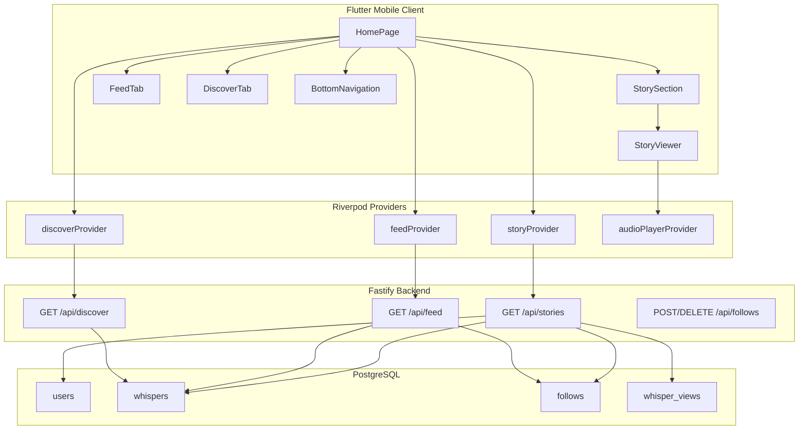
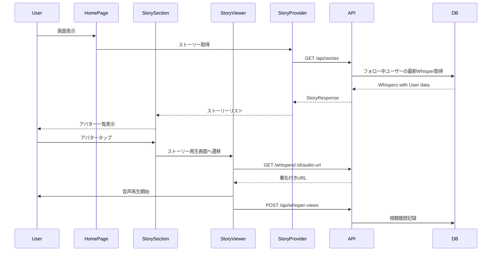
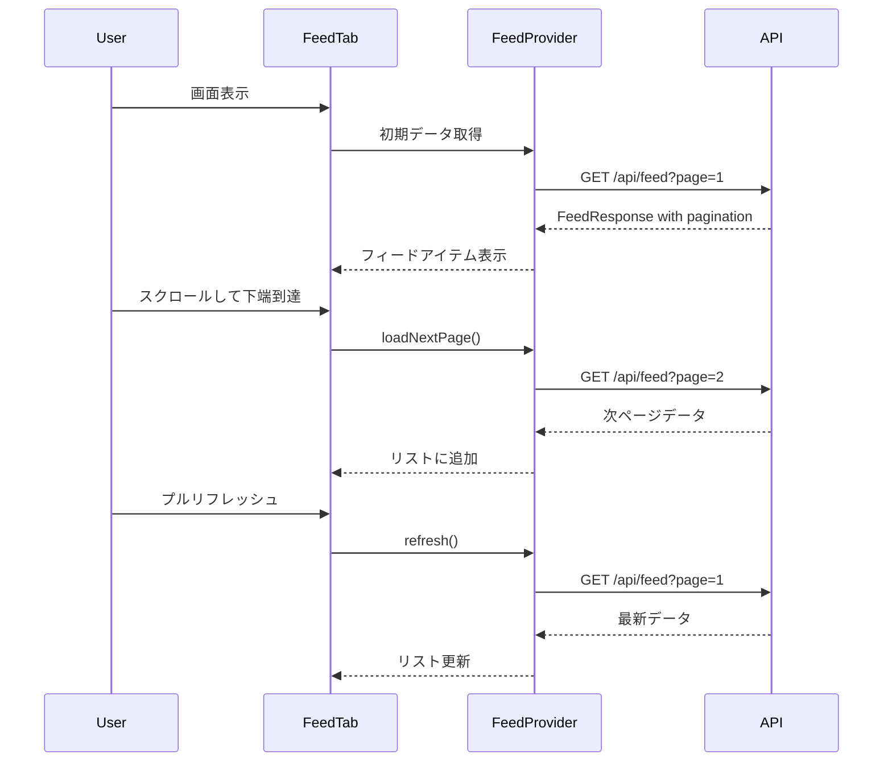
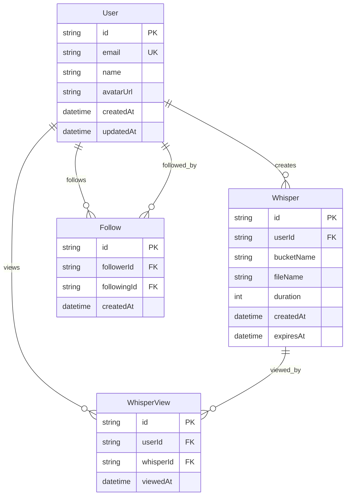

# Technical Design: Home Feed

## Overview

**Purpose**: Voiceletのメインホーム画面を提供し、ユーザーがフォロー中のユーザーの音声投稿をストーリー形式で視聴し、フォロー外のコンテンツを発見できるようにする。

**Users**: すべてのVoiceletユーザーがメインの音声コンテンツ消費画面として利用する。

**Impact**: 既存のスキーマに`Follow`、`WhisperView`モデルを追加し、新規APIエンドポイントとFlutter UIを実装する。

### Goals
- フォロー中ユーザーのストーリー形式での投稿表示
- フォローフィードと発見欄のタブ切り替えUI
- 無限スクロール対応のフィード表示
- 「夜のささやき」デザインシステムに沿った洗練されたUI
- 開発確認用のシードデータ作成

### Non-Goals
- 推薦アルゴリズムの実装（初期は新着順）
- オフラインキャッシュ対応
- プッシュ通知連携
- ユーザープロフィール編集機能

## Architecture

### Architecture Pattern & Boundary Map



**Architecture Integration**:
- Selected pattern: Feature-first拡張 — 既存`home`ディレクトリを拡張し一貫性を維持
- Domain boundaries: UI層（pages/widgets）、状態管理層（providers）、データ層（services/models）
- Existing patterns preserved: Freezedモデル、Riverpod Provider、go_router、Zodスキーマ
- New components rationale: ストーリー/フィード/発見の3つの独立したデータフローを管理するため専用Providerを追加
- Steering compliance: Controller-Service-Modelパターン、Feature-first構成を維持

### Technology Stack

| Layer | Choice / Version | Role in Feature | Notes |
|-------|------------------|-----------------|-------|
| Frontend | Flutter 3.10+ / Riverpod 2.4+ | ホーム画面UI、状態管理 | 既存スタックを継続使用 |
| Backend | Fastify 5 / TypeScript | REST API提供 | 新規エンドポイント追加 |
| Data | PostgreSQL 16 / Prisma | データ永続化 | Follow, WhisperViewモデル追加 |
| Audio | audioplayers 6.1+ | 音声再生 | 既存パッケージ活用 |

## System Flows

### ストーリー視聴フロー



### フィード無限スクロールフロー



## Requirements Traceability

| Requirement | Summary | Components | Interfaces | Flows |
|-------------|---------|------------|------------|-------|
| 1.1 | ストーリーセクション横スクロール | StorySection | storyProvider | ストーリー視聴 |
| 1.2 | 円形アバター表示 | StoryAvatar | - | - |
| 1.3 | 未視聴グラデーションリング | StoryAvatar | WhisperView API | - |
| 1.4 | ストーリー再生画面遷移 | StoryViewer | audioPlayerProvider | ストーリー視聴 |
| 1.5 | 視聴プログレスバー | StoryViewer | - | - |
| 2.1 | フィード一覧表示 | FeedTab | feedProvider | フィード無限スクロール |
| 2.2 | 新着順カード表示 | FeedCard | - | - |
| 2.3 | カード情報表示 | FeedCard | - | - |
| 2.4 | タップで再生開始 | FeedCard | audioPlayerProvider | - |
| 2.5 | 無限スクロール | FeedTab | feedProvider | フィード無限スクロール |
| 2.6 | プルリフレッシュ | FeedTab | feedProvider | フィード無限スクロール |
| 3.1 | タブ切り替えUI | HomePage | - | - |
| 3.2 | 発見欄人気投稿表示 | DiscoverTab | discoverProvider | - |
| 3.3 | グリッド/カード表示 | DiscoverCard | - | - |
| 3.4 | 発見欄から再生遷移 | DiscoverTab | audioPlayerProvider | - |
| 3.5 | コンテンツ更新 | DiscoverTab | discoverProvider | - |
| 4.1-4.6 | ビジュアルデザイン | 全UIコンポーネント | AppTheme | - |
| 5.1 | スケルトンローダー | SkeletonLoader | - | - |
| 5.2 | 遅延読み込み | CachedNetworkImage | - | - |
| 5.3 | エラーハンドリング | ErrorState | - | - |
| 5.4 | 空状態表示 | EmptyState | - | - |
| 5.5 | 60fpsスクロール | FeedTab, DiscoverTab | - | - |
| 6.1 | ボトムナビゲーション | BottomNavigation | - | - |
| 6.2 | ナビゲーション遷移 | BottomNavigation | go_router | - |
| 6.3 | アクティブタブハイライト | BottomNavigation | - | - |
| 6.4 | 新規投稿ボタン | BottomNavigation | go_router | - |

## Components and Interfaces

| Component | Domain/Layer | Intent | Req Coverage | Key Dependencies | Contracts |
|-----------|--------------|--------|--------------|------------------|-----------|
| HomePage | UI/Pages | メイン画面コンテナ、タブ管理 | 3.1, 6.1-6.4 | StorySection, FeedTab, DiscoverTab | State |
| StorySection | UI/Widgets | ストーリーアバター横スクロール表示 | 1.1, 1.2, 1.3 | storyProvider, StoryAvatar | - |
| StoryAvatar | UI/Widgets | 個別アバター表示、未視聴リング | 1.2, 1.3 | - | - |
| StoryViewer | UI/Pages | 全画面ストーリー再生 | 1.4, 1.5 | audioPlayerProvider | State |
| FeedTab | UI/Widgets | フォローフィード一覧 | 2.1, 2.5, 2.6 | feedProvider, FeedCard | State |
| FeedCard | UI/Widgets | 投稿カード表示 | 2.2, 2.3, 2.4 | audioPlayerProvider | - |
| DiscoverTab | UI/Widgets | 発見欄一覧 | 3.2, 3.3, 3.4, 3.5 | discoverProvider, DiscoverCard | State |
| DiscoverCard | UI/Widgets | 発見欄投稿カード | 3.3 | - | - |
| BottomNavigation | UI/Widgets | ボトムナビゲーション | 6.1, 6.2, 6.3, 6.4 | go_router | - |
| storyProvider | Provider | ストーリーデータ取得・管理 | 1.1-1.5 | HomeApiService | Service |
| feedProvider | Provider | フィードデータ取得・ページネーション | 2.1-2.6 | HomeApiService | Service |
| discoverProvider | Provider | 発見欄データ取得 | 3.2-3.5 | HomeApiService | Service |
| audioPlayerProvider | Provider | 音声再生状態管理 | 1.4, 2.4, 3.4 | audioplayers | State |
| HomeApiService | Service | ホーム画面関連API呼び出し | all | ApiClient | API |
| StoriesController | Backend | ストーリーAPI | 1.1-1.5 | Prisma | API |
| FeedController | Backend | フィードAPI | 2.1-2.6 | Prisma | API |
| DiscoverController | Backend | 発見欄API | 3.2-3.5 | Prisma | API |
| HomeSeeder | Backend | シードデータ生成 | - | Prisma | Batch |

### Mobile UI Layer

#### HomePage

| Field | Detail |
|-------|--------|
| Intent | ホーム画面のメインコンテナ、ストーリー・フィード・発見の統合表示 |
| Requirements | 3.1, 6.1, 6.2, 6.3, 6.4 |

**Responsibilities & Constraints**
- ストーリーセクション、フィード/発見タブ、ボトムナビゲーションの配置管理
- タブ切り替え状態の保持
- Scaffold全体のレイアウト制御

**Dependencies**
- Inbound: main.dart via go_router (P0)
- Outbound: StorySection, FeedTab, DiscoverTab, BottomNavigation (P0)

**Contracts**: State [x]

##### State Management
```dart
// HomePageの状態
enum HomeTab { feed, discover }

class HomePageState {
  final HomeTab currentTab;
  final bool isRefreshing;
}
```

#### StoryViewer

| Field | Detail |
|-------|--------|
| Intent | ストーリー（音声投稿）の全画面再生ビュー |
| Requirements | 1.4, 1.5 |

**Responsibilities & Constraints**
- 音声の再生/一時停止制御
- プログレスバー表示
- ジェスチャーハンドリング（タップで一時停止、左右スワイプで前後移動）
- 視聴完了時の自動次ストーリー遷移

**Dependencies**
- Inbound: StorySection via Navigator (P0)
- Outbound: audioPlayerProvider (P0), WhisperView API (P1)

**Contracts**: State [x]

##### State Management
```dart
class StoryViewerState {
  final List<StoryItem> stories;
  final int currentIndex;
  final Duration progress;
  final Duration totalDuration;
  final bool isPlaying;
  final bool isLoading;
}
```

**Implementation Notes**
- Integration: 音声URLは署名付きURLを毎回取得
- Validation: 有効期限切れURLの再取得ロジック
- Risks: ネットワーク遅延による再生開始遅延 → プリフェッチで軽減

### Mobile Provider Layer

#### storyProvider

| Field | Detail |
|-------|--------|
| Intent | フォロー中ユーザーのストーリーデータ取得・キャッシュ |
| Requirements | 1.1, 1.2, 1.3 |

**Responsibilities & Constraints**
- ストーリーリストの取得とキャッシュ
- 未視聴フラグの管理
- ユーザーごとのグループ化

**Dependencies**
- Outbound: HomeApiService (P0)

**Contracts**: Service [x]

##### Service Interface
```dart
@riverpod
class StoryNotifier extends _$StoryNotifier {
  @override
  Future<List<UserStory>> build() async;

  Future<void> refresh();
  void markAsViewed(String whisperID);
}

class UserStory {
  final User user;
  final List<StoryItem> stories;
  final bool hasUnviewed;
}

class StoryItem {
  final String id;
  final String whisperID;
  final int duration;
  final DateTime createdAt;
  final bool isViewed;
}
```

#### feedProvider

| Field | Detail |
|-------|--------|
| Intent | フォローフィードの無限スクロール対応データ管理 |
| Requirements | 2.1, 2.2, 2.5, 2.6 |

**Responsibilities & Constraints**
- ページネーション状態管理
- 追加ページのロード
- プルリフレッシュ対応
- リストアイテムのキャッシュ

**Dependencies**
- Outbound: HomeApiService (P0)

**Contracts**: Service [x]

##### Service Interface
```dart
@riverpod
class FeedNotifier extends _$FeedNotifier {
  @override
  Future<FeedState> build() async;

  Future<void> loadNextPage();
  Future<void> refresh();
}

class FeedState {
  final List<FeedItem> items;
  final bool hasMore;
  final int currentPage;
  final bool isLoadingMore;
  final String? error;
}

class FeedItem {
  final String id;
  final User user;
  final Whisper whisper;
}
```

#### discoverProvider

| Field | Detail |
|-------|--------|
| Intent | 発見欄コンテンツの取得・管理 |
| Requirements | 3.2, 3.3, 3.5 |

**Responsibilities & Constraints**
- フォロー外ユーザーの投稿取得
- ページネーション対応
- 定期リフレッシュ

**Dependencies**
- Outbound: HomeApiService (P0)

**Contracts**: Service [x]

##### Service Interface
```dart
@riverpod
class DiscoverNotifier extends _$DiscoverNotifier {
  @override
  Future<DiscoverState> build() async;

  Future<void> loadNextPage();
  Future<void> refresh();
}

class DiscoverState {
  final List<DiscoverItem> items;
  final bool hasMore;
  final int currentPage;
}

class DiscoverItem {
  final String id;
  final User user;
  final Whisper whisper;
}
```

### Backend Controllers

#### StoriesController

| Field | Detail |
|-------|--------|
| Intent | フォロー中ユーザーのストーリー取得API |
| Requirements | 1.1, 1.2, 1.3, 1.4, 1.5 |

**Responsibilities & Constraints**
- 認証ユーザーのフォロー一覧取得
- 各フォロー先の最新Whisper（24時間以内）取得
- 視聴済みフラグの付与
- ユーザー情報の結合

**Dependencies**
- Outbound: Prisma (P0)

**Contracts**: API [x]

##### API Contract
| Method | Endpoint | Request | Response | Errors |
|--------|----------|---------|----------|--------|
| GET | /api/stories | Query: userId | StoriesResponse | 401, 404, 500 |

```typescript
// Request
interface StoriesQuery {
  userId: string;
}

// Response
interface StoriesResponse {
  data: UserStory[];
}

interface UserStory {
  user: {
    id: string;
    name: string;
    avatarUrl: string | null;
  };
  stories: StoryItem[];
  hasUnviewed: boolean;
}

interface StoryItem {
  id: string;
  whisperId: string;
  duration: number;
  createdAt: string;
  isViewed: boolean;
}
```

#### FeedController

| Field | Detail |
|-------|--------|
| Intent | フォローフィードのページネーション対応取得API |
| Requirements | 2.1, 2.2, 2.3, 2.5, 2.6 |

**Responsibilities & Constraints**
- フォロー中ユーザーの全Whisper取得
- 新着順ソート
- カーソルベースページネーション

**Dependencies**
- Outbound: Prisma (P0)

**Contracts**: API [x]

##### API Contract
| Method | Endpoint | Request | Response | Errors |
|--------|----------|---------|----------|--------|
| GET | /api/feed | Query: userId, page, limit | FeedResponse | 401, 404, 500 |

```typescript
// Request
interface FeedQuery {
  userId: string;
  page?: number;  // default: 1
  limit?: number; // default: 20
}

// Response
interface FeedResponse {
  data: FeedItem[];
  pagination: {
    total: number;
    page: number;
    limit: number;
    totalPages: number;
    hasNext: boolean;
    hasPrev: boolean;
  };
}

interface FeedItem {
  id: string;
  user: {
    id: string;
    name: string;
    avatarUrl: string | null;
  };
  whisper: {
    id: string;
    duration: number;
    createdAt: string;
    expiresAt: string;
  };
}
```

#### DiscoverController

| Field | Detail |
|-------|--------|
| Intent | 発見欄（フォロー外ユーザー投稿）取得API |
| Requirements | 3.2, 3.3, 3.4, 3.5 |

**Responsibilities & Constraints**
- フォロー外ユーザーのWhisper取得
- 新着順ソート（初期実装）
- 自分自身の投稿は除外

**Dependencies**
- Outbound: Prisma (P0)

**Contracts**: API [x]

##### API Contract
| Method | Endpoint | Request | Response | Errors |
|--------|----------|---------|----------|--------|
| GET | /api/discover | Query: userId, page, limit | DiscoverResponse | 401, 500 |

```typescript
// Request
interface DiscoverQuery {
  userId: string;
  page?: number;
  limit?: number;
}

// Response
interface DiscoverResponse {
  data: DiscoverItem[];
  pagination: {
    total: number;
    page: number;
    limit: number;
    totalPages: number;
    hasNext: boolean;
    hasPrev: boolean;
  };
}

interface DiscoverItem {
  id: string;
  user: {
    id: string;
    name: string;
    avatarUrl: string | null;
  };
  whisper: {
    id: string;
    duration: number;
    createdAt: string;
    expiresAt: string;
  };
}
```

### Backend Seeder

#### HomeSeeder

| Field | Detail |
|-------|--------|
| Intent | ホーム画面確認用のダミーデータ生成 |
| Requirements | ユーザー追加要件 |

**Responsibilities & Constraints**
- テスト用ユーザーの作成（10名程度）
- フォロー関係の作成（メインユーザーが5名をフォロー、5名がメインユーザーをフォロー）
- 各ユーザーに複数のWhisper作成
- 視聴履歴の一部作成（未視聴状態を確認できるように）

**Contracts**: Batch [x]

##### Batch / Job Contract
- Trigger: `npm run db:seed`または`npx prisma db seed`
- Input: なし（固定パターン）
- Output: コンソールログ（作成件数）
- Idempotency: 既存データをクリアして再作成（開発環境のみ）

```typescript
// シードデータ構造
const seedData = {
  mainUser: {
    email: 'demo@voicelet.app',
    name: 'Demo User',
    avatarUrl: null,
  },
  followingUsers: [
    { name: 'User A', whispersCount: 3 },
    { name: 'User B', whispersCount: 2 },
    { name: 'User C', whispersCount: 4 },
    { name: 'User D', whispersCount: 1 },
    { name: 'User E', whispersCount: 2 },
  ],
  discoverUsers: [
    { name: 'Discover User 1', whispersCount: 3 },
    { name: 'Discover User 2', whispersCount: 2 },
    { name: 'Discover User 3', whispersCount: 4 },
    { name: 'Discover User 4', whispersCount: 1 },
    { name: 'Discover User 5', whispersCount: 2 },
  ],
};
```

## Data Models

### Domain Model



### Physical Data Model

#### Prisma Schema追加

```prisma
model User {
  id        String    @id @default(uuid())
  email     String    @unique
  name      String
  avatarUrl String?   @map("avatar_url")
  createdAt DateTime  @default(now()) @map("created_at")
  updatedAt DateTime  @updatedAt @map("updated_at")

  whispers      Whisper[]
  following     Follow[]      @relation("UserFollowing")
  followers     Follow[]      @relation("UserFollowers")
  whisperViews  WhisperView[]

  @@map("users")
}

model Follow {
  id          String   @id @default(uuid())
  followerId  String   @map("follower_id")
  followingId String   @map("following_id")
  createdAt   DateTime @default(now()) @map("created_at")

  follower  User @relation("UserFollowing", fields: [followerId], references: [id], onDelete: Cascade)
  following User @relation("UserFollowers", fields: [followingId], references: [id], onDelete: Cascade)

  @@unique([followerId, followingId])
  @@index([followerId])
  @@index([followingId])
  @@map("follows")
}

model WhisperView {
  id        String   @id @default(uuid())
  userId    String   @map("user_id")
  whisperId String   @map("whisper_id")
  viewedAt  DateTime @default(now()) @map("viewed_at")

  user    User    @relation(fields: [userId], references: [id], onDelete: Cascade)
  whisper Whisper @relation(fields: [whisperId], references: [id], onDelete: Cascade)

  @@unique([userId, whisperId])
  @@index([userId])
  @@index([whisperId])
  @@map("whisper_views")
}

model Whisper {
  id         String   @id @default(uuid())
  userId     String   @map("user_id")
  bucketName String   @map("bucket_name")
  fileName   String   @map("file_name")
  duration   Int
  createdAt  DateTime @default(now()) @map("created_at")
  expiresAt  DateTime @map("expires_at")

  user  User          @relation(fields: [userId], references: [id], onDelete: Cascade)
  views WhisperView[]

  @@index([userId])
  @@index([createdAt])
  @@index([expiresAt])
  @@map("whispers")
}
```

### Data Contracts & Integration

#### Flutter Models (Freezed)

```dart
@freezed
class UserStory with _$UserStory {
  const factory UserStory({
    required User user,
    required List<StoryItem> stories,
    required bool hasUnviewed,
  }) = _UserStory;

  factory UserStory.fromJson(Map<String, dynamic> json) =>
      _$UserStoryFromJson(json);
}

@freezed
class StoryItem with _$StoryItem {
  const factory StoryItem({
    required String id,
    required String whisperId,
    required int duration,
    required String createdAt,
    required bool isViewed,
  }) = _StoryItem;

  factory StoryItem.fromJson(Map<String, dynamic> json) =>
      _$StoryItemFromJson(json);
}

@freezed
class FeedItem with _$FeedItem {
  const factory FeedItem({
    required String id,
    required User user,
    required Whisper whisper,
  }) = _FeedItem;

  factory FeedItem.fromJson(Map<String, dynamic> json) =>
      _$FeedItemFromJson(json);
}

@freezed
class DiscoverItem with _$DiscoverItem {
  const factory DiscoverItem({
    required String id,
    required User user,
    required Whisper whisper,
  }) = _DiscoverItem;

  factory DiscoverItem.fromJson(Map<String, dynamic> json) =>
      _$DiscoverItemFromJson(json);
}
```

## Error Handling

### Error Strategy

- UI層: AsyncValueパターンでloading/error/data状態を統一管理
- API層: Zodバリデーションエラー → 400、認証エラー → 401、リソース不在 → 404
- データ層: Prismaエラーをキャッチしてアプリケーション例外に変換

### Error Categories and Responses

**User Errors (4xx)**:
- 401 Unauthorized: ユーザーID未指定または無効 → 再認証誘導
- 404 Not Found: ユーザーまたはWhisperが存在しない → 適切なメッセージ表示

**System Errors (5xx)**:
- 500 Internal Server Error: データベース接続エラー等 → リトライオプション表示
- ネットワークタイムアウト: ローディング状態維持 + タイムアウトメッセージ

**Business Logic Errors**:
- 空のフィード: EmptyStateウィジェット表示（「フォローしてコンテンツを見つけよう」）
- 空の発見欄: EmptyStateウィジェット表示（「まだ投稿がありません」）

### Monitoring
- Flutterクラッシュレポート: 将来Sentry/Firebase Crashlytics導入
- APIエラーログ: pino-prettyでリクエスト/レスポンスログ出力

## Testing Strategy

### Unit Tests
- `storyProvider`: ストーリーリスト取得、未視聴フラグ更新
- `feedProvider`: ページネーション、リフレッシュ、エラーハンドリング
- `discoverProvider`: データ取得、ページネーション
- Zodスキーマ: リクエスト/レスポンスバリデーション

### Integration Tests
- StoriesController: フォロー関係に基づくストーリー取得
- FeedController: ページネーション動作、フォロー関係フィルタリング
- DiscoverController: フォロー外ユーザーのみ返却確認
- Seeder: シードデータ投入と各API動作確認

### E2E/UI Tests
- ホーム画面表示: ストーリーセクション、フィードタブ、発見タブの表示確認
- ストーリー視聴フロー: アバタータップ → 再生画面 → 音声再生 → 次ストーリー
- 無限スクロール: スクロールして追加データ読み込み確認
- プルリフレッシュ: リフレッシュ動作確認

### Performance
- リスト表示: 100件以上のアイテムで60fps維持確認
- API応答時間: 200ms以内目標
- 画像読み込み: ネットワーク画像のキャッシュ動作確認

## Optional Sections

### Security Considerations
- ユーザーIDはリクエストから取得（認証統合後はJWTから抽出）
- フォロー関係に基づくアクセス制御（自分のフィードのみ取得可能）
- 署名付きURL有効期限: 60分（既存実装準拠）

### Performance & Scalability
- 目標: フィード取得200ms以内、ストーリー取得150ms以内
- N+1クエリ回避: Prisma includeで関連データ一括取得
- インデックス: followerId, followingId, whisperId, createdAtに設定済み
- 将来的なキャッシュ層: Redis導入を検討（ユーザー増加時）
