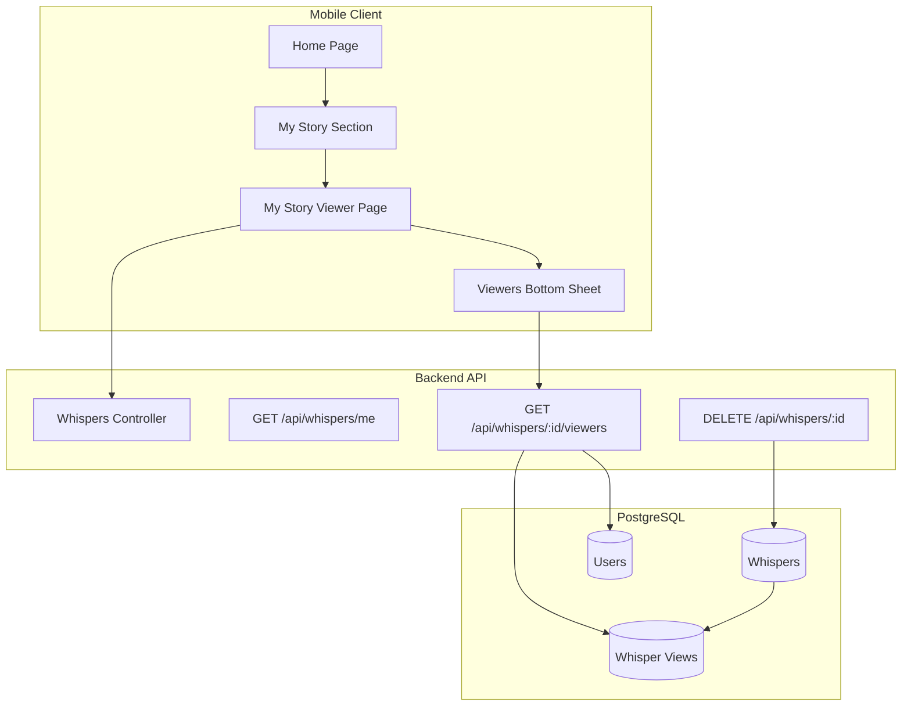
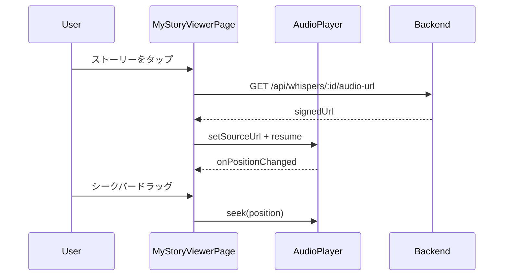
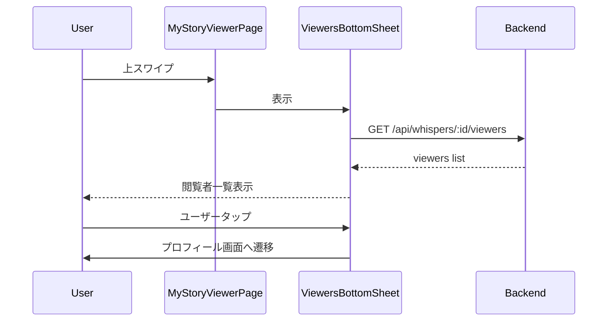
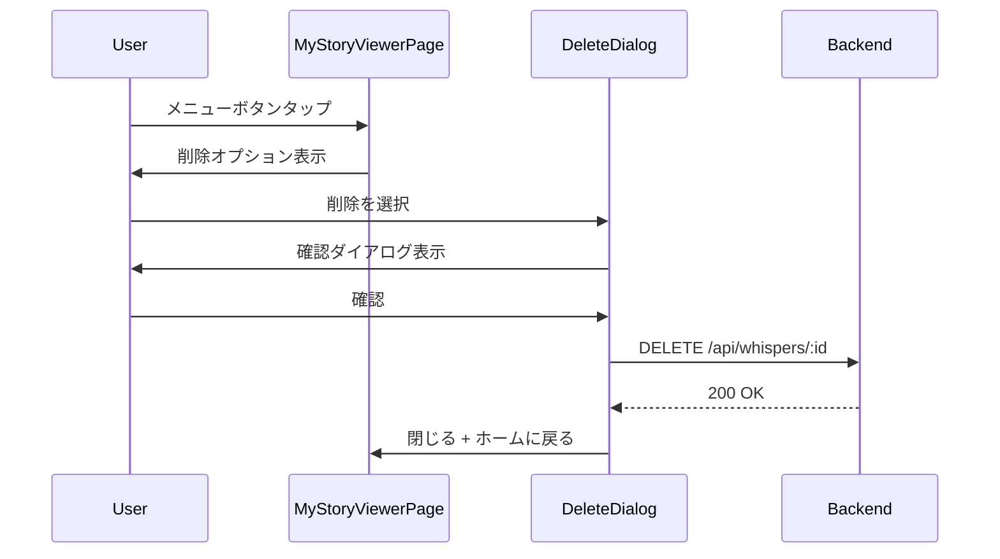

# Design Document: My Stories Viewer

## Overview
**Purpose**: 本機能は、ユーザーが自分で投稿したストーリー（音声投稿）を閲覧・管理する機能を提供する。Instagram Storiesに類似したUXで、シーク再生、閲覧者確認、削除機能を実装する。

**Users**: Voiceletの登録ユーザーが、自分の投稿した音声ストーリーの確認、閲覧者の把握、不要な投稿の削除に使用する。

**Impact**: 既存のMyStorySectionウィジェットを拡張し、新規のMyStoryViewerPageを追加する。バックエンドには閲覧者一覧取得APIとストーリー削除APIを追加する。

### Goals
- 自分のストーリーをシーク可能な形式で再生できる
- 自分のストーリーの閲覧者を確認できる
- 不要なストーリーを削除できる
- 複数の自分のストーリー間をスムーズにナビゲートできる

### Non-Goals
- 他ユーザーのストーリー閲覧機能の変更
- ストーリーの編集機能
- ストーリーのアーカイブ機能
- プッシュ通知による閲覧者通知

## Architecture

### Existing Architecture Analysis
現在のシステムでは:
- **StoryViewerPage**: 他ユーザーのストーリー再生専用。視聴記録APIを呼び出し、シークバーなし
- **MyStorySection**: 自分のWhisper一覧を横並び表示。タップ時のコールバックで処理をカスタマイズ可能
- **WhisperView**: 閲覧履歴を記録。削除時にカスケード削除

### Architecture Pattern & Boundary Map



**Architecture Integration**:
- Selected pattern: Feature-first + Controller-Service-Model（既存パターン継続）
- Domain/feature boundaries: homeフィーチャー内にMyStoryViewer関連を追加
- Existing patterns preserved: Riverpod providers、Freezed models、Fastify controllers
- New components rationale: 自分のストーリー閲覧は他ユーザー向けと要件が異なるため新規ページ作成
- Steering compliance: tech.md、structure.mdの規約に準拠

### Technology Stack

| Layer | Choice / Version | Role in Feature | Notes |
|-------|------------------|-----------------|-------|
| Frontend | Flutter 3.10+ / audioplayers | 音声再生・シークバーUI | 既存使用中 |
| Backend | Fastify 5 / Zod | API実装・バリデーション | 既存使用中 |
| Data | PostgreSQL 16 / Prisma | データ永続化 | 既存スキーマ活用 |

## System Flows

### ストーリー再生フロー



### 閲覧者一覧表示フロー



### ストーリー削除フロー



## Requirements Traceability

| Requirement | Summary | Components | Interfaces | Flows |
|-------------|---------|------------|------------|-------|
| 1.1, 1.2, 1.3, 1.4 | ストーリー一覧表示 | MyStorySection | myWhispersProvider | - |
| 2.1, 2.2, 2.3, 2.4, 2.5, 2.6 | ストーリー再生 | MyStoryViewerPage | AudioPlayer, Backend API | ストーリー再生フロー |
| 3.1, 3.2, 3.3, 3.4, 3.5 | ナビゲーション | MyStoryViewerPage | - | - |
| 4.1, 4.2, 4.3, 4.4, 4.5, 4.6 | 閲覧者一覧 | ViewersBottomSheet | GET /api/whispers/:id/viewers | 閲覧者一覧表示フロー |
| 5.1, 5.2, 5.3, 5.4, 5.5, 5.6 | 削除機能 | DeleteConfirmDialog | DELETE /api/whispers/:id | ストーリー削除フロー |
| 6.1, 6.2, 6.3, 6.4, 6.5 | 閲覧記録バックエンド | WhisperViewsController | POST /api/whisper-views | - |

## Components and Interfaces

| Component | Domain/Layer | Intent | Req Coverage | Key Dependencies | Contracts |
|-----------|--------------|--------|--------------|------------------|-----------|
| MyStoryViewerPage | Mobile/UI | 自分のストーリー再生画面 | 2.1-2.6, 3.1-3.5 | AudioPlayer (P0), homeApiService (P0) | State |
| ViewersBottomSheet | Mobile/UI | 閲覧者一覧表示 | 4.1-4.6 | viewersProvider (P0) | State |
| DeleteConfirmDialog | Mobile/UI | 削除確認ダイアログ | 5.1-5.6 | deleteWhisperProvider (P0) | - |
| viewersProvider | Mobile/Provider | 閲覧者データ取得 | 4.2-4.4 | homeApiService (P0) | Service |
| deleteWhisperProvider | Mobile/Provider | ストーリー削除処理 | 5.3-5.6 | homeApiService (P0) | Service |
| GET /api/whispers/:id/viewers | Backend/API | 閲覧者一覧取得 | 6.4, 4.2-4.4 | Prisma (P0) | API |
| DELETE /api/whispers/:id | Backend/API | ストーリー削除 | 5.3, 6.5 | Prisma (P0) | API |

### Mobile Layer

#### MyStoryViewerPage

| Field | Detail |
|-------|--------|
| Intent | 自分のストーリーを再生し、シーク・ナビゲーション・閲覧者確認・削除を提供 |
| Requirements | 2.1, 2.2, 2.3, 2.4, 2.5, 2.6, 3.1, 3.2, 3.3, 3.4, 3.5 |

**Responsibilities & Constraints**
- 自分のストーリーの音声再生とシーク操作を管理
- 左右タップによるストーリー間ナビゲーション
- 上スワイプで閲覧者一覧表示、メニューから削除操作
- 視聴記録APIは呼び出さない（自分のストーリーのため）

**Dependencies**
- Inbound: MyStorySection — ストーリー選択時に遷移 (P0)
- Outbound: ViewersBottomSheet — 閲覧者一覧表示 (P1)
- Outbound: DeleteConfirmDialog — 削除確認 (P1)
- External: audioplayers — 音声再生 (P0)

**Contracts**: State [x]

##### State Management
```dart
class MyStoryViewerState {
  final List<MyWhisper> whispers;
  final int currentIndex;
  final bool isPlaying;
  final Duration currentPosition;
  final Duration totalDuration;
  final bool isLoading;
}
```
- State model: 再生状態、現在位置、総時間、ローディング状態を管理
- Persistence: セッション内のみ（永続化不要）
- Concurrency: AudioPlayerのストリーム購読でリアルタイム更新

**Implementation Notes**
- Integration: go_routerでページ遷移、パラメータでwhispersリストとindexを受け渡し
- Validation: whispers空チェック、index範囲チェック
- Risks: 音声読み込み失敗時のエラーハンドリング必須

#### ViewersBottomSheet

| Field | Detail |
|-------|--------|
| Intent | 特定ストーリーの閲覧者一覧をボトムシートで表示 |
| Requirements | 4.1, 4.2, 4.3, 4.4, 4.5, 4.6 |

**Responsibilities & Constraints**
- 閲覧者のアバター、ユーザー名、閲覧日時を表示
- 閲覧者タップでプロフィール画面へ遷移
- 閲覧者0人の場合は空状態メッセージ表示

**Dependencies**
- Inbound: MyStoryViewerPage — 上スワイプで表示 (P0)
- Outbound: ProfilePage — ユーザータップで遷移 (P1)
- External: homeApiService — API呼び出し (P0)

**Contracts**: State [x]

##### State Management
```dart
@freezed
class ViewersState with _$ViewersState {
  const factory ViewersState({
    required List<Viewer> viewers,
    required int totalCount,
    required bool isLoading,
    String? error,
  }) = _ViewersState;
}

@freezed
class Viewer with _$Viewer {
  const factory Viewer({
    required String id,
    required String name,
    String? avatarUrl,
    required String viewedAt,
  }) = _Viewer;
}
```

**Implementation Notes**
- Integration: DraggableScrollableSheetで実装
- Validation: whisperId必須
- Risks: 大量閲覧者時のスクロールパフォーマンス（ページネーション検討）

### Backend Layer

#### GET /api/whispers/:whisperId/viewers

| Field | Detail |
|-------|--------|
| Intent | 指定Whisperの閲覧者一覧を取得 |
| Requirements | 4.2, 4.3, 4.4, 6.4 |

**Responsibilities & Constraints**
- Whisperのオーナーのみ閲覧者一覧を取得可能
- 閲覧日時の降順でソート
- ユーザー情報（id, name, avatarPath）を含む

**Dependencies**
- Inbound: ViewersBottomSheet — 閲覧者一覧取得 (P0)
- External: Prisma — DB操作 (P0)

**Contracts**: API [x]

##### API Contract
| Method | Endpoint | Request | Response | Errors |
|--------|----------|---------|----------|--------|
| GET | /api/whispers/:whisperId/viewers | Query: userId | ViewersResponse | 401, 403, 404 |

```typescript
// Request
interface ViewersQueryParams {
  userId: string;  // リクエスト元ユーザーID
}

// Response
interface ViewersResponse {
  data: Viewer[];
  totalCount: number;
}

interface Viewer {
  id: string;
  name: string;
  avatarUrl: string | null;
  viewedAt: string;  // ISO 8601
}
```

**Implementation Notes**
- Integration: controller/whispers/_whisperId/viewers/controller.ts に配置
- Validation: userIdがWhisperのownerか検証（403エラー）
- Risks: N+1クエリ回避のためincludeでユーザー情報を取得

#### DELETE /api/whispers/:whisperId

| Field | Detail |
|-------|--------|
| Intent | 指定Whisperを削除 |
| Requirements | 5.3, 6.5 |

**Responsibilities & Constraints**
- Whisperのオーナーのみ削除可能
- 削除時にWhisperViewも自動削除（onDelete: Cascade）
- GCSの音声ファイルも削除

**Dependencies**
- Inbound: DeleteConfirmDialog — 削除実行 (P0)
- External: Prisma — DB操作 (P0)
- External: GCS — ファイル削除 (P0)

**Contracts**: API [x]

##### API Contract
| Method | Endpoint | Request | Response | Errors |
|--------|----------|---------|----------|--------|
| DELETE | /api/whispers/:whisperId | Query: userId | DeleteResponse | 401, 403, 404, 500 |

```typescript
// Request
interface DeleteQueryParams {
  userId: string;  // リクエスト元ユーザーID
}

// Response
interface DeleteResponse {
  message: string;
}
```

**Implementation Notes**
- Integration: controller/whispers/_whisperId/controller.ts に追加
- Validation: userIdがWhisperのownerか検証（403エラー）
- Risks: GCS削除失敗時のロールバック処理

## Data Models

### Domain Model
- **Whisper**: 音声投稿（Aggregate Root）
- **WhisperView**: 閲覧履歴（Whisperの子エンティティ）
- **User**: ユーザー（閲覧者情報の参照用）

### Logical Data Model
既存スキーマで対応可能。新規テーブル追加なし。

**Structure Definition**:
- Whisper 1:N WhisperView（1つのWhisperに複数の閲覧記録）
- WhisperView N:1 User（閲覧者情報）
- User 1:N Whisper（1人のユーザーが複数のWhisperを投稿）

**Consistency & Integrity**:
- `@@unique([userId, whisperId])`で重複閲覧記録を防止
- `onDelete: Cascade`でWhisper削除時に閲覧記録も削除

### Data Contracts & Integration

**API Data Transfer**
```typescript
// 閲覧者一覧レスポンス
const viewersResponseSchema = z.object({
  data: z.array(z.object({
    id: z.string(),
    name: z.string(),
    avatarUrl: z.string().nullable(),
    viewedAt: z.string(),
  })),
  totalCount: z.number(),
});

// 削除レスポンス
const deleteResponseSchema = z.object({
  message: z.string(),
});
```

## Error Handling

### Error Strategy
- ユーザーエラー: フィールドレベルのバリデーションエラー表示
- システムエラー: 汎用エラーメッセージ + リトライ誘導
- ビジネスロジックエラー: 具体的な理由を説明

### Error Categories and Responses
- **401 Unauthorized**: ユーザー未認証 → ログイン画面へ誘導
- **403 Forbidden**: 他ユーザーのWhisperにアクセス → エラートースト表示
- **404 Not Found**: Whisper不存在 → ホーム画面に戻る
- **500 Internal Server Error**: サーバーエラー → リトライボタン表示

### Monitoring
- 削除API呼び出し時のログ記録（userId, whisperId, timestamp）
- エラー発生時のSentry送信

## Testing Strategy

### Unit Tests
- MyStoryViewerPage: シーク操作、ナビゲーションロジック
- viewersProvider: API呼び出し、エラーハンドリング
- deleteWhisperProvider: 削除処理、状態更新

### Integration Tests
- 閲覧者一覧API: 正常系、権限エラー、空レスポンス
- 削除API: 正常系、権限エラー、GCS削除失敗

### E2E/UI Tests
- ストーリー再生からシークバー操作
- 閲覧者一覧表示からプロフィール遷移
- 削除フロー（確認ダイアログ→削除完了）

## Security Considerations

### Authorization
- 閲覧者一覧API: Whisperオーナーのみアクセス可能
- 削除API: Whisperオーナーのみ実行可能
- userIdパラメータとリクエスト元の検証必須

### Data Protection
- 閲覧者情報は公開範囲が限定（オーナーのみ）
- GCS署名付きURLの有効期限管理
