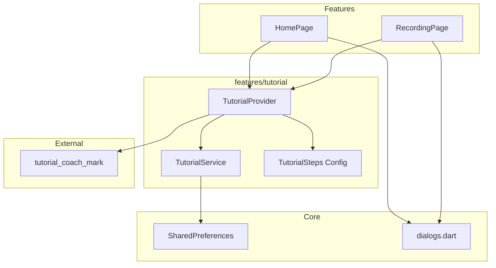
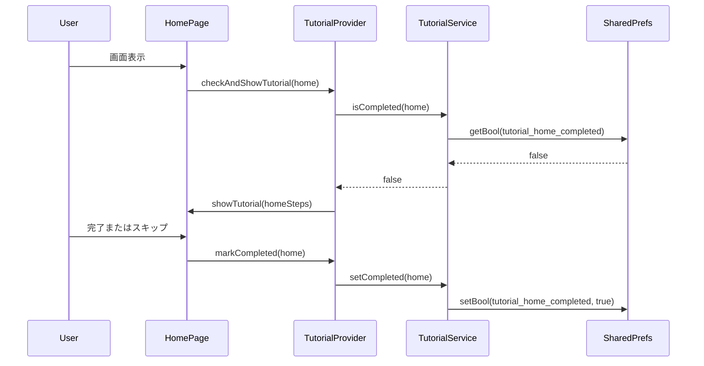
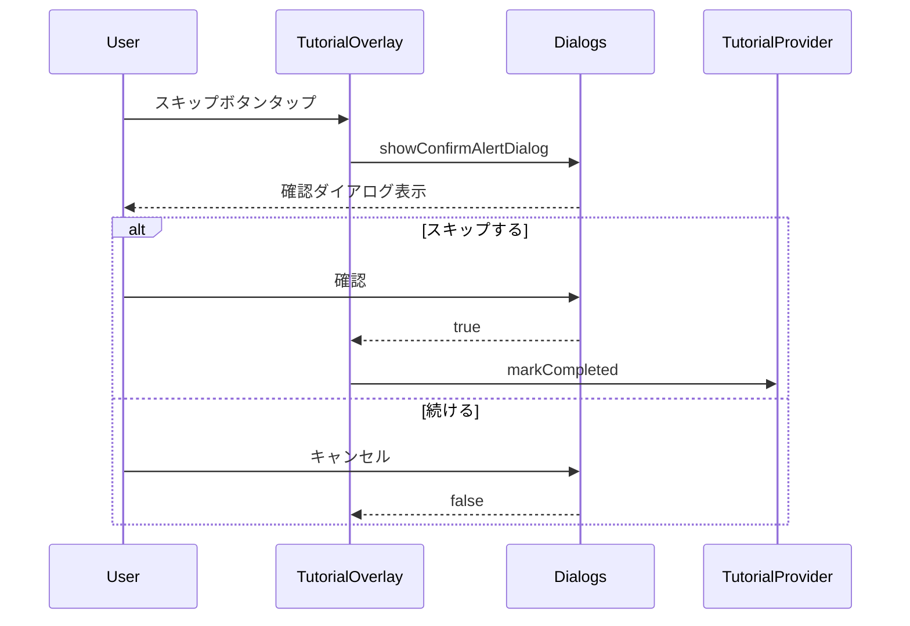
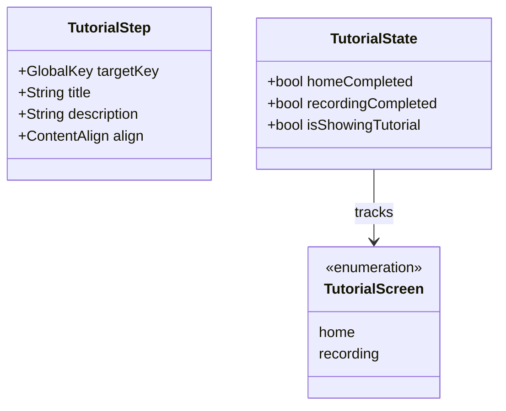

# Design Document: Onboarding Feature

## Overview

**Purpose**: 本機能は、新規ユーザーがアプリの操作方法を直感的に学べるインタラクティブなチュートリアル体験を提供する。

**Users**: 初めてアプリを使用するユーザー、および操作方法を復習したい既存ユーザーが対象。

**Impact**: ホーム画面と録音画面に対して、オーバーレイ形式のチュートリアルを追加し、復習ボタンを配置する。

### Goals
- 初回起動時にホーム画面と録音画面のチュートリアルを順次表示
- 各画面に復習ボタンを配置し、任意のタイミングで再学習可能にする
- 途中離脱機能により、経験豊富なユーザーの時間を節約

### Non-Goals
- サーバーサイドでのチュートリアル完了状態の同期
- 多言語対応（現時点では日本語のみ）
- A/Bテストやアナリティクス連携

## Architecture

### Existing Architecture Analysis

現在のアプリは Feature-first アーキテクチャを採用しており、各機能は `features/{feature}/` 配下に独立して配置されている。状態管理は Riverpod、ルーティングは go_router を使用。

**維持すべきパターン**:
- Feature-first ディレクトリ構成
- Riverpod による状態管理
- 既存の `dialogs.dart` ユーティリティの再利用

**注意点**:
- 既存の `features/auth/pages/onboarding_page.dart` はプロフィール入力画面であり、本機能とは別物

### Architecture Pattern & Boundary Map



**Architecture Integration**:
- **Selected pattern**: Feature Module（`features/tutorial/`）
- **Domain boundaries**: チュートリアル関連のロジックは `features/tutorial/` に集約、各画面は Provider 経由で利用
- **Existing patterns preserved**: Feature-first、Riverpod、core utilities
- **New components rationale**: 状態永続化とステップ管理を分離し、テスト容易性を確保
- **Steering compliance**: tech.md の Riverpod パターン、structure.md の Feature-first 構成に準拠

### Technology Stack

| Layer | Choice / Version | Role in Feature | Notes |
|-------|------------------|-----------------|-------|
| UI Overlay | tutorial_coach_mark ^1.3.3 | チュートリアルオーバーレイ表示 | GlobalKey ベース |
| State Management | flutter_riverpod ^2.4.9 | チュートリアル状態管理 | 既存パターン踏襲 |
| Local Storage | shared_preferences ^2.5.4 | 完了状態の永続化 | 新規依存 |
| Dialogs | core/utils/dialogs.dart | 離脱確認ダイアログ | 既存再利用 |

## System Flows

### 初回起動フロー



### スキップ確認フロー



## Requirements Traceability

| Requirement | Summary | Components | Interfaces | Flows |
|-------------|---------|------------|------------|-------|
| 1.1 | 初回起動時にホーム画面チュートリアル表示 | TutorialProvider, HomePage | TutorialService | 初回起動フロー |
| 1.2 | ホーム完了後、録音画面初回アクセス時にチュートリアル表示 | TutorialProvider, RecordingPage | TutorialService | 初回起動フロー |
| 1.3 | 完了状態をローカルストレージに永続化 | TutorialService | SharedPreferences | - |
| 1.4 | 再インストール時にリセット | - | SharedPreferences | 自動 |
| 2.1-2.5 | ホーム画面チュートリアルのステップ表示 | HomeTutorialSteps | tutorial_coach_mark | - |
| 3.1-3.5 | 録音画面チュートリアルのステップ表示 | RecordingTutorialSteps | tutorial_coach_mark | - |
| 4.1-4.5 | 復習機能（復習ボタンと再表示） | HomePage, RecordingPage | TutorialProvider | - |
| 5.1-5.5 | スキップ機能（確認ダイアログ付き） | TutorialOverlay | dialogs.dart | スキップ確認フロー |
| 6.1-6.5 | UI/UX（ハイライト、オーバーレイ、アニメーション） | - | tutorial_coach_mark | パッケージ標準機能 |

## Components and Interfaces

| Component | Domain/Layer | Intent | Req Coverage | Key Dependencies | Contracts |
|-----------|--------------|--------|--------------|------------------|-----------|
| TutorialService | Service | 完了状態の永続化を管理 | 1.3, 1.4 | SharedPreferences (P0) | Service |
| TutorialProvider | Provider | チュートリアル状態とフロー制御 | 1.1, 1.2, 4.1-4.5 | TutorialService (P0), tutorial_coach_mark (P0) | State |
| HomeTutorialSteps | Config | ホーム画面のステップ定義 | 2.1-2.5 | - | - |
| RecordingTutorialSteps | Config | 録音画面のステップ定義 | 3.1-3.5 | - | - |
| HomePage (修正) | UI | 復習ボタン追加 | 4.1, 4.2 | TutorialProvider (P1) | - |
| RecordingPage (修正) | UI | 復習ボタン追加 | 4.3, 4.4 | TutorialProvider (P1) | - |

### Service Layer

#### TutorialService

| Field | Detail |
|-------|--------|
| Intent | オンボーディング完了状態の永続化を管理 |
| Requirements | 1.3, 1.4 |

**Responsibilities & Constraints**
- チュートリアル完了状態の読み取り・書き込み
- SharedPreferences へのアクセスをカプセル化
- 画面ごとに独立したフラグを管理

**Dependencies**
- External: SharedPreferences — 状態永続化 (P0)

**Contracts**: Service [x]

##### Service Interface
```dart
abstract class TutorialService {
  /// 指定画面のチュートリアルが完了済みかを確認
  Future<bool> isCompleted(TutorialScreen screen);

  /// 指定画面のチュートリアルを完了済みとしてマーク
  Future<void> setCompleted(TutorialScreen screen);

  /// 全てのチュートリアル状態をリセット（デバッグ用）
  Future<void> resetAll();
}

enum TutorialScreen {
  home,
  recording,
}
```

- Preconditions: SharedPreferences が初期化済み
- Postconditions: 状態変更は即座に永続化される
- Invariants: 一度完了した状態は resetAll() 以外で変更されない

**Implementation Notes**
- Integration: SharedPreferencesAsync を使用、キー形式は `tutorial_{screen}_completed`
- Validation: 不正な画面識別子は例外をスロー
- Risks: SharedPreferences 初期化前のアクセス → アプリ起動時に初期化を保証

### Provider Layer

#### TutorialProvider

| Field | Detail |
|-------|--------|
| Intent | チュートリアル表示フローの制御と状態管理 |
| Requirements | 1.1, 1.2, 4.1-4.5 |

**Responsibilities & Constraints**
- 画面表示時のチュートリアル表示判定
- TutorialCoachMark インスタンスの生成と表示
- 復習モードの制御

**Dependencies**
- Inbound: HomePage, RecordingPage — チュートリアル表示トリガー (P1)
- Outbound: TutorialService — 完了状態管理 (P0)
- External: tutorial_coach_mark — オーバーレイ表示 (P0)

**Contracts**: State [x]

##### State Management
```dart
@freezed
class TutorialState with _$TutorialState {
  const factory TutorialState({
    @Default(false) bool homeCompleted,
    @Default(false) bool recordingCompleted,
    @Default(false) bool isShowingTutorial,
  }) = _TutorialState;
}

final tutorialProvider = StateNotifierProvider<TutorialNotifier, TutorialState>((ref) {
  return TutorialNotifier(ref.read(tutorialServiceProvider));
});
```

- State model: Freezed によるイミュータブル状態
- Persistence: TutorialService 経由で SharedPreferences に永続化
- Concurrency: 同時に1つのチュートリアルのみ表示可能

**Implementation Notes**
- Integration: 各画面の `initState` または `didChangeDependencies` で `checkAndShowTutorial` を呼び出し
- Validation: 既にチュートリアル表示中の場合は新規表示をブロック
- Risks: 画面遷移中のチュートリアル表示 → `isShowingTutorial` フラグで排他制御

### Configuration Layer

#### HomeTutorialSteps / RecordingTutorialSteps

| Field | Detail |
|-------|--------|
| Intent | 各画面のチュートリアルステップを定義 |
| Requirements | 2.1-2.5, 3.1-3.5 |

**Responsibilities & Constraints**
- GlobalKey とターゲットウィジェットの対応付け
- ステップごとの説明テキストとポジション設定
- 純粋な設定データとして実装（ロジックを含まない）

**Implementation Notes**
- 各画面で必要な GlobalKey を定義し、ステップ設定で参照
- ステップ数: ホーム画面 4-5 ステップ、録音画面 3-4 ステップを想定

## Data Models

### Domain Model



### Logical Data Model

**SharedPreferences Keys**:
| Key | Type | Description |
|-----|------|-------------|
| `tutorial_home_completed` | bool | ホーム画面チュートリアル完了フラグ |
| `tutorial_recording_completed` | bool | 録音画面チュートリアル完了フラグ |

**Consistency & Integrity**:
- 各フラグは独立して管理、トランザクション不要
- アプリ再インストール時に自動クリア

## Error Handling

### Error Strategy

本機能はユーザー体験を向上させる補助機能であり、エラー発生時はサイレントに処理し、メイン機能に影響を与えない。

### Error Categories and Responses

**System Errors**:
- SharedPreferences 読み取り失敗 → 未完了として扱い、チュートリアル表示
- SharedPreferences 書き込み失敗 → ログ出力のみ、次回起動時に再表示

**UI Errors**:
- GlobalKey 参照切れ → 該当ステップをスキップ、次のステップへ進む

### Monitoring

- debugPrint でエラーログ出力
- 本番環境での詳細なモニタリングは将来検討

## Testing Strategy

### Unit Tests
- TutorialService: `isCompleted`, `setCompleted`, `resetAll` の動作確認
- TutorialState: Freezed モデルの等価性とコピー動作

### Integration Tests
- HomePage + TutorialProvider: 初回表示時のチュートリアル起動
- RecordingPage + TutorialProvider: ホーム完了後の録音画面チュートリアル起動
- 復習ボタンタップ時の再表示

### E2E/UI Tests
- 初回起動から両画面のチュートリアル完了までのフロー
- スキップ確認ダイアログの動作
- 復習ボタンからの再表示

## Optional Sections

### Performance & Scalability

**Target Metrics**:
- チュートリアル表示までの遅延: < 100ms
- SharedPreferences 読み取り: < 50ms

**Optimization**:
- SharedPreferencesWithCache の使用を検討（頻繁な読み取りがある場合）
- 現状は SharedPreferencesAsync で十分
