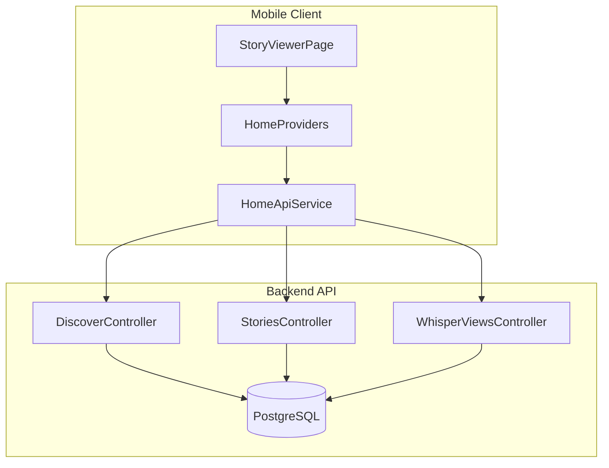
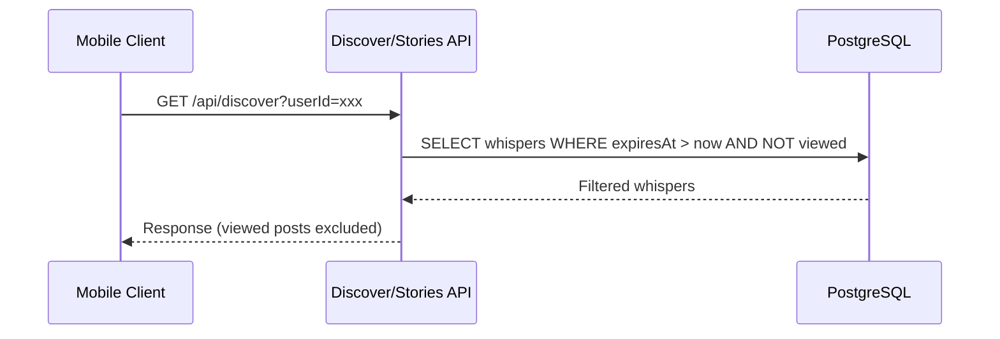
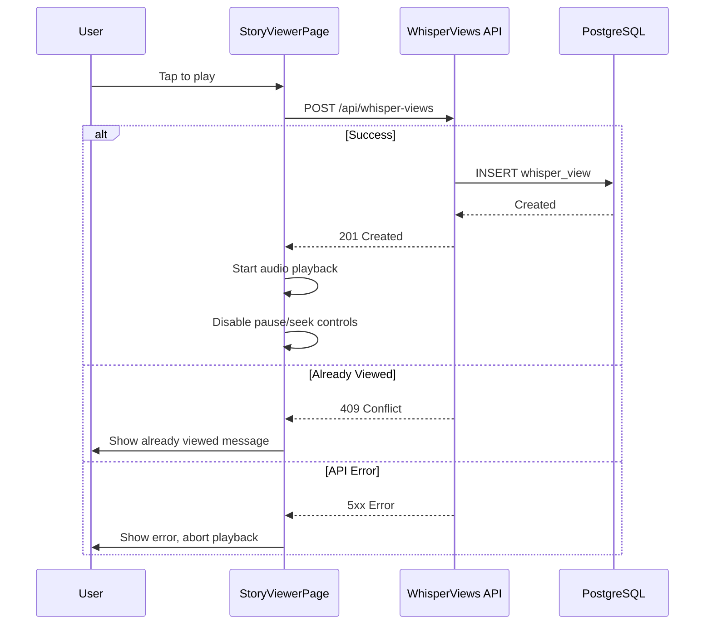
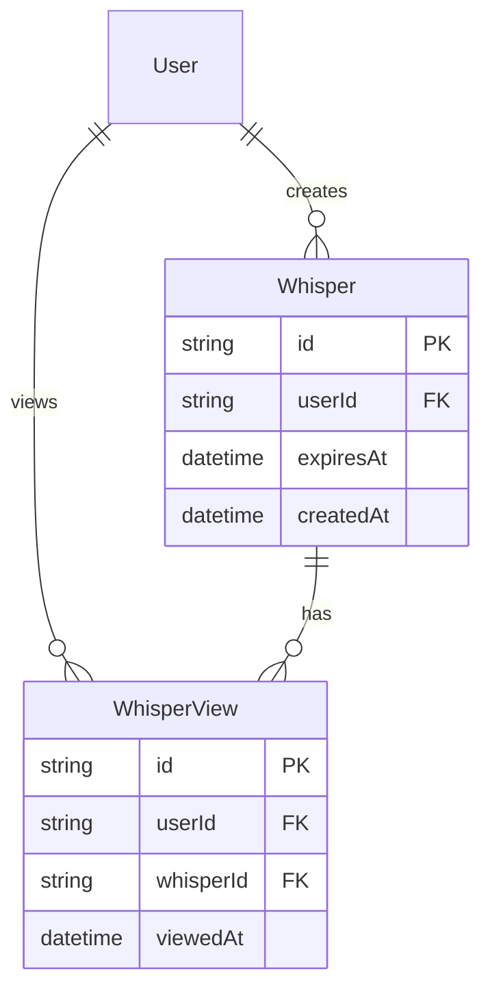

# Technical Design: post-viewing-constraints

## Overview

**Purpose**: 他人の投稿視聴時に3つの制約（有効期限フィルタ、再生制御、視聴済み除外）を付与し、音声コンテンツの希少性と一期一会の体験価値を実現する。

**Users**: Voiceletの一般ユーザーが、他人の投稿を視聴する際にこの制約を体験する。

**Impact**: 既存のdiscover/stories APIのクエリ条件を拡張し、モバイルクライアントの再生制御ロジックを変更する。

### Goals
- 有効期限切れの投稿を完全にフィルタリングする
- 視聴開始と同時に視聴記録を永続化し、再視聴を不可にする
- 再生中の一時停止・シーク操作を禁止する

### Non-Goals
- 自分自身の投稿への制約適用（自分の投稿は対象外）
- オフライン視聴のサポート
- 視聴履歴の削除機能

## Architecture

### Existing Architecture Analysis

現在のシステムは以下の構成を持つ:

- **Backend**: Fastify + Prisma (Controller-Service-Model パターン)
- **Mobile**: Flutter + Riverpod (Feature-first構成)
- **視聴記録**: `WhisperView`モデルが既に存在し、`POST /api/whisper-views` で記録可能
- **有効期限フィルタ**: discover/stories APIで `expiresAt > now` 条件を適用済み

### Architecture Pattern & Boundary Map



**Architecture Integration**:
- Selected pattern: 既存Controller拡張（最小限の変更）
- Domain boundaries: 視聴制約はAPIレイヤーとUIレイヤーに分散
- Existing patterns preserved: Controller-Service-Model、Feature-first
- New components rationale: 新規コンポーネント不要、既存拡張のみ
- Steering compliance: モノレポ構成、Prisma ORM使用を維持

### Technology Stack

| Layer | Choice / Version | Role in Feature | Notes |
|-------|------------------|-----------------|-------|
| Backend | Fastify 5 + Prisma | APIクエリ条件拡張 | 既存スタック維持 |
| Mobile | Flutter 3.10+ / audioplayers | 再生制御の制限 | 既存パッケージ使用 |
| Data | PostgreSQL 16 | WhisperView永続化 | 既存スキーマ使用 |

## System Flows

### 投稿一覧取得フロー（視聴済み除外）



### 視聴開始フロー（即時記録）



## Requirements Traceability

| Requirement | Summary | Components | Interfaces | Flows |
|-------------|---------|------------|------------|-------|
| 1.1, 1.2, 1.3 | 有効期限フィルタリング | DiscoverController, StoriesController | API Query | 投稿一覧取得 |
| 2.1, 2.5 | 再生制御（一時停止・シーク禁止） | StoryViewerPage | - | - |
| 2.2, 2.3 | 視聴記録の即時永続化 | StoryViewerPage, WhisperViewsController | POST /api/whisper-views | 視聴開始 |
| 2.4 | API失敗時の再生中断 | StoryViewerPage | - | 視聴開始 |
| 3.1 | 視聴済み投稿の除外 | DiscoverController, StoriesController | API Query | 投稿一覧取得 |
| 3.2 | 視聴記録のサーバー側永続化 | WhisperViewsController | POST /api/whisper-views | - |
| 3.3 | 視聴済み投稿の再生防止 | StoryViewerPage | - | 視聴開始 |
| 4.1, 4.2, 4.3 | 視聴記録データモデル | WhisperView (既存) | - | - |

## Components and Interfaces

| Component | Domain/Layer | Intent | Req Coverage | Key Dependencies | Contracts |
|-----------|--------------|--------|--------------|------------------|-----------|
| DiscoverController | Backend/API | おすすめ投稿取得（制約付き） | 1.1, 1.2, 1.3, 3.1 | Prisma (P0) | API |
| StoriesController | Backend/API | フォロー中投稿取得（制約付き） | 1.1, 1.2, 1.3, 3.1 | Prisma (P0) | API |
| WhisperViewsController | Backend/API | 視聴記録の永続化 | 2.3, 4.1, 4.2, 4.3 | Prisma (P0) | API |
| StoryViewerPage | Mobile/UI | 再生制御と視聴記録送信 | 2.1, 2.2, 2.4, 2.5, 3.3 | AudioPlayer (P0), HomeApiService (P0) | State |

### Backend / API Layer

#### DiscoverController

| Field | Detail |
|-------|--------|
| Intent | おすすめユーザーの未視聴投稿を取得する |
| Requirements | 1.1, 1.2, 1.3, 3.1 |

**Responsibilities & Constraints**
- expiresAtが現在時刻より未来の投稿のみを返却
- リクエストユーザーが視聴済みの投稿を除外
- フィルタリングはサーバーサイドで実行

**Dependencies**
- Outbound: Prisma — データベースクエリ (P0)

**Contracts**: API [x]

##### API Contract

| Method | Endpoint | Request | Response | Errors |
|--------|----------|---------|----------|--------|
| GET | /api/discover | `{ userId, page, limit }` | `{ data: DiscoverUser[], pagination }` | 401 |
| GET | /api/discover/:targetUserId/stories | `{ userId }` | `{ user, stories: Story[] }` | - |

**Implementation Notes**
- クエリ条件に `NOT: { views: { some: { userId } } }` を追加
- `/stories` エンドポイントでは視聴済み投稿を除外して返却

---

#### StoriesController

| Field | Detail |
|-------|--------|
| Intent | フォロー中ユーザーの未視聴投稿を取得する |
| Requirements | 1.1, 1.2, 1.3, 3.1 |

**Responsibilities & Constraints**
- expiresAtが現在時刻より未来の投稿のみを返却
- リクエストユーザーが視聴済みの投稿を除外
- ユーザーごとにグループ化して返却

**Dependencies**
- Outbound: Prisma — データベースクエリ (P0)

**Contracts**: API [x]

##### API Contract

| Method | Endpoint | Request | Response | Errors |
|--------|----------|---------|----------|--------|
| GET | /api/stories | `{ userId }` | `{ data: UserStory[] }` | 401 |

**Implementation Notes**
- クエリ条件に `NOT: { views: { some: { userId } } }` を追加
- hasUnviewedフラグは視聴済み除外により常にtrueとなるため削除可能

---

#### WhisperViewsController

| Field | Detail |
|-------|--------|
| Intent | 視聴記録を永続化する |
| Requirements | 2.3, 4.1, 4.2, 4.3 |

**Responsibilities & Constraints**
- userId × whisperIdの組み合わせで一意の視聴記録を作成
- 重複登録時は409エラーを返却（既存実装を維持）

**Dependencies**
- Outbound: Prisma — データベース書き込み (P0)

**Contracts**: API [x]

##### API Contract

| Method | Endpoint | Request | Response | Errors |
|--------|----------|---------|----------|--------|
| POST | /api/whisper-views | `{ userId, whisperId }` | `{ message, view }` | 409 (重複) |

**Implementation Notes**
- 既存実装で要件を満たしている
- 変更不要

---

### Mobile / UI Layer

#### StoryViewerPage

| Field | Detail |
|-------|--------|
| Intent | 音声投稿の再生と視聴制御を行う |
| Requirements | 2.1, 2.2, 2.4, 2.5, 3.3 |

**Responsibilities & Constraints**
- 再生開始前に視聴記録APIを呼び出す
- API成功後のみ音声再生を開始
- 再生中は一時停止・シーク操作を無効化

**Dependencies**
- Outbound: HomeApiService — 視聴記録API呼び出し (P0)
- External: AudioPlayer — 音声再生制御 (P0)

**Contracts**: State [x]

##### State Management

```dart
// 再生状態
enum PlaybackState {
  idle,      // 再生前
  recording, // 視聴記録中（API呼び出し中）
  playing,   // 再生中（操作不可）
  completed, // 再生完了
  error,     // エラー
}

// 状態遷移
// idle -> recording -> playing -> completed
// idle -> recording -> error
// idle -> error (既に視聴済み)
```

**Implementation Notes**
- `_loadCurrentStory()` の処理順序を変更: API呼び出し → 成功時のみ再生開始
- `_togglePlayPause()` を再生中は無効化
- GestureDetectorの中央タップ（一時停止トグル）を再生中は無視
- 視聴記録API失敗時はSnackBarでエラー表示し、再生を開始しない

## Data Models

### Domain Model



**Business Rules & Invariants**:
- WhisperViewは `(userId, whisperId)` の組み合わせで一意
- expiresAtを過ぎたWhisperは一覧から除外される
- 一度作成されたWhisperViewは削除不可

### Physical Data Model

既存のスキーマを使用。変更不要。

```sql
-- whisper_views テーブル（既存）
CREATE TABLE whisper_views (
  id UUID PRIMARY KEY DEFAULT gen_random_uuid(),
  user_id UUID NOT NULL REFERENCES users(id) ON DELETE CASCADE,
  whisper_id UUID NOT NULL REFERENCES whispers(id) ON DELETE CASCADE,
  viewed_at TIMESTAMP DEFAULT NOW(),
  UNIQUE(user_id, whisper_id)
);

CREATE INDEX idx_whisper_views_user_id ON whisper_views(user_id);
CREATE INDEX idx_whisper_views_whisper_id ON whisper_views(whisper_id);
```

## Error Handling

### Error Categories and Responses

**User Errors (4xx)**:
- 409 Conflict: 既に視聴済みの投稿を再度視聴しようとした場合 → 「この投稿は既に視聴済みです」

**System Errors (5xx)**:
- 視聴記録API失敗 → 再生を開始せず「エラーが発生しました」を表示

**Business Logic Errors**:
- 視聴済み投稿の再生試行（クライアント側ガード） → 再生を開始しない

### Monitoring

- 視聴記録API呼び出し回数と成功率
- 409レスポンスの発生頻度（不正な再視聴試行の検知）

## Testing Strategy

### Unit Tests
- DiscoverController: 有効期限切れ投稿の除外
- DiscoverController: 視聴済み投稿の除外
- StoriesController: 有効期限切れ投稿の除外
- StoriesController: 視聴済み投稿の除外

### Integration Tests
- 視聴記録作成 → 投稿一覧から除外される
- 重複視聴記録 → 409エラー
- 有効期限切れ投稿 → 一覧に表示されない

### E2E/UI Tests
- 再生開始 → 一時停止ボタンが無効
- 再生開始 → 視聴記録が作成される
- 視聴済み投稿 → 再生不可
