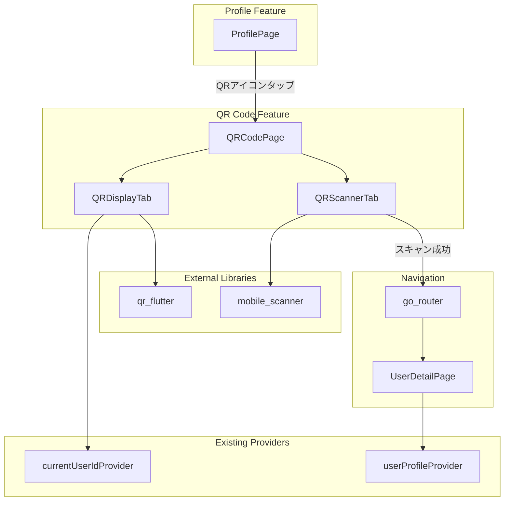
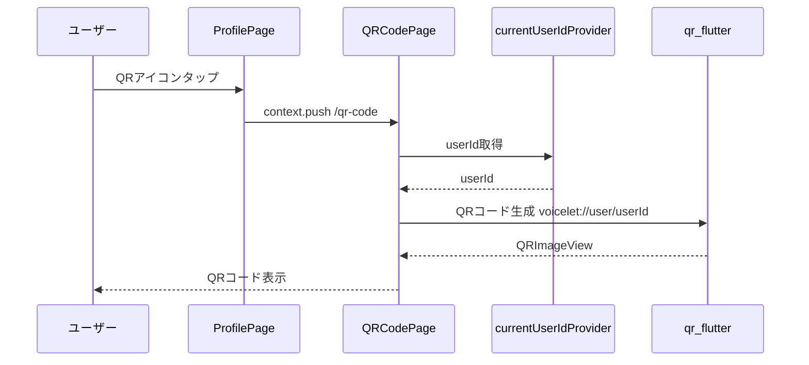
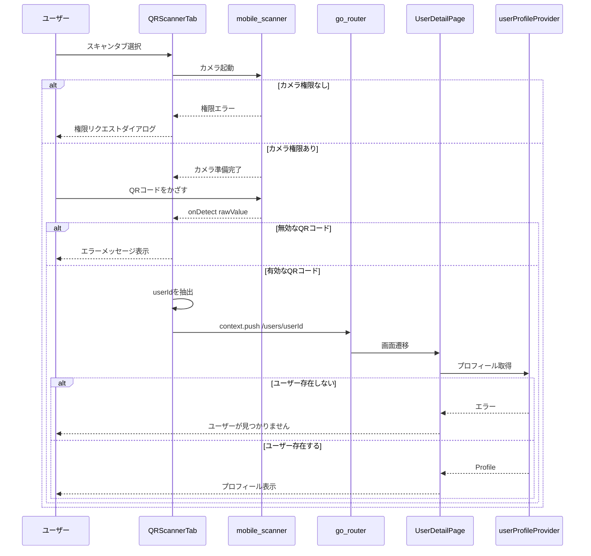

# Technical Design: QRコードフォロー機能

## Overview

**Purpose**: QRコードを使った対面でのユーザー交換機能を提供する。ユーザーは自分のプロフィールに紐づいたQRコードを表示し、他のユーザーがスキャンすることで素早くプロフィール画面にアクセスできる。

**Users**: 対面でユーザー交換を行いたいすべてのVoiceletユーザー。イベントや友人との出会いの場面で活用される。

**Impact**: 既存のプロフィール画面にQRコード機能へのエントリーポイントを追加し、新規feature（`qr_code`）を導入する。

### Goals
- ユーザーが自分のQRコードを即座に表示できる
- QRスキャンで対象ユーザーのプロフィールに1アクションで遷移
- オフライン状態でも自分のQRコード表示が可能

### Non-Goals
- QRコードの保存・シェア機能（将来検討）
- Deep Linkによるアプリ外からの遷移（将来検討）
- QRコードのカスタムデザイン機能

## Architecture

### Existing Architecture Analysis

**変更対象の既存コンポーネント**:
- `profile_page.dart`: AppBarにQRコードアイコンを追加
- `main.dart`: `/qr-code`ルートを追加

**再利用する既存コンポーネント**:
- `currentUserIdProvider`: 現在のユーザーID取得
- `userProfileProvider`: スキャン後のユーザー存在確認
- `/users/:userId`ルート: プロフィール画面遷移

**維持すべきパターン**:
- Feature-firstディレクトリ構成
- Riverpodによる状態管理
- go_routerによるルーティング
- AppThemeによるUIスタイリング

### Architecture Pattern & Boundary Map



**Architecture Integration**:
- **Selected pattern**: Hybrid（既存パターン踏襲 + 独立feature作成）
- **Domain boundaries**: QRコード機能は独立featureとして分離、プロフィール機能との結合は最小限（エントリーポイントのみ）
- **Existing patterns preserved**: Feature-first構成、Riverpodプロバイダー、go_routerルーティング
- **New components rationale**: QRコード表示・スキャンは専用UIが必要、既存コンポーネントの肥大化を防ぐ
- **Steering compliance**: モノレポ構成、Feature isolation原則を維持

### Technology Stack

| Layer | Choice / Version | Role in Feature | Notes |
|-------|------------------|-----------------|-------|
| Mobile / UI | Flutter 3.10+ | 画面実装、ウィジェット | 既存 |
| QR Generation | qr_flutter 4.1.0 | QRコード画像生成 | 新規追加 |
| QR Scanning | mobile_scanner 7.1.4 | カメラ制御、QR検出 | 新規追加 |
| State | Riverpod | ユーザー情報取得 | 既存プロバイダー再利用 |
| Navigation | go_router | 画面遷移 | 既存ルート拡張 |

## System Flows

### QRコード表示フロー



### QRコードスキャンフロー



**Key Decisions**:
- スキャン成功時は即座に遷移（確認ダイアログなし）
- ユーザー存在確認は遷移先の`UserDetailPage`で既存の処理を活用
- カメラ権限はOS標準ダイアログを使用

## Requirements Traceability

| Requirement | Summary | Components | Interfaces | Flows |
|-------------|---------|------------|------------|-------|
| 1.1 | QRコード画面表示 | QRCodePage, QRDisplayTab | - | QR表示フロー |
| 1.2 | userIdを含むQRコード | QRDisplayTab | QRデータ形式 | - |
| 1.3 | プロフィール情報表示 | QRDisplayTab | currentUserIdProvider | - |
| 1.4 | オフライン表示可能 | qr_flutter | - | - |
| 2.1 | カメラ起動 | QRScannerTab, mobile_scanner | - | スキャンフロー |
| 2.2 | プロフィール遷移 | QRScannerTab, go_router | - | スキャンフロー |
| 2.3 | カメラ権限リクエスト | mobile_scanner, Info.plist | - | スキャンフロー |
| 2.4 | 無効QRエラー | QRScannerTab | - | スキャンフロー |
| 2.5 | ユーザー不在エラー | UserDetailPage | userProfileProvider | スキャンフロー |
| 2.6 | 自分自身のスキャン | QRScannerTab | currentUserIdProvider | - |
| 3.1 | エントリーポイント | ProfilePage | - | - |
| 3.2 | タブ切り替え | QRCodePage | TabController | - |
| 3.3 | 戻るボタン | QRCodePage | AppBar | - |
| 4.1 | ネットワークエラー | UserDetailPage | - | - |
| 4.2 | オフライン状態表示 | QRScannerTab | - | - |

## Components and Interfaces

| Component | Domain/Layer | Intent | Req Coverage | Key Dependencies | Contracts |
|-----------|--------------|--------|--------------|------------------|-----------|
| QRCodePage | UI / Page | QR機能のメイン画面、タブ切り替え | 3.2, 3.3 | TabController (P0) | State |
| QRDisplayTab | UI / Widget | 自分のQRコード表示 | 1.1, 1.2, 1.3, 1.4 | qr_flutter (P0), currentUserIdProvider (P0) | - |
| QRScannerTab | UI / Widget | QRコードスキャン | 2.1, 2.2, 2.3, 2.4, 2.6, 4.2 | mobile_scanner (P0), go_router (P0) | - |
| ProfilePage（変更） | UI / Page | QRアイコン追加 | 3.1 | QRCodePage (P1) | - |

### UI Layer

#### QRCodePage

| Field | Detail |
|-------|--------|
| Intent | QR機能のメイン画面、表示/スキャンのタブ切り替えを提供 |
| Requirements | 3.2, 3.3 |

**Responsibilities & Constraints**
- タブ（表示/スキャン）の状態管理
- AppBarと戻るボタンの提供
- 子ウィジェット（QRDisplayTab, QRScannerTab）の切り替え

**Dependencies**
- Inbound: ProfilePage — QRアイコンタップで遷移 (P1)
- Outbound: QRDisplayTab, QRScannerTab — タブコンテンツ (P0)

**Contracts**: State [x]

##### State Management
- **State model**: `TabController`による現在のタブインデックス管理
- **Persistence**: 不要（画面離脱時にリセット）
- **Concurrency**: 不要

**Implementation Notes**
- `SingleTickerProviderStateMixin`を使用
- 初期タブは「自分のQRコード」（index: 0）

---

#### QRDisplayTab

| Field | Detail |
|-------|--------|
| Intent | 現在のユーザーのQRコードとプロフィール情報を表示 |
| Requirements | 1.1, 1.2, 1.3, 1.4 |

**Responsibilities & Constraints**
- `currentUserIdProvider`からuserIdを取得
- `voicelet://user/{userId}`形式でQRコード生成
- アバター、名前、ユーザー名の表示
- オフラインでも表示可能（qr_flutterはローカル生成）

**Dependencies**
- Inbound: QRCodePage — タブコンテンツとして表示 (P0)
- External: qr_flutter — QRコード生成 (P0)
- External: currentUserIdProvider — userId取得 (P0)
- External: myProfileProvider — プロフィール情報取得 (P0)

**Contracts**: なし

**Implementation Notes**
- `QrImageView`ウィジェットでQR表示
- サイズ: 200x200程度
- 背景色: `AppTheme.bgSecondary`
- QRデータ形式: `voicelet://user/{userId}`

---

#### QRScannerTab

| Field | Detail |
|-------|--------|
| Intent | カメラでQRコードをスキャンし、対象ユーザーのプロフィールに遷移 |
| Requirements | 2.1, 2.2, 2.3, 2.4, 2.6, 4.2 |

**Responsibilities & Constraints**
- `MobileScanner`ウィジェットでカメラ制御
- スキャン結果の検証（プレフィックスチェック）
- 自分自身のスキャン検出
- 有効なuserIdの場合、プロフィール画面に遷移
- 無効なQRコードの場合、エラーメッセージ表示

**Dependencies**
- Inbound: QRCodePage — タブコンテンツとして表示 (P0)
- External: mobile_scanner — カメラ制御・QR検出 (P0)
- External: go_router — 画面遷移 (P0)
- External: currentUserIdProvider — 自分自身の判定 (P0)

**Contracts**: なし

##### QRデータ検証ロジック
```dart
// 検証フロー（設計仕様、実装時の参考）
// 1. プレフィックス確認: voicelet://user/
// 2. userId抽出
// 3. 自分自身チェック
// 4. プロフィール画面遷移 or 自分のプロフィール画面遷移
```

**Implementation Notes**
- 重複スキャン防止: 遷移後はスキャナーを一時停止
- エラー表示: SnackBarで短時間表示
- カメラ権限なし: OSダイアログに委任（`mobile_scanner`が処理）
- オフライン検出: スキャン成功後、遷移前にネットワーク状態を確認し警告表示

---

#### ProfilePage（変更）

| Field | Detail |
|-------|--------|
| Intent | AppBarにQRコードアイコンを追加 |
| Requirements | 3.1 |

**Implementation Notes**
- AppBar actionsに`IconButton`（`Icons.qr_code`）を追加
- タップで`context.push('/qr-code')`
- 既存の編集・ログアウトアイコンと並列配置

## Data Models

### Domain Model

**QRコードデータ形式**:
```
voicelet://user/{userId}
```
- プレフィックス: `voicelet://user/`
- userId: UUIDv4形式（例: `123e4567-e89b-12d3-a456-426614174000`）

**検証ルール**:
- プレフィックスが`voicelet://user/`で始まること
- userId部分がUUID形式であること（緩やかな検証）

### Data Contracts & Integration

**QRコードペイロード**:
| Field | Type | Description |
|-------|------|-------------|
| rawValue | String | `voicelet://user/{userId}` |

**パース結果**:
| Field | Type | Description |
|-------|------|-------------|
| isValid | bool | 有効なVoicelet QRか |
| userId | String? | 抽出されたuserId（無効時null） |

## Error Handling

### Error Categories and Responses

**User Errors (UI)**:
| Error | Response | Recovery |
|-------|----------|----------|
| カメラ権限拒否 | 「カメラへのアクセスを許可してください」 | 設定画面への誘導 |
| 無効なQRコード | 「このQRコードは読み取れません」 | 再スキャン促進 |

**Business Logic Errors**:
| Error | Response | Recovery |
|-------|----------|----------|
| ユーザー不在 | 「ユーザーが見つかりません」 | UserDetailPageの既存エラー表示 |
| 自分自身のスキャン | 自分のプロフィール画面へ遷移 | 正常動作として処理 |

**Network Errors**:
| Error | Response | Recovery |
|-------|----------|----------|
| オフライン（QR表示） | 正常表示（ローカル生成） | なし |
| オフライン（スキャン後） | 「ネットワーク接続を確認してください」 | リトライ促進 |

## Testing Strategy

### Unit Tests
- QRデータ形式のパース処理（有効/無効パターン）
- プレフィックス検証ロジック
- userId抽出ロジック

### Widget Tests
- QRDisplayTab: QRコードが正しく表示されること
- QRScannerTab: スキャン結果に応じた画面遷移
- QRCodePage: タブ切り替えが正常に動作すること

### Integration Tests
- プロフィール画面 → QR画面 → スキャン → ユーザー詳細画面の遷移フロー
- 自分自身のQRスキャン時の挙動

## Platform Configuration

### iOS (Info.plist)
```xml
<key>NSCameraUsageDescription</key>
<string>QRコードをスキャンしてユーザーをフォローするために使用します</string>
```

### Android (AndroidManifest.xml)
```xml
<uses-permission android:name="android.permission.CAMERA" />
<uses-feature android:name="android.hardware.camera" android:required="false" />
```

## Supporting References

詳細な調査結果は [research.md](./research.md) を参照。
