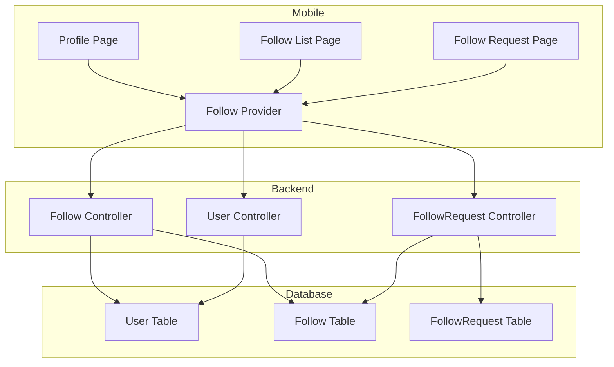
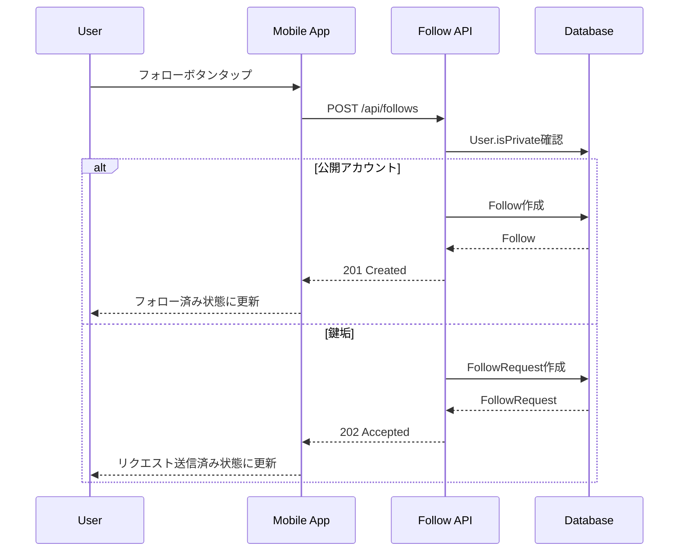
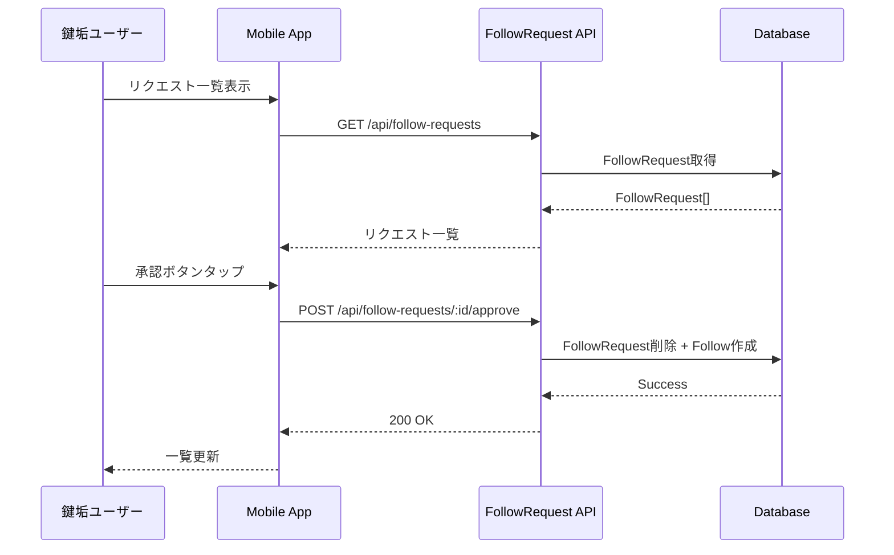
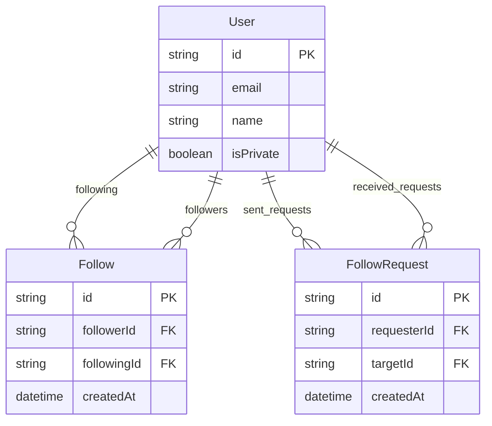

# Design Document: Social Network

## Overview

**Purpose**: フォロー・フォロワー・鍵垢・フォローリクエスト機能を提供し、Voiceletユーザー間のソーシャルグラフを構築する。

**Users**: 全ての認証済みユーザーがフォロー機能を利用し、プライバシーを重視するユーザーは鍵垢機能でフォロワーを制御する。

**Impact**: 既存のUserモデルとFollowモデルを拡張し、FollowRequestモデルを新規追加。プロフィール画面にフォロー関連UIを追加。

### Goals
- ユーザー間のフォロー関係を作成・削除できる
- フォロー・フォロワー一覧をページネーション付きで取得できる
- 鍵垢設定により非公開アカウントを実現する
- 鍵垢ユーザーへのフォローリクエスト送信・承認・拒否ができる
- 不要なフォロワーを削除できる

### Non-Goals
- 通知機能（別スコープ）
- ブロック機能
- ミュート機能
- フォロー推薦機能

## Architecture

### Existing Architecture Analysis
- **現行パターン**: Controller-Service-Modelパターン、Fastify autoload
- **既存ドメイン境界**: User, Whisper, Follow（基本実装済み）
- **統合ポイント**: Supabase Auth、Prisma ORM
- **対応する技術的負債**: なし

### Architecture Pattern & Boundary Map



**Architecture Integration**:
- Selected pattern: 既存のController-Modelパターンを拡張
- Domain boundaries: Follow（フォロー関係）、FollowRequest（リクエスト管理）を明確に分離
- Existing patterns preserved: Fastify autoload、Zodバリデーション、Riverpod状態管理
- New components rationale: FollowRequestモデルはリクエストの一時的な状態を管理するため分離
- Steering compliance: モノレポ構成、Feature-first構造を維持

### Technology Stack

| Layer | Choice / Version | Role in Feature | Notes |
|-------|------------------|-----------------|-------|
| Frontend | Flutter 3.10+ / Riverpod | 状態管理とUI | 既存スタック |
| Backend | Fastify 5 / TypeScript | APIエンドポイント | 既存スタック |
| Data | PostgreSQL 16 / Prisma | フォロー関係の永続化 | 既存スタック |
| Infrastructure | Supabase | 認証 | 既存スタック |

## System Flows

### フォロー作成フロー（公開アカウント）



### フォローリクエスト承認フロー



## Requirements Traceability

| Requirement | Summary | Components | Interfaces | Flows |
|-------------|---------|------------|------------|-------|
| 1.1 | フォロー作成 | FollowController, FollowProvider | POST /api/follows | フォロー作成フロー |
| 1.2 | フォローボタン状態更新 | ProfilePage, FollowProvider | - | - |
| 1.3 | フォロー解除 | FollowController | DELETE /api/follows | - |
| 1.4 | 自己フォロー防止 | FollowController | POST /api/follows | - |
| 1.5 | エラー表示 | ProfilePage | - | - |
| 2.1 | フォロー一覧表示 | FollowListPage, FollowProvider | GET /api/users/:id/following | - |
| 2.2 | フォロワー一覧表示 | FollowListPage, FollowProvider | GET /api/users/:id/followers | - |
| 2.3 | ページネーション | FollowController | Query params | - |
| 2.4 | 鍵垢の一覧非表示 | FollowListPage, UserController | GET /api/users/:id | - |
| 3.1 | 非公開設定 | UserController, ProfileEditPage | PATCH /api/profiles/me | - |
| 3.2 | 鍵垢フォロー時のリクエスト作成 | FollowController | POST /api/follows | フォロー作成フロー |
| 3.3 | 非フォロワーへの投稿非表示 | WhisperController | - | 別スコープで対応 |
| 3.4 | 非公開解除 | UserController | PATCH /api/profiles/me | - |
| 3.5 | 鍵アイコン表示 | ProfilePage | - | - |
| 4.1 | フォローリクエスト送信 | FollowController | POST /api/follows | フォロー作成フロー |
| 4.2 | リクエスト送信済み状態表示 | ProfilePage | - | - |
| 4.3 | リクエスト取消 | FollowRequestController | DELETE /api/follow-requests/:id | - |
| 4.4 | 重複リクエスト防止 | FollowController | POST /api/follows | - |
| 4.5 | リクエストエラー表示 | ProfilePage | - | - |
| 5.1 | リクエスト一覧取得 | FollowRequestController, FollowRequestPage | GET /api/follow-requests | - |
| 5.2 | リクエスト承認 | FollowRequestController | POST /api/follow-requests/:id/approve | リクエスト承認フロー |
| 5.3 | リクエスト拒否 | FollowRequestController | POST /api/follow-requests/:id/reject | - |
| 5.4 | 承認・拒否ボタン表示 | FollowRequestPage | - | - |
| 5.5 | リクエストバッジ表示 | HomePage | GET /api/follow-requests/count | - |
| 6.1 | フォロワー削除 | FollowController | DELETE /api/followers/:id | - |
| 6.2 | 削除成功表示 | FollowListPage | - | - |
| 6.3 | 削除確認ダイアログ | FollowListPage | - | - |
| 6.4 | 削除エラー表示 | FollowListPage | - | - |

## Components and Interfaces

| Component | Domain/Layer | Intent | Req Coverage | Key Dependencies | Contracts |
|-----------|--------------|--------|--------------|------------------|-----------|
| FollowController | Backend/API | フォロー関係のCRUD | 1.1-1.4, 2.3, 4.1, 4.4, 6.1 | Prisma (P0) | API |
| FollowRequestController | Backend/API | フォローリクエスト管理 | 4.3, 5.1-5.3, 5.5 | Prisma (P0) | API |
| UserController | Backend/API | ユーザープロファイル更新 | 3.1, 3.4 | Prisma (P0) | API |
| FollowProvider | Mobile/State | フォロー状態管理 | 1.2, 2.1-2.2, 4.2 | Dio (P0) | State |
| ProfilePage | Mobile/UI | プロフィール表示 | 1.2, 1.5, 3.5, 4.2, 4.5 | FollowProvider (P0) | - |
| FollowListPage | Mobile/UI | フォロー一覧表示 | 2.1-2.2, 2.4, 6.2-6.4 | FollowProvider (P0) | - |
| FollowRequestPage | Mobile/UI | リクエスト管理画面 | 5.4 | FollowProvider (P0) | - |

### Backend/API

#### FollowController

| Field | Detail |
|-------|--------|
| Intent | フォロー関係の作成・削除・一覧取得 |
| Requirements | 1.1, 1.3, 1.4, 2.3, 4.1, 4.4, 6.1 |

**Responsibilities & Constraints**
- フォロー/アンフォローの実行
- 自己フォロー防止のバリデーション
- 鍵垢判定とフォローリクエストへの振り分け
- フォロワー削除（自分のフォロワーのみ）

**Dependencies**
- Inbound: Mobile App — フォロー操作リクエスト (P0)
- Outbound: Prisma — DB操作 (P0)
- External: なし

**Contracts**: API [x]

##### API Contract

| Method | Endpoint | Request | Response | Errors |
|--------|----------|---------|----------|--------|
| POST | /api/follows | `{ followingId: string }` | `{ follow: Follow }` or `{ followRequest: FollowRequest }` | 400, 409 |
| DELETE | /api/follows/:followingId | - | `{ message: string }` | 404 |
| GET | /api/users/:userId/followers | `?page&limit` | `{ data: User[], pagination }` | 403, 404 |
| GET | /api/users/:userId/following | `?page&limit` | `{ data: User[], pagination }` | 403, 404 |
| DELETE | /api/followers/:followerId | - | `{ message: string }` | 404 |

**Implementation Notes**
- 認証ユーザーのIDはJWTから取得（followerId不要）
- 鍵垢ユーザーへのフォローは202 Acceptedでリクエスト作成を通知
- フォロワー/フォロー一覧は鍵垢で非フォロワーの場合は403を返却

#### FollowRequestController

| Field | Detail |
|-------|--------|
| Intent | フォローリクエストの管理 |
| Requirements | 4.3, 5.1, 5.2, 5.3, 5.5 |

**Responsibilities & Constraints**
- リクエスト一覧取得（自分宛のみ）
- リクエスト承認（Follow作成 + Request削除）
- リクエスト拒否（Request削除のみ）
- リクエスト取消（送信者のみ）

**Dependencies**
- Inbound: Mobile App — リクエスト管理操作 (P0)
- Outbound: Prisma — DB操作 (P0)

**Contracts**: API [x]

##### API Contract

| Method | Endpoint | Request | Response | Errors |
|--------|----------|---------|----------|--------|
| GET | /api/follow-requests | `?page&limit` | `{ data: FollowRequest[], pagination }` | - |
| GET | /api/follow-requests/count | - | `{ count: number }` | - |
| POST | /api/follow-requests/:id/approve | - | `{ follow: Follow }` | 404 |
| POST | /api/follow-requests/:id/reject | - | `{ message: string }` | 404 |
| DELETE | /api/follow-requests/:id | - | `{ message: string }` | 403, 404 |

**Implementation Notes**
- 承認はトランザクション内でFollowRequest削除とFollow作成を実行
- 取消は送信者本人のみ許可（403チェック）

### Mobile/State

#### FollowProvider

| Field | Detail |
|-------|--------|
| Intent | フォロー関連の状態管理とAPI通信 |
| Requirements | 1.2, 2.1, 2.2, 4.2 |

**Responsibilities & Constraints**
- フォロー状態の取得・更新
- フォロー一覧のページネーション管理
- フォローリクエスト状態の管理
- オプティミスティックUI更新

**Dependencies**
- Inbound: ProfilePage, FollowListPage — UI操作 (P0)
- Outbound: Dio — HTTP通信 (P0)

**Contracts**: State [x]

##### State Management

```dart
// フォロー状態
enum FollowStatus { none, following, requested }

// ユーザーのフォロー状態Provider
final followStatusProvider = FutureProvider.family<FollowStatus, String>((ref, userId) async {
  // API呼び出しでフォロー状態を取得
});

// フォロー一覧Provider
final followingListProvider = FutureProvider.family<List<User>, String>((ref, userId) async {
  // ページネーション付きでフォロー一覧を取得
});

// フォロワー一覧Provider
final followersListProvider = FutureProvider.family<List<User>, String>((ref, userId) async {
  // ページネーション付きでフォロワー一覧を取得
});

// フォローリクエスト一覧Provider
final followRequestsProvider = FutureProvider<List<FollowRequest>>((ref) async {
  // 自分宛のリクエスト一覧を取得
});

// リクエストカウントProvider
final followRequestCountProvider = FutureProvider<int>((ref) async {
  // バッジ表示用のカウントを取得
});
```

## Data Models

### Domain Model



**Business Rules & Invariants**:
- ユーザーは自分自身をフォローできない
- 同一ペアのFollow/FollowRequestは1つのみ
- FollowRequestはtargetがisPrivate=trueの場合のみ作成可能
- 承認時はFollowRequest削除とFollow作成をアトミックに実行

### Physical Data Model

**Userテーブル変更**:
```sql
ALTER TABLE users ADD COLUMN is_private BOOLEAN NOT NULL DEFAULT false;
```

**FollowRequestテーブル新規作成**:
```sql
CREATE TABLE follow_requests (
    id UUID PRIMARY KEY DEFAULT gen_random_uuid(),
    requester_id UUID NOT NULL REFERENCES users(id) ON DELETE CASCADE,
    target_id UUID NOT NULL REFERENCES users(id) ON DELETE CASCADE,
    created_at TIMESTAMP WITH TIME ZONE NOT NULL DEFAULT NOW(),
    UNIQUE (requester_id, target_id)
);

CREATE INDEX idx_follow_requests_requester ON follow_requests(requester_id);
CREATE INDEX idx_follow_requests_target ON follow_requests(target_id);
```

### Data Contracts & Integration

**Prismaスキーマ追加**:
```prisma
model User {
  // 既存フィールド...
  isPrivate         Boolean         @default(false) @map("is_private")
  sentRequests      FollowRequest[] @relation("requester")
  receivedRequests  FollowRequest[] @relation("target")
}

model FollowRequest {
  id          String   @id @default(uuid())
  requesterId String   @map("requester_id")
  targetId    String   @map("target_id")
  createdAt   DateTime @default(now()) @map("created_at")

  requester   User     @relation("requester", fields: [requesterId], references: [id], onDelete: Cascade)
  target      User     @relation("target", fields: [targetId], references: [id], onDelete: Cascade)

  @@unique([requesterId, targetId])
  @@index([requesterId])
  @@index([targetId])
  @@map("follow_requests")
}
```

**APIレスポンススキーマ**:
```typescript
// フォロー情報付きユーザー
const userWithFollowSchema = z.object({
  id: z.string(),
  name: z.string().nullable(),
  avatarUrl: z.string().nullable(),
  isPrivate: z.boolean(),
  followStatus: z.enum(['none', 'following', 'requested']),
});

// フォローリクエスト
const followRequestSchema = z.object({
  id: z.string(),
  requester: z.object({
    id: z.string(),
    name: z.string().nullable(),
    avatarUrl: z.string().nullable(),
  }),
  createdAt: z.string(),
});
```

## Error Handling

### Error Categories and Responses

**User Errors (4xx)**:
- 400 Bad Request: 自己フォロー試行 → "自分自身をフォローできません"
- 403 Forbidden: 鍵垢の非フォロワーによる一覧アクセス → "このユーザーのフォロー一覧は非公開です"
- 404 Not Found: 存在しないフォロー関係 → "フォロー関係が見つかりません"
- 409 Conflict: 重複フォロー/リクエスト → "既にフォロー済みです" / "既にリクエスト済みです"

**System Errors (5xx)**:
- 500 Internal Server Error: DB接続エラー → 一般的なエラーメッセージを表示

### Monitoring
- フォロー/リクエスト作成・削除のログ出力
- 403エラーの監視（不正アクセス試行検知）

## Testing Strategy

### Unit Tests
- FollowController: 自己フォロー防止ロジック
- FollowController: 鍵垢判定とリクエスト振り分け
- FollowRequestController: 承認トランザクション
- FollowProvider: 状態更新ロジック

### Integration Tests
- フォロー作成→一覧取得→削除の一連フロー
- 鍵垢設定→リクエスト送信→承認→フォロー確認
- 非フォロワーによる鍵垢一覧アクセス拒否

### E2E/UI Tests
- プロフィール画面でのフォローボタン操作
- フォロー/フォロワー一覧表示と無限スクロール
- フォローリクエスト一覧での承認・拒否操作

## Security Considerations

- 認証: 全フォロー操作はJWT認証必須
- 認可: フォロワー削除は自分のフォロワーに対してのみ許可
- 認可: リクエスト承認・拒否は対象ユーザーのみ許可
- 認可: リクエスト取消は送信者のみ許可
- プライバシー: 鍵垢のフォロー一覧は非フォロワーに非公開
