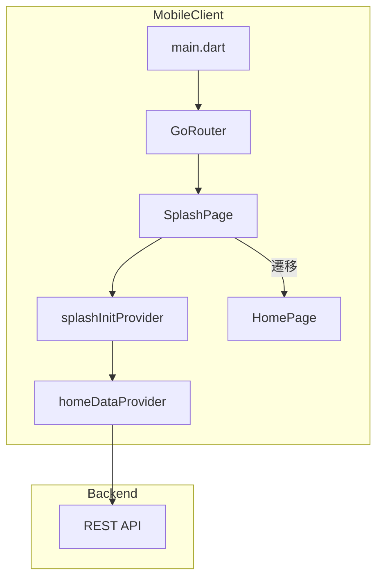
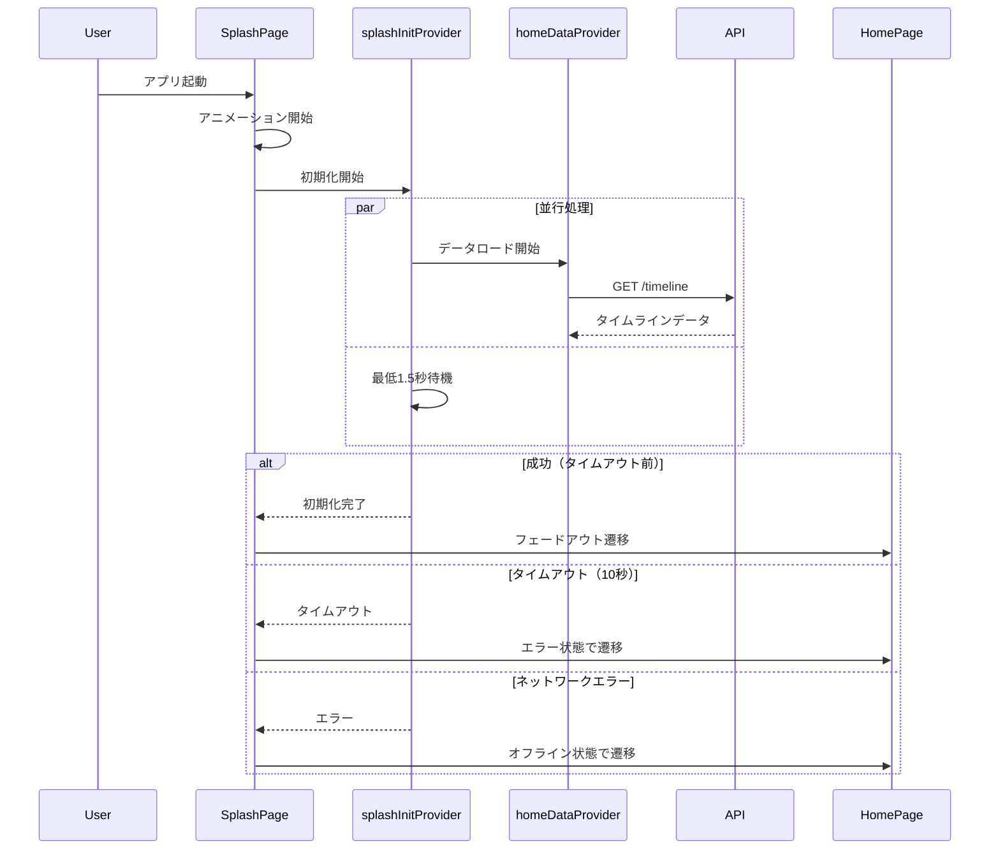
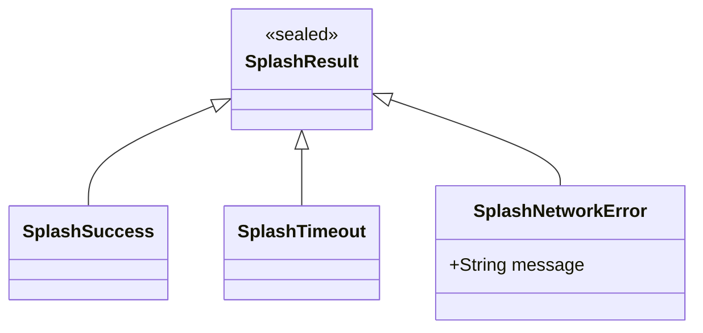

# Design Document: splash-screen

## Overview
**Purpose**: アプリ起動時にホーム画面のデータロード中、ユーザーにブランディング要素（アイコン、キャッチコピー）を含むおしゃれな画面を表示し、待機体験を向上させる。

**Users**: Voiceletの全ユーザーがアプリ起動時に利用する。

**Impact**: 既存のルーティング設定（initialLocation）を変更し、新規SplashPageをエントリーポイントとして追加する。

### Goals
- アプリアイコンとキャッチコピーを含むブランディング画面の表示
- ホーム画面データのプリロードと最低表示時間（1.5秒）の両立
- 滑らかなトランジションによるシームレスなUX
- 既存デザインシステム（AppTheme）との一貫性維持

### Non-Goals
- ライトモード対応（現時点では既存のダークモードのみ）
- ネイティブスプラッシュ（flutter_native_splash）との連携
- 認証フローとの統合（将来フェーズ）
- ディープリンク対応の完全なguardロジック

## Architecture

### Architecture Pattern & Boundary Map



**Architecture Integration**:
- Selected pattern: Feature-first構成（`features/splash/`ディレクトリ）
- Domain boundaries: SplashはUIとProvider、HomeはデータモデルとProvider
- Existing patterns preserved: Riverpod状態管理、go_routerルーティング、AppThemeデザインシステム
- New components rationale: SplashPage（UI）、splashInitProvider（初期化ロジック）の2コンポーネントで責務分離
- Steering compliance: Feature-first + Core utilitiesパターンに準拠

### Technology Stack

| Layer | Choice / Version | Role in Feature | Notes |
|-------|------------------|-----------------|-------|
| Frontend | Flutter 3.10+ / Dart | スプラッシュ画面UI実装 | 既存環境 |
| State Management | flutter_riverpod 2.4.9 | 初期化状態・データロード管理 | FutureProvider使用 |
| Routing | go_router 14.0.0 | スプラッシュ→ホーム遷移制御 | initialLocation変更 |
| Animation | Flutter Animation API | フェードイン・スケールアニメーション | 追加依存なし |

## System Flows

### アプリ起動〜ホーム遷移フロー



**Key Decisions**:
- 最低表示時間（1.5秒）とデータロードを`Future.wait`で並行実行
- タイムアウト（10秒）後はエラー状態でもホーム画面へ遷移（スプラッシュでブロックしない）

## Requirements Traceability

| Requirement | Summary | Components | Interfaces | Flows |
|-------------|---------|------------|------------|-------|
| 1.1 | アプリアイコン中央表示 | SplashPage | - | 起動フロー |
| 1.2 | キャッチコピー表示 | SplashPage | - | 起動フロー |
| 1.3 | グラデーション背景 | SplashPage | AppTheme.gradientBgMain | 起動フロー |
| 1.4 | アニメーション演出 | SplashPage | AnimationController | 起動フロー |
| 2.1 | データロード完了で遷移 | splashInitProvider | homeDataProvider | 遷移フロー |
| 2.2 | ロード中は表示継続 | SplashPage, splashInitProvider | - | 遷移フロー |
| 2.3 | 最低1.5秒表示 | splashInitProvider | Future.wait | 遷移フロー |
| 2.4 | フェードアウト遷移 | SplashPage | AnimatedOpacity | 遷移フロー |
| 3.1 | タイムアウト時の遷移 | splashInitProvider | SplashResult | エラーフロー |
| 3.2 | ネットワークエラー時の遷移 | splashInitProvider | SplashResult | エラーフロー |
| 3.3 | タイムアウト10秒設定 | splashInitProvider | - | エラーフロー |
| 4.1 | 高解像度アイコン表示 | SplashPage | Image.asset | 起動フロー |
| 4.2 | ブランドフォント使用 | SplashPage | AppTheme.textTheme | 起動フロー |
| 4.3 | ダーク/ライトモード対応 | - | - | 非対応（Non-Goals） |
| 4.4 | レスポンシブレイアウト | SplashPage | MediaQuery | 起動フロー |

## Components and Interfaces

| Component | Domain/Layer | Intent | Req Coverage | Key Dependencies | Contracts |
|-----------|--------------|--------|--------------|------------------|-----------|
| SplashPage | features/splash/pages | スプラッシュ画面UI | 1.1-1.4, 2.2, 2.4, 4.1, 4.2, 4.4 | splashInitProvider (P0), AppTheme (P0) | State |
| splashInitProvider | features/splash/providers | 初期化ロジック・状態管理 | 2.1, 2.3, 3.1-3.3 | homeDataProvider (P0) | Service |
| homeDataProvider | features/home/providers | ホームデータ取得 | 2.1 | ApiClient (P0) | Service |

### features/splash

#### SplashPage

| Field | Detail |
|-------|--------|
| Intent | スプラッシュ画面のUI表示とアニメーション制御 |
| Requirements | 1.1, 1.2, 1.3, 1.4, 2.2, 2.4, 4.1, 4.2, 4.4 |

**Responsibilities & Constraints**
- アプリアイコン、キャッチコピー、グラデーション背景の描画
- フェードイン・スケールアニメーションの制御
- splashInitProviderの状態監視と画面遷移トリガー
- 各種画面サイズへのレスポンシブ対応

**Dependencies**
- Inbound: GoRouter — ルーティングからの画面表示 (P0)
- Outbound: splashInitProvider — 初期化状態の監視 (P0)
- External: AppTheme — デザイン定数 (P0)

**Contracts**: State [x]

##### State Management

```dart
/// SplashPageの内部状態
class SplashPageState {
  /// アニメーション進行度 (0.0 - 1.0)
  final double animationProgress;

  /// 遷移中フラグ
  final bool isTransitioning;
}
```

- State model: AnimationControllerによるアニメーション状態、遷移フラグ
- Persistence: なし（画面ローカル状態のみ）
- Concurrency: シングルスレッド（UIスレッド）

**Implementation Notes**
- Integration: ConsumerStatefulWidgetとしてRiverpodと統合
- Validation: splashInitProviderの状態がSplashResult.successの場合のみ遷移実行
- Risks: アニメーション中の強制終了時にdisposeが正しく呼ばれることを確認

---

#### splashInitProvider

| Field | Detail |
|-------|--------|
| Intent | 初期化処理の実行と状態管理 |
| Requirements | 2.1, 2.3, 3.1, 3.2, 3.3 |

**Responsibilities & Constraints**
- ホームデータのプリロード開始
- 最低表示時間（1.5秒）の待機
- タイムアウト（10秒）の管理
- 初期化結果（成功/タイムアウト/エラー）の返却

**Dependencies**
- Inbound: SplashPage — 初期化結果の監視 (P0)
- Outbound: homeDataProvider — データロードの委譲 (P0)

**Contracts**: Service [x]

##### Service Interface

```dart
/// スプラッシュ初期化の結果型
sealed class SplashResult {
  const SplashResult();
}

/// 初期化成功
class SplashSuccess extends SplashResult {
  const SplashSuccess();
}

/// タイムアウト
class SplashTimeout extends SplashResult {
  const SplashTimeout();
}

/// ネットワークエラー
class SplashNetworkError extends SplashResult {
  final String message;
  const SplashNetworkError(this.message);
}

/// splashInitProvider: FutureProvider<SplashResult>
///
/// 最低表示時間とデータロードを並行実行し、
/// タイムアウト管理を含む初期化結果を返却する。
```

- Preconditions: なし（アプリ起動直後に実行）
- Postconditions: SplashResult（Success/Timeout/NetworkError）を返却
- Invariants: タイムアウト時間は10秒固定、最低表示時間は1.5秒固定

**Implementation Notes**
- Integration: `Future.wait`で最低表示時間とデータロードを並行処理
- Validation: homeDataProviderのエラーをキャッチしてSplashNetworkErrorに変換
- Risks: homeDataProviderが未実装の場合はモック実装で対応

### features/home

#### homeDataProvider

| Field | Detail |
|-------|--------|
| Intent | ホーム画面用タイムラインデータの取得 |
| Requirements | 2.1 |

**Responsibilities & Constraints**
- タイムラインAPIの呼び出し
- レスポンスデータのキャッシュ（Riverpodによる自動キャッシュ）

**Dependencies**
- Inbound: splashInitProvider — プリロードトリガー (P0)
- Outbound: ApiClient — HTTP通信 (P0)

**Contracts**: Service [x]

##### Service Interface

```dart
/// homeDataProvider: FutureProvider<List<TimelineItem>>
///
/// タイムラインAPIを呼び出し、結果をキャッシュする。
/// スプラッシュ画面でプリロードされ、ホーム画面で即座に利用可能。
```

- Preconditions: ネットワーク接続（オフライン時はエラー）
- Postconditions: TimelineItemのリスト、またはエラー
- Invariants: Riverpodによるキャッシュ管理

**Implementation Notes**
- Integration: 既存のApiClientパターンに準拠
- Validation: APIレスポンスの型検証はFreezedモデルで実施
- Risks: APIエンドポイントが未実装の場合はモックデータで対応

## Data Models

### Domain Model



**Business Rules & Invariants**:
- 最低表示時間: 1.5秒（ブランド認知確保）
- タイムアウト: 10秒（ユーザー離脱防止）
- エラー時もホーム画面へ遷移（スプラッシュでブロックしない）

### Data Contracts & Integration

**API Data Transfer**:
- ホームデータ取得: `GET /api/timeline` → `List<TimelineItem>`
- スプラッシュ画面専用のAPIは不要

## Error Handling

### Error Strategy
スプラッシュ画面ではエラーをユーザーに表示せず、ホーム画面へ遷移して状態を伝達する。

### Error Categories and Responses

**System Errors**:
- タイムアウト（10秒超過）→ `SplashTimeout`としてホーム画面へ遷移、ホーム画面でリトライUIを表示
- ネットワークエラー → `SplashNetworkError`としてホーム画面へ遷移、オフラインバナーを表示

**Recovery Flow**:
1. splashInitProviderがエラーをキャッチ
2. 適切なSplashResult型に変換
3. SplashPageが結果を受け取り、ホーム画面へ遷移
4. ホーム画面が初期状態に応じたUIを表示

## Testing Strategy

### Unit Tests
- `splashInitProvider`: 最低表示時間（1.5秒）の動作確認
- `splashInitProvider`: タイムアウト（10秒）の動作確認
- `SplashResult`: sealed classの各サブタイプの生成確認

### Integration Tests
- スプラッシュ画面表示 → データロード成功 → ホーム画面遷移フロー
- スプラッシュ画面表示 → タイムアウト → ホーム画面遷移フロー
- アニメーション完了後の状態確認

### E2E/UI Tests
- アプリ起動からホーム画面表示までの一連のフロー
- アイコン・キャッチコピーの表示確認
- 各種画面サイズでのレスポンシブ表示確認

## Performance & Scalability

**Target Metrics**:
- スプラッシュ画面表示までの時間: < 500ms（アプリ起動から）
- アニメーションフレームレート: 60fps維持

**Optimization Techniques**:
- アイコン画像のプリキャッシュ（`precacheImage`）
- 不要なリビルド防止（`ref.watch`の最小化）
