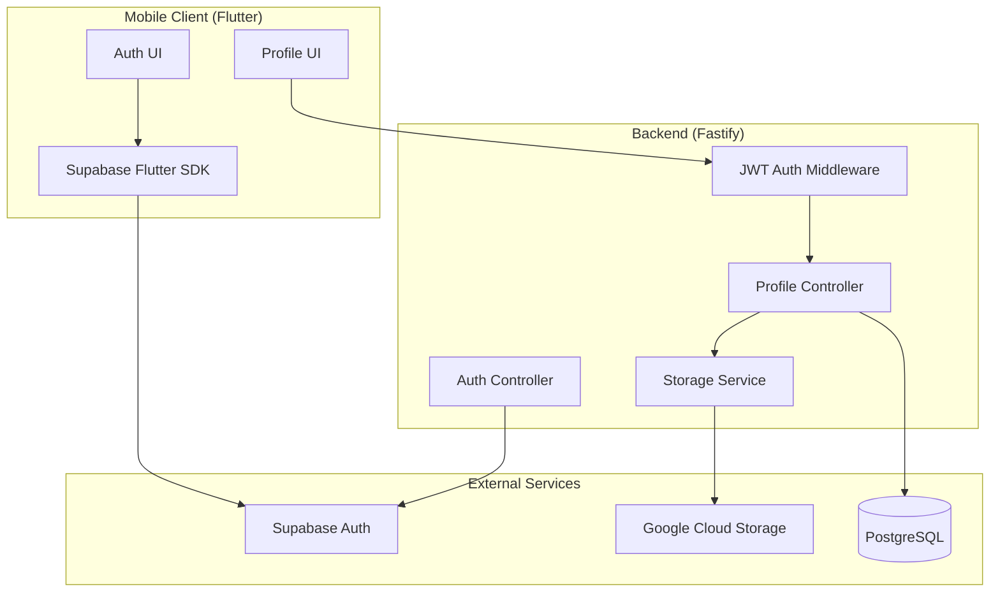
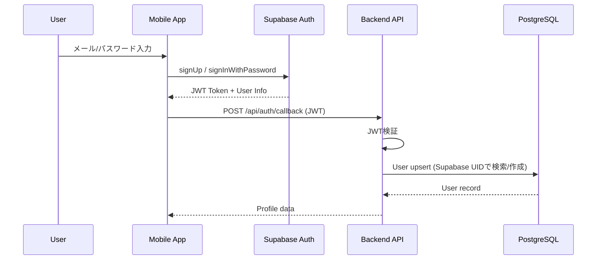
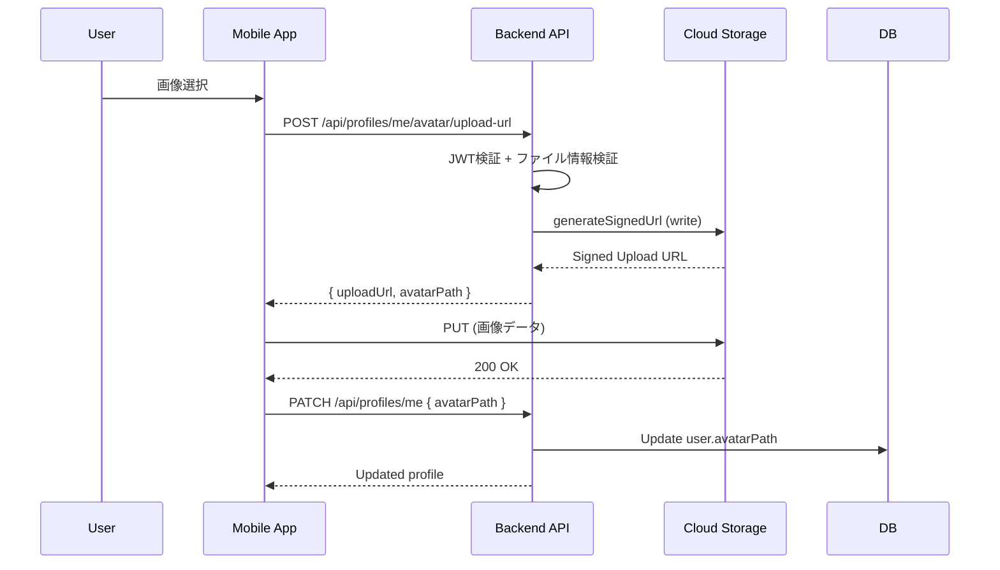
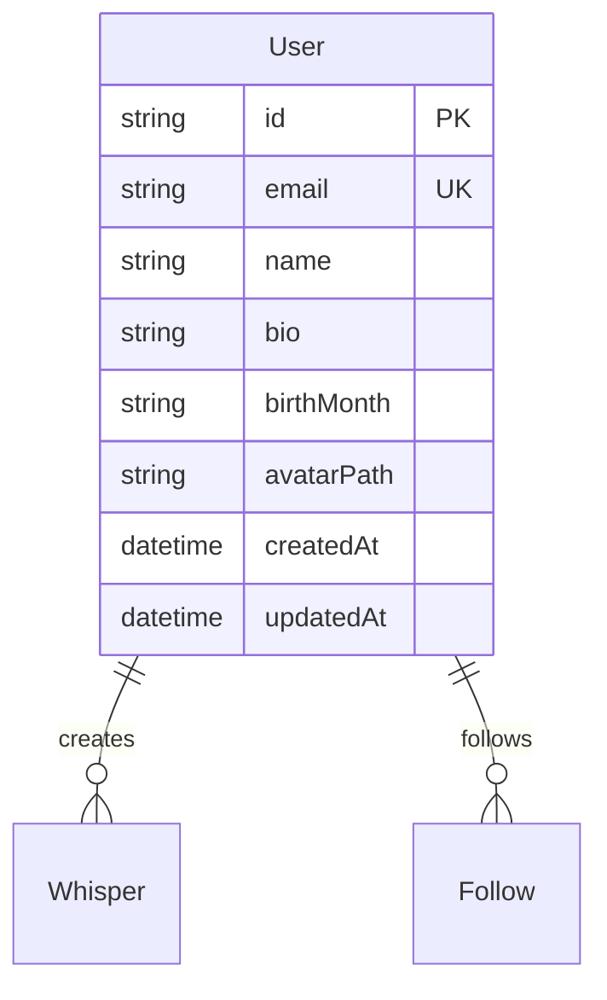

# Technical Design: User Profile CRUD

## Overview

**Purpose**: Supabase Authによる認証基盤とCloud Storage署名付きURLによるアバター画像管理を備えた、ユーザープロフィールのCRUD機能を提供する。

**Users**: 認証済みユーザーが自身のプロフィール（表示名、自己紹介、生年月、アバター画像）を管理し、他ユーザーのプロフィールを閲覧できる。

**Impact**: 既存のUserモデルにプロフィールフィールドを追加し、認証フローをSupabase Auth基盤に移行する。

### Goals
- Supabase Authによる安全なユーザー認証（メール/パスワード）
- プロフィール情報のCRUD操作（表示名、自己紹介、生年月）
- Cloud Storage署名付きURLによるアバター画像のアップロード/ダウンロード
- 生年月から年齢を自動計算してAPIレスポンスに含める

### Non-Goals
- ソーシャルログイン（Google/Apple）は初回スコープ外
- プロフィール画像のリサイズ/最適化処理
- Supabase DB RLSの使用（アプリケーションレベル認可を採用）

## Architecture

### Existing Architecture Analysis

現在のシステムは以下の構成:
- **Backend**: Fastify + Prisma + PostgreSQL
- **Mobile**: Flutter + Riverpod
- **Storage**: Google Cloud Storage（音声ファイル用に実装済み）

既存の署名付きURL生成ロジック（`backend/src/services/storage.ts`）を拡張してアバター画像に対応する。認証はデモユーザーIDのハードコードから、Supabase Auth JWT検証に移行する。

### Architecture Pattern & Boundary Map



**Architecture Integration**:
- **Selected pattern**: Controller-based REST API（既存パターン踏襲）
- **Domain boundaries**: 認証（auth）とプロフィール（profiles）を独立controllerに分離
- **Existing patterns preserved**: Zod schema、fastify-autoload、Prisma直接使用
- **New components rationale**: JWT認証ミドルウェアを追加してリクエスト認可を一元管理
- **Steering compliance**: TypeScript strict mode、Zod validation維持

### Technology Stack

| Layer | Choice / Version | Role in Feature | Notes |
|-------|------------------|-----------------|-------|
| Mobile Auth | supabase_flutter ^2.0 | Supabase Auth連携 | PKCE flow、セッション永続化 |
| Backend Auth | @fastify/jwt ^8.0 | JWT検証 | Supabase JWT Secret使用 |
| Backend Framework | Fastify 5 | 既存 | fastify-autoload継続 |
| Database | Prisma + PostgreSQL 16 | 既存 | Userモデル拡張 |
| Storage | @google-cloud/storage | 既存 | 署名付きURL生成 |

## System Flows

### 認証フロー（新規登録/ログイン）



### アバターアップロードフロー



## Requirements Traceability

| Requirement | Summary | Components | Interfaces | Flows |
|-------------|---------|------------|------------|-------|
| 1.1, 1.2 | Supabase Auth登録/ログイン | AuthController, SupabaseSDK | Auth API | 認証フロー |
| 1.3 | ログアウト | SupabaseSDK | - | - |
| 1.4, 1.5 | 認証エラー処理 | AuthController | Auth API | - |
| 2.1, 2.2 | プロフィール作成 | ProfileController | Profile API | - |
| 2.4, 9.1 | 生年月保存 | ProfileController, Prisma | Profile API | - |
| 3.1-3.5 | プロフィール参照/年齢表示 | ProfileController | Profile API | - |
| 4.1-4.5 | プロフィール更新 | ProfileController | Profile API | - |
| 5.1-5.4 | アカウント削除 | ProfileController, StorageService | Profile API | - |
| 6.1-6.6 | アバターアップロード | ProfileController, StorageService | Avatar API | アップロードフロー |
| 7.1-7.5 | アバターダウンロード | ProfileController, StorageService | Profile API | - |
| 8.1-8.5 | セキュリティ | AuthMiddleware | - | - |
| 9.2, 9.3 | 年齢計算 | ProfileController | Profile API | - |

## Components and Interfaces

| Component | Domain/Layer | Intent | Req Coverage | Key Dependencies | Contracts |
|-----------|--------------|--------|--------------|------------------|-----------|
| AuthMiddleware | Backend/Middleware | JWT検証と認可 | 8.1-8.2 | @fastify/jwt (P0) | Service |
| AuthController | Backend/Controller | 認証コールバック処理 | 1.1-1.5 | Supabase Admin (P0), Prisma (P0) | API |
| ProfileController | Backend/Controller | プロフィールCRUD | 2-7, 9 | Prisma (P0), StorageService (P1) | API |
| StorageService | Backend/Service | 署名付きURL生成 | 6, 7 | @google-cloud/storage (P0) | Service |
| SupabaseAuthProvider | Mobile/Provider | 認証状態管理 | 1.1-1.5 | supabase_flutter (P0) | State |
| ProfileProvider | Mobile/Provider | プロフィール状態管理 | 2-4, 9 | Dio (P0) | State |
| ProfileEditPage | Mobile/UI | プロフィール編集画面 | 4.3, 9.4 | ProfileProvider (P0) | - |
| ProfileViewPage | Mobile/UI | プロフィール表示画面 | 3.5, 9.5 | ProfileProvider (P0) | - |

### Backend / Middleware

#### AuthMiddleware

| Field | Detail |
|-------|--------|
| Intent | JWTトークンを検証し、リクエストにユーザー情報を付与する |
| Requirements | 8.1, 8.2 |

**Responsibilities & Constraints**
- Authorization headerからBearerトークンを抽出
- Supabase JWT Secretでトークンを検証
- request.userにデコードされたユーザー情報を格納
- 無効なトークンの場合は401エラーを返却

**Dependencies**
- External: @fastify/jwt — JWT検証 (P0)

**Contracts**: Service [x]

##### Service Interface
```typescript
interface AuthenticatedRequest extends FastifyRequest {
  user: {
    sub: string;  // Supabase User ID
    email: string;
    iat: number;
    exp: number;
  };
}

// Fastify preHandler hook
async function authenticate(
  request: FastifyRequest,
  reply: FastifyReply
): Promise<void>;
```
- Preconditions: Authorizationヘッダーに有効なBearerトークンが存在
- Postconditions: request.userにデコードされたJWTペイロードが格納
- Invariants: 無効なトークンでは後続処理に進まない

### Backend / Controller

#### AuthController

| Field | Detail |
|-------|--------|
| Intent | Supabase Auth認証後のコールバック処理とユーザー同期 |
| Requirements | 1.1, 1.2, 2.1 |

**Responsibilities & Constraints**
- 認証成功後にSupabase UIDでローカルDBにユーザーをupsert
- 初回認証時に空のプロフィールレコードを自動作成
- Supabaseセッション情報のバリデーション

**Dependencies**
- External: Supabase Admin SDK — ユーザー情報取得 (P0)
- Outbound: Prisma — User upsert (P0)

**Contracts**: API [x]

##### API Contract
| Method | Endpoint | Request | Response | Errors |
|--------|----------|---------|----------|--------|
| POST | /api/auth/callback | AuthCallbackRequest | ProfileResponse | 400, 401 |

```typescript
// Request
interface AuthCallbackRequest {
  accessToken: string;
}

// Response
interface ProfileResponse {
  id: string;
  email: string;
  name: string | null;
  bio: string | null;
  age: number | null;
  avatarUrl: string | null;
  createdAt: string;
  updatedAt: string;
}
```

#### ProfileController

| Field | Detail |
|-------|--------|
| Intent | プロフィール情報のCRUD操作とアバターURL管理 |
| Requirements | 2.2-2.5, 3.1-3.6, 4.1-4.5, 5.1-5.4, 6.1-6.6, 7.1-7.5, 9.1-9.6 |

**Responsibilities & Constraints**
- 自分のプロフィール取得/更新/削除
- 他ユーザーのプロフィール参照（読み取り専用）
- アバター画像の署名付きURL生成
- 生年月から年齢を計算してレスポンスに含める

**Dependencies**
- Inbound: AuthMiddleware — 認証済みリクエスト (P0)
- Outbound: Prisma — User CRUD (P0)
- Outbound: StorageService — 署名付きURL生成 (P1)

**Contracts**: API [x]

##### API Contract
| Method | Endpoint | Request | Response | Errors |
|--------|----------|---------|----------|--------|
| GET | /api/profiles/me | - | ProfileResponse | 401 |
| PATCH | /api/profiles/me | UpdateProfileRequest | ProfileResponse | 400, 401 |
| DELETE | /api/profiles/me | - | { message: string } | 401 |
| GET | /api/profiles/:userId | - | ProfileResponse | 404 |
| POST | /api/profiles/me/avatar/upload-url | AvatarUploadRequest | AvatarUploadResponse | 400, 401 |

```typescript
// Update Profile Request
interface UpdateProfileRequest {
  name?: string;        // 1-100文字
  bio?: string;         // 0-500文字
  birthMonth?: string;  // YYYY-MM形式
  avatarPath?: string;  // アップロード完了後のパス
}

// Avatar Upload Request
interface AvatarUploadRequest {
  contentType: 'image/jpeg' | 'image/png' | 'image/webp';
  fileSize: number;  // bytes, max 5MB
}

// Avatar Upload Response
interface AvatarUploadResponse {
  uploadUrl: string;    // 署名付きアップロードURL
  avatarPath: string;   // 保存されるパス
  expiresAt: string;    // URL有効期限
}
```

**Implementation Notes**
- Integration: プロフィール取得時にavatarPathがあれば署名付きダウンロードURLを生成してavatarUrlに設定
- Validation: 生年月は`/^\d{4}-(0[1-9]|1[0-2])$/`形式、将来日付は不可
- Risks: 署名付きURL生成の遅延によるレスポンス時間増加 → キャッシュ検討

### Backend / Service

#### StorageService

| Field | Detail |
|-------|--------|
| Intent | Cloud Storage署名付きURL生成（既存実装を拡張） |
| Requirements | 6.1, 6.4, 6.5, 7.1, 7.3 |

**Responsibilities & Constraints**
- アバター画像用の署名付きアップロードURL生成
- アバター画像用の署名付きダウンロードURL生成
- ファイルパス命名規則: `avatars/{userId}/{timestamp}.{ext}`
- 許可Content-Type: image/jpeg, image/png, image/webp
- 最大ファイルサイズ: 5MB

**Dependencies**
- External: @google-cloud/storage — GCS操作 (P0)

**Contracts**: Service [x]

##### Service Interface
```typescript
interface AvatarUploadOptions {
  userId: string;
  contentType: 'image/jpeg' | 'image/png' | 'image/webp';
  fileSize: number;
}

interface AvatarUploadResult {
  signedUrl: string;
  avatarPath: string;
  expiresAt: Date;
}

// 拡張する関数
function generateAvatarUploadSignedUrl(
  options: AvatarUploadOptions
): Promise<AvatarUploadResult>;

function generateAvatarDownloadSignedUrl(
  avatarPath: string,
  expiresInMinutes?: number  // default: 60
): Promise<string>;

function deleteAvatarFiles(userId: string): Promise<void>;
```
- Preconditions: 有効なuserId、許可されたcontentType、fileSize <= 5MB
- Postconditions: 有効期限内のURLが生成される
- Invariants: ファイルパスは常にavatars/プレフィックスを持つ

### Mobile / Provider

#### SupabaseAuthProvider

| Field | Detail |
|-------|--------|
| Intent | Supabase Authの状態管理とセッション永続化 |
| Requirements | 1.1-1.5 |

**Responsibilities & Constraints**
- サインアップ/サインイン/サインアウト操作
- 認証状態変更のリッスン（onAuthStateChange）
- アクセストークンの自動リフレッシュ（SDK内部で処理）
- 認証後にバックエンドAPIへコールバック

**Dependencies**
- External: supabase_flutter — Supabase SDK (P0)
- Outbound: API Client — Backend callback (P0)

**Contracts**: State [x]

##### State Management
```dart
// 認証状態
sealed class AuthState {}
class AuthStateInitial extends AuthState {}
class AuthStateLoading extends AuthState {}
class AuthStateAuthenticated extends AuthState {
  final User user;
  final Profile profile;
}
class AuthStateUnauthenticated extends AuthState {}
class AuthStateError extends AuthState {
  final String message;
}

// Provider定義
final supabaseAuthProvider = StateNotifierProvider<SupabaseAuthNotifier, AuthState>;
final currentUserProvider = Provider<User?>;
final accessTokenProvider = Provider<String?>;
```

#### ProfileProvider

| Field | Detail |
|-------|--------|
| Intent | プロフィール情報の状態管理 |
| Requirements | 2.2, 3.1-3.5, 4.1-4.3, 9.4-9.5 |

**Responsibilities & Constraints**
- 自分のプロフィール取得/キャッシュ
- プロフィール更新操作
- アバターアップロードフロー管理
- 他ユーザープロフィールの取得

**Dependencies**
- Inbound: SupabaseAuthProvider — 認証状態 (P0)
- External: Dio — HTTP通信 (P0)

**Contracts**: State [x]

##### State Management
```dart
// プロフィールモデル (Freezed)
@freezed
class Profile with _$Profile {
  factory Profile({
    required String id,
    required String email,
    String? name,
    String? bio,
    int? age,
    String? avatarUrl,
    String? birthMonth,  // 編集時のみ使用
    required DateTime createdAt,
    required DateTime updatedAt,
  }) = _Profile;
}

// Provider定義
final myProfileProvider = FutureProvider<Profile>;
final profileProvider = FutureProvider.family<Profile, String>;  // userId
final profileUpdateProvider = StateNotifierProvider<ProfileUpdateNotifier, AsyncValue<void>>;
```

### Mobile / UI

#### ProfileEditPage
- **Intent**: プロフィール編集フォーム（生年月入力を含む）
- **Requirements**: 4.3, 9.4
- **Implementation Note**: 生年月は年・月のDropdownで入力、表示時は年齢のみ表示

#### ProfileViewPage
- **Intent**: プロフィール表示画面（年齢表示）
- **Requirements**: 3.5, 9.5
- **Implementation Note**: birthMonthは表示せず、計算されたageを表示

## Data Models

### Domain Model



**Business Rules & Invariants**:
- emailはユニーク
- birthMonthはYYYY-MM形式、将来日付不可
- avatarPathはCloud Storage内のパス、nullの場合はデフォルト画像
- 年齢はbirthMonthから動的計算（DB保存しない）

### Physical Data Model

**Prisma Schema変更**:
```prisma
model User {
  id         String    @id @default(uuid())
  email      String    @unique
  name       String?
  bio        String?   @db.VarChar(500)
  birthMonth String?   @map("birth_month") @db.Char(7)  // YYYY-MM
  avatarPath String?   @map("avatar_path")
  createdAt  DateTime  @default(now()) @map("created_at")
  updatedAt  DateTime  @updatedAt @map("updated_at")

  // 既存リレーション
  whispers   Whisper[]
  followers  Follow[]  @relation("following")
  following  Follow[]  @relation("follower")
  views      WhisperView[]

  @@map("users")
}
```

**Migration Notes**:
- 既存nameフィールドをnullableに変更
- 既存avatarUrlをavatarPathにリネーム
- bio, birthMonthを新規追加

### Data Contracts & Integration

**API Response**:
- birthMonthはGET /api/profiles/meのみ返却（自分のプロフィール編集用）
- 他ユーザーのプロフィールにはage（計算値）のみ含める
- avatarUrlは署名付きダウンロードURLを動的生成

## Error Handling

### Error Strategy
- 認証エラー: 401 Unauthorized → ログイン画面へリダイレクト
- 認可エラー: 403 Forbidden → エラーメッセージ表示
- バリデーションエラー: 400 Bad Request → フィールド別エラー表示
- リソース不存在: 404 Not Found → エラー画面表示

### Error Categories and Responses

**User Errors (4xx)**:
- 401: JWT無効/期限切れ → 再ログイン誘導
- 403: 他ユーザーのプロフィール編集試行 → エラーメッセージ
- 400: バリデーション失敗 → フィールド別エラー
- 404: プロフィール未存在 → 「ユーザーが見つかりません」

**System Errors (5xx)**:
- 500: DB/Storage障害 → 「しばらくしてから再試行」
- 503: 署名付きURL生成失敗 → リトライ促進

### Monitoring
- 認証失敗率の監視
- 署名付きURL生成のレイテンシ
- プロフィール更新のエラー率

## Testing Strategy

### Unit Tests
- 年齢計算ロジック（境界値: 誕生月前/後）
- birthMonthバリデーション（形式、将来日付）
- 署名付きURL生成パラメータ

### Integration Tests
- 認証フロー（Supabase Mock）
- プロフィールCRUD API
- アバターアップロードフロー

### E2E Tests
- 新規登録→プロフィール作成→更新フロー
- アバター画像アップロード→表示確認
- ログアウト→再ログインフロー

## Security Considerations

- **JWT検証**: すべての保護エンドポイントでSupabase JWT Secretによる検証
- **認可**: 自分以外のプロフィールへの書き込み操作を拒否
- **署名付きURL**: ユーザー固有のパスで生成、有効期限設定
- **入力バリデーション**: Zodスキーマで全入力を検証
- **ファイルアップロード**: Content-Type制限、サイズ制限（5MB）

## Migration Strategy

1. **Phase 1**: DBマイグレーション（bio, birthMonth追加、avatarUrl→avatarPathリネーム）
2. **Phase 2**: バックエンドAPI実装（認証ミドルウェア、プロフィールAPI）
3. **Phase 3**: モバイル認証フロー移行（Supabase Auth統合）
4. **Phase 4**: モバイルプロフィール画面実装
5. **Phase 5**: 既存デモユーザーの移行対応

**Rollback Trigger**: 認証失敗率が5%を超えた場合、デモモードにフォールバック
