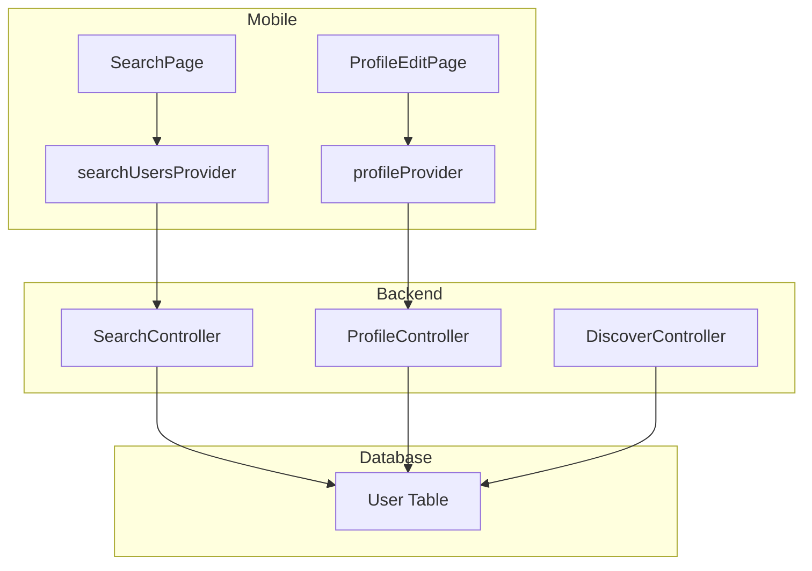
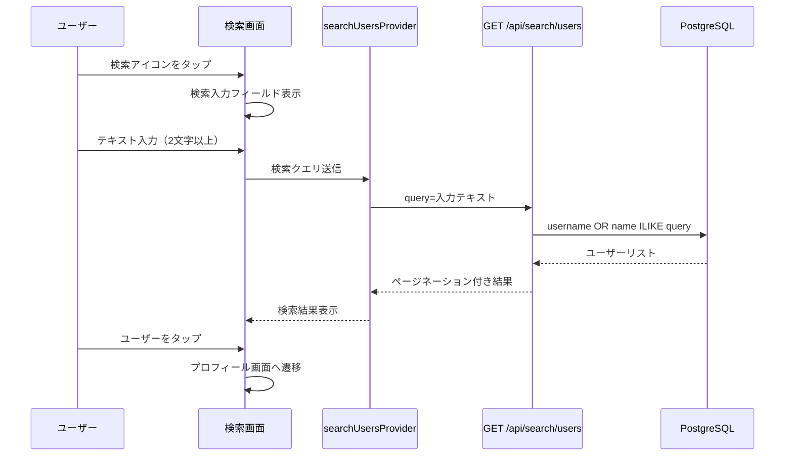
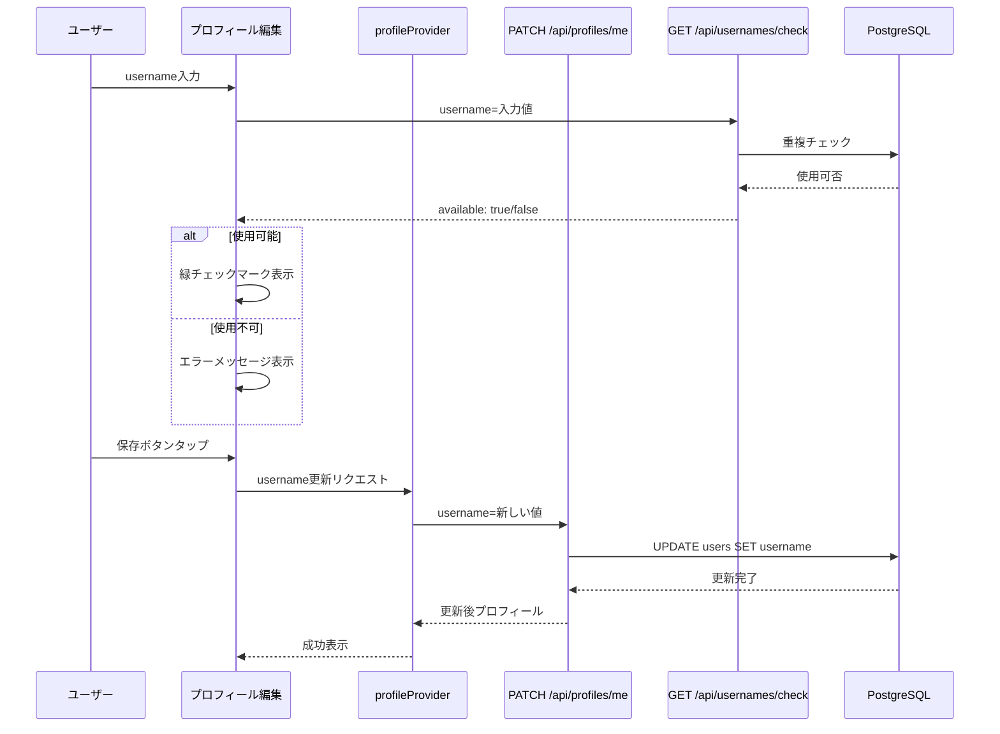
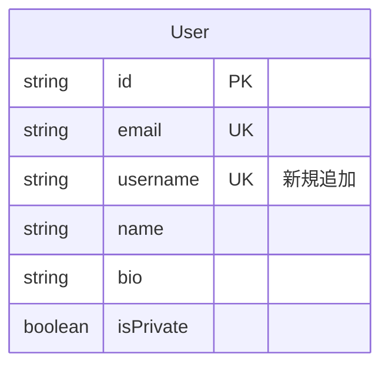

# Design Document: User Search and Unique ID

## Overview

**Purpose**: ユーザー検索機能とユニークID（@username）機能を提供し、ユーザー間の発見性を向上させる。加えて、おすすめフィードから鍵アカウントを除外することでプライバシーを尊重する。

**Users**: 全ユーザーがホーム画面から他ユーザーを検索し、自身のユニークIDを設定・管理できる。

**Impact**: Userモデルに`username`フィールドを追加し、新規検索APIと検索UI、プロフィール編集UIを拡張する。

### Goals
- フリーテキストによるユーザー検索（表示名・username両方）
- 一意のユーザーID（@username）の設定・変更機能
- おすすめフィードから鍵アカウントの除外

### Non-Goals
- Whisper（音声投稿）の検索機能
- ハッシュタグやトピック検索
- ユーザーメンション機能（@username入力による通知）

## Architecture

### Existing Architecture Analysis
- **Backend**: Fastify + Prisma + Zodによるコントローラー・スキーマパターン
- **Mobile**: Flutter + Riverpod + Freezedによるfeature-firstアーキテクチャ
- **Database**: PostgreSQL with Prisma ORM
- **既存パターン**: `/api/users`でsearchクエリによる検索、ページネーションユーティリティが利用可能

### Architecture Pattern & Boundary Map



**Architecture Integration**:
- **Selected pattern**: 既存のController-Service-Modelパターンを踏襲
- **Domain boundaries**: 検索機能は新規`search`コントローラーとして分離
- **Existing patterns preserved**: Zodスキーマ、ページネーション、Riverpod Provider
- **New components rationale**: 検索の責務分離、将来の拡張性確保
- **Steering compliance**: モノレポ構成、型安全性を維持

### Technology Stack

| Layer | Choice / Version | Role in Feature | Notes |
|-------|------------------|-----------------|-------|
| Frontend | Flutter 3.10+ / Riverpod | 検索UI・状態管理 | 既存スタック |
| Backend | Fastify 5 / TypeScript | 検索API・バリデーション | 既存スタック |
| Data | PostgreSQL 16 / Prisma | username保存・検索クエリ | uniqueインデックス追加 |
| Validation | Zod | API入力検証 | 既存スタック |

## System Flows

### ユーザー検索フロー



### ユニークID設定フロー



## Requirements Traceability

| Requirement | Summary | Components | Interfaces | Flows |
|-------------|---------|------------|------------|-------|
| 1.1 | 検索アイコンタップで検索画面表示 | SearchPage, HomePage | - | 検索フロー |
| 1.2 | 表示名・usernameで部分一致検索 | SearchController | GET /api/search/users | 検索フロー |
| 1.3 | 検索結果にアバター・表示名・username表示 | SearchPage, SearchResultCard | SearchUserResponse | 検索フロー |
| 1.4 | 検索結果タップでプロフィール遷移 | SearchPage | - | 検索フロー |
| 1.5 | 0件時メッセージ表示 | SearchPage | - | - |
| 1.6 | 検索中ローディング表示 | SearchPage | - | - |
| 1.7 | 2文字以上で検索実行 | SearchController | Zod validation | - |
| 2.1 | usernameフィールド追加 | User Model | Prisma schema | - |
| 2.2 | username一意性保証 | User Model | @unique constraint | - |
| 2.3 | リアルタイム使用可否チェック | UsernameCheckController | GET /api/usernames/check | 設定フロー |
| 2.4 | 重複時エラー表示 | ProfileEditPage | - | 設定フロー |
| 2.5 | 使用可能文字制限 | ProfileController | Zod validation | - |
| 2.6 | 長さ制限（3-30文字） | ProfileController | Zod validation | - |
| 2.7 | @自動除去 | ProfileController | - | - |
| 2.8 | @username形式で表示 | ProfilePage, UserCard | - | - |
| 2.9 | 新規登録時username必須 | ProfileController | registerProfileRequestSchema | - |
| 3.1 | 編集画面で現在値表示 | ProfileEditPage | - | 設定フロー |
| 3.2 | 変更時一意性検証 | ProfileController | PATCH /api/profiles/me | 設定フロー |
| 3.3 | 変更成功メッセージ | ProfileEditPage | - | - |
| 3.4 | 旧username即時解放 | ProfileController | - | - |
| 4.1 | おすすめフィードから鍵アカウント除外 | DiscoverController | isPrivate: false filter | - |
| 4.2 | おすすめユーザーリストから鍵アカウント除外 | DiscoverController | isPrivate: false filter | - |
| 4.3 | 鍵設定時おすすめ非表示 | DiscoverController | isPrivate: false filter | - |
| 4.4 | 公開切替時次回取得から含める | DiscoverController | - | - |
| 4.5 | 検索結果は鍵アカウントも含む | SearchController | - | - |
| 5.1 | プロフィールにusername表示 | ProfilePage | - | - |
| 5.2 | ユーザーカードに両方表示 | UserListTile, SearchResultCard | - | - |
| 5.3 | usernameタップでコピー | ProfilePage | - | - |
| 5.4 | 自分のusernameを目立つ位置に表示 | ProfilePage | - | - |

## Components and Interfaces

| Component | Domain/Layer | Intent | Req Coverage | Key Dependencies | Contracts |
|-----------|--------------|--------|--------------|------------------|-----------|
| SearchController | Backend/API | ユーザー検索API | 1.2, 1.7, 4.5 | Prisma (P0) | API |
| UsernameCheckController | Backend/API | username使用可否確認 | 2.3 | Prisma (P0) | API |
| ProfileController (拡張) | Backend/API | username更新 | 2.5, 2.6, 2.7, 2.9, 3.2, 3.4 | Prisma (P0) | API |
| DiscoverController (修正) | Backend/API | 鍵アカウント除外 | 4.1, 4.2, 4.3, 4.4 | Prisma (P0) | API |
| SearchPage | Mobile/UI | 検索画面 | 1.1, 1.3, 1.4, 1.5, 1.6 | SearchProvider (P0) | State |
| ProfileEditPage (拡張) | Mobile/UI | username編集 | 2.4, 3.1, 3.3 | ProfileProvider (P0) | State |
| searchUsersProvider | Mobile/Provider | 検索状態管理 | 1.2, 1.3 | Dio (P0) | State |

### Backend/API

#### SearchController

| Field | Detail |
|-------|--------|
| Intent | フリーテキストによるユーザー検索を提供 |
| Requirements | 1.2, 1.7, 4.5 |

**Responsibilities & Constraints**
- username/nameに対する部分一致検索（ILIKE）
- 2文字以上のクエリを必須とする
- 鍵アカウントも検索結果に含める（4.5）
- ページネーション対応

**Dependencies**
- Inbound: SearchPage — 検索リクエスト (P0)
- External: Prisma — DBアクセス (P0)

**Contracts**: API [x]

##### API Contract
| Method | Endpoint | Request | Response | Errors |
|--------|----------|---------|----------|--------|
| GET | /api/search/users | SearchUsersQuery | SearchUsersResponse | 400 |

```typescript
// Request Schema
const searchUsersQuerySchema = z.object({
  query: z.string().min(2),
  page: z.coerce.number().int().positive().default(1),
  limit: z.coerce.number().int().positive().max(50).default(20),
})

// Response Schema
const searchUserSchema = z.object({
  id: z.string(),
  username: z.string().nullable(),
  name: z.string().nullable(),
  avatarUrl: z.string().nullable(),
  isPrivate: z.boolean(),
})

const searchUsersResponseSchema = createPaginatedResponseSchema(searchUserSchema)
```

**Implementation Notes**
- Integration: 既存のページネーションユーティリティを使用
- Validation: クエリ2文字未満は400エラー
- Risks: 大量ユーザー時のパフォーマンス → username/nameにインデックス必須

#### UsernameCheckController

| Field | Detail |
|-------|--------|
| Intent | username使用可否のリアルタイム確認 |
| Requirements | 2.3 |

**Contracts**: API [x]

##### API Contract
| Method | Endpoint | Request | Response | Errors |
|--------|----------|---------|----------|--------|
| GET | /api/usernames/check | UsernameCheckQuery | UsernameCheckResponse | 400 |

```typescript
const usernameCheckQuerySchema = z.object({
  username: z.string().min(3).max(30).regex(/^[a-zA-Z0-9_.]+$/),
})

const usernameCheckResponseSchema = z.object({
  available: z.boolean(),
  message: z.string().optional(),
})
```

#### ProfileController (拡張)

| Field | Detail |
|-------|--------|
| Intent | usernameを含むプロフィール管理 |
| Requirements | 2.5, 2.6, 2.7, 2.9, 3.2, 3.4 |

**Contracts**: API [x]

##### API Contract（変更箇所のみ）

```typescript
// registerProfileRequestSchema に追加
const registerProfileRequestSchema = z.object({
  username: z.string()
    .min(3, 'ユーザー名は3文字以上です')
    .max(30, 'ユーザー名は30文字以下です')
    .regex(/^[a-zA-Z0-9_.]+$/, '半角英数字、アンダースコア、ピリオドのみ使用できます')
    .transform((val) => val.replace(/^@/, '')), // @自動除去
  name: z.string().min(1).max(100),
  // ... 既存フィールド
})

// updateProfileRequestSchema に追加
const updateProfileRequestSchema = z.object({
  username: z.string()
    .min(3)
    .max(30)
    .regex(/^[a-zA-Z0-9_.]+$/)
    .transform((val) => val.replace(/^@/, ''))
    .optional(),
  // ... 既存フィールド
})

// レスポンススキーマに追加
const myProfileResponseSchema = z.object({
  username: z.string().nullable(),
  // ... 既存フィールド
})
```

**Implementation Notes**
- Validation: 一意性チェックはPrismaのuniqueConstraintViolationエラーをキャッチ
- Risks: 同時更新時の競合 → トランザクション内で処理

#### DiscoverController (修正)

| Field | Detail |
|-------|--------|
| Intent | おすすめフィードから鍵アカウントを除外 |
| Requirements | 4.1, 4.2, 4.3, 4.4 |

**Implementation Notes**
- Integration: 既存のwhere条件に`isPrivate: false`を追加
- クエリ変更のみ、インターフェース変更なし

### Mobile/UI

#### SearchPage

| Field | Detail |
|-------|--------|
| Intent | ユーザー検索UI |
| Requirements | 1.1, 1.3, 1.4, 1.5, 1.6 |

**Contracts**: State [x]

##### State Management
```dart
// Provider
@riverpod
Future<PaginatedResponse<SearchUser>> searchUsers(
  SearchUsersRef ref,
  String query,
) async {
  if (query.length < 2) return PaginatedResponse.empty();
  // API call
}

// Model
@freezed
class SearchUser with _$SearchUser {
  const factory SearchUser({
    required String id,
    String? username,
    String? name,
    String? avatarUrl,
    @Default(false) bool isPrivate,
  }) = _SearchUser;

  factory SearchUser.fromJson(Map<String, dynamic> json) =>
      _$SearchUserFromJson(json);
}
```

**Implementation Notes**
- Integration: ホーム画面ヘッダーに検索アイコンを追加
- go_routerで`/search`ルートを追加

#### ProfileEditPage (拡張)

| Field | Detail |
|-------|--------|
| Intent | username編集フィールド追加 |
| Requirements | 2.4, 3.1, 3.3 |

**Implementation Notes**
- Integration: 既存のプロフィール編集ページにusernameフィールドを追加
- Validation: 入力時にdebounceしてusernameチェックAPIを呼び出し

## Data Models

### Domain Model



**Business Rules & Invariants**
- usernameはシステム全体で一意
- usernameは大文字小文字を区別しない（case-insensitive）
- usernameは3-30文字、半角英数字・アンダースコア・ピリオドのみ

### Physical Data Model

**For PostgreSQL**:

```sql
-- マイグレーション
ALTER TABLE users ADD COLUMN username VARCHAR(30);
CREATE UNIQUE INDEX users_username_key ON users (LOWER(username));

-- 注: 既存ユーザーはnull許容、プロフィール編集時に設定を促す
```

**Prisma Schema変更**:
```prisma
model User {
  id         String    @id @default(uuid())
  email      String    @unique
  username   String?   @unique @db.VarChar(30)  // 新規追加
  name       String?
  bio        String?   @db.VarChar(500)
  birthMonth String?   @map("birth_month") @db.Char(7)
  avatarPath String?   @map("avatar_path")
  isPrivate  Boolean   @default(false) @map("is_private")
  createdAt  DateTime  @default(now()) @map("created_at")
  updatedAt  DateTime  @updatedAt @map("updated_at")

  // ... relations

  @@map("users")
}
```

### Data Contracts & Integration

**API Data Transfer**
- SearchUser: id, username, name, avatarUrl, isPrivate
- ProfileResponse: 既存フィールド + username

## Error Handling

### Error Categories and Responses

**User Errors (4xx)**:
- 400: 検索クエリが2文字未満
- 400: username形式が不正
- 409: usernameが既に使用されている

**Business Logic Errors (422)**:
- username一意性違反 → 409 Conflictとして返却

### Error Messages

| Code | Situation | Message |
|------|-----------|---------|
| 400 | 検索クエリ不足 | 検索キーワードは2文字以上入力してください |
| 400 | username形式不正 | ユーザー名は半角英数字、アンダースコア、ピリオドのみ使用できます |
| 400 | username長さ不正 | ユーザー名は3文字以上30文字以下です |
| 409 | username重複 | このユーザー名は既に使用されています |

## Testing Strategy

### Unit Tests
- usernameバリデーション（形式、長さ、@除去）
- 検索クエリバリデーション
- 検索結果フィルタリング（鍵アカウント含む/除外）

### Integration Tests
- ユーザー検索API（部分一致、ページネーション）
- username重複チェックAPI
- username更新API（一意性、トランザクション）
- おすすめフィードの鍵アカウント除外

### E2E/UI Tests
- 検索画面表示・入力・結果表示
- username編集・リアルタイムチェック・保存
- 検索結果からプロフィール遷移
