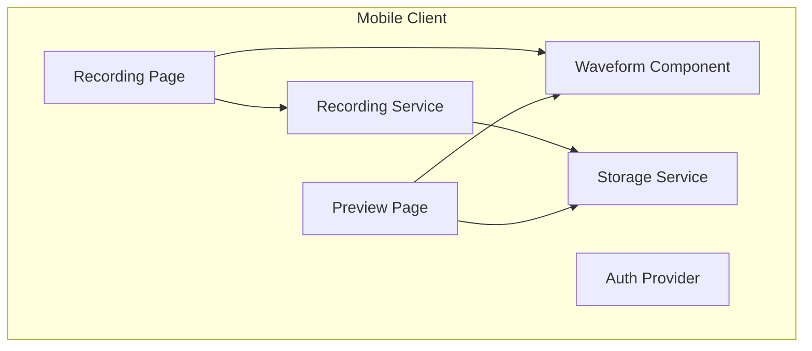
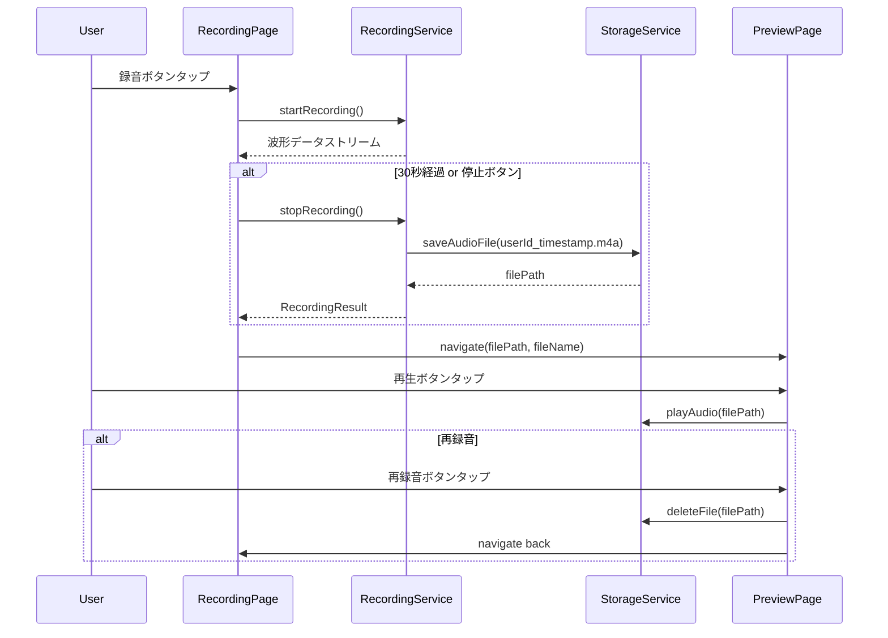

# Technical Design: voice-post

## Overview

**Purpose**: 本機能は、ユーザーが30秒以内の音声を録音し、プレビューするまでの一連のフローを提供する。

**Users**: 一般ユーザーがモバイルアプリで音声コンテンツを作成する。開発時はデモユーザー（ハードコードされたダミーID）として動作確認を行う。

**Impact**: モバイルアプリに録音・プレビュー機能を新規構築する。バックエンド・クラウド連携は将来Phase 2で実装。

**実装フェーズ**:
- **Phase 1（本スコープ）**: ローカルで完結する録音・プレビュー・ローカル保存機能
- **Phase 2（将来）**: クラウドストレージへのアップロード・DB永続化

### Goals
- 高精度な音声収音を優先した30秒録音機能の実装
- 簡易的な波形インジケーターによる視覚フィードバック
- 録音・プレビューの直感的なUXフロー
- デモユーザーIDによる開発体験

### Non-Goals
- 本番向け認証・認可システムの実装（将来課題）
- 音声編集機能（トリミング、エフェクト等）
- リアルタイムストリーミング配信
- Web版対応
- Android対応（iOS専用）
- **クラウドストレージへのアップロード（Phase 2）**
- **データベースへの永続化（Phase 2）**
- **バックエンドAPI実装（Phase 2）**

## Architecture

### Architecture Pattern & Boundary Map（Phase 1）



**Architecture Integration**:
- **Selected pattern**: Feature-first（Mobile）
- **Domain boundaries**: 録音・プレビュー機能はMobile内で完結
- **Existing patterns preserved**: 既存のRiverpod Provider構成を踏襲
- **New components rationale**: 録音・ストレージ・波形表示のための専用コンポーネントを追加
- **Steering compliance**: tech.md/structure.mdのパターンに準拠

### Technology Stack（Phase 1）

| Layer | Choice / Version | Role in Feature | Notes |
|-------|------------------|-----------------|-------|
| Mobile Recording | record ^5.0.0 | 音声録音（マイク入力→ファイル出力） | 高精度収音を優先、iOS専用 |
| Mobile Waveform | audio_waveforms ^1.0.0 | 簡易波形インジケーター表示 | 軽量実装 |
| Mobile Storage | path_provider ^2.0.0 | 一時ファイル保存パス取得 | iOS専用 |

## System Flows

### 録音→プレビューフロー（Phase 1: ローカル完結）



**Key Decisions**:
- ファイル名はMobileで生成（`{userId}_{timestamp}.m4a`形式）
- 録音完了後はローカルストレージに保存
- 再録音時は既存ファイルを削除
- Phase 2でクラウドアップロード機能を追加予定

## Requirements Traceability（Phase 1）

| Requirement | Summary | Components | Interfaces | Flows |
|-------------|---------|------------|------------|-------|
| 1.1 | 録音開始・マイクアクセス要求 | RecordingPage, RecordingService | RecordingService.start() | 録音フロー |
| 1.2 | 簡易波形インジケーター表示 | WaveformComponent | amplitudeStream | 録音フロー |
| 1.3 | 経過時間表示 | RecordingPage | durationStream | 録音フロー |
| 1.4 | 30秒自動停止 | RecordingService | maxDuration config | 録音フロー |
| 1.5 | 手動停止→プレビュー遷移 | RecordingPage | stopRecording() | 録音フロー |
| 1.6 | マイク権限拒否エラー | RecordingPage | PermissionError | エラーハンドリング |
| 1.7 | 高精度収音優先 | RecordingService | AAC encoder config | 録音フロー |
| 2.1 | 録音後の簡易波形表示 | PreviewPage, WaveformComponent | waveformData | プレビューフロー |
| 2.2 | 再生機能 | PreviewPage | playAudio() | プレビューフロー |
| 2.3 | 再生位置表示 | WaveformComponent | playbackPosition | プレビューフロー |
| 2.4 | 再録音（破棄→録音画面） | PreviewPage | discardAndRerecord() | プレビューフロー |
| 2.5 | 音声長さ表示 | PreviewPage | duration | プレビューフロー |
| 3.1 | ローカルストレージ保存 | StorageService | saveAudioFile() | 録音フロー |
| 3.2 | 容量不足エラー | StorageService | StorageError | エラーハンドリング |
| 3.3 | 一意識別子付与 | StorageService | userId_timestamp形式 | 録音フロー |
| 4.1 | 認証済み状態起動 | AuthProvider | demoUserId | アプリ起動 |
| 4.2 | 全機能アクセス可能 | - | - | - |
| 5.1 | 録音中音量インジケーター | WaveformComponent | amplitudeLevel | 録音フロー |
| 5.2 | 録音後概要波形 | WaveformComponent | waveformData | プレビューフロー |
| 5.3 | 再生位置ハイライト | WaveformComponent | playbackPosition | プレビューフロー |
| 5.4 | パフォーマンス優先軽量実装 | WaveformComponent | - | 全体 |

## Components and Interfaces（Phase 1）

### Component Summary

| Component | Domain/Layer | Intent | Req Coverage | Key Dependencies | Contracts |
|-----------|--------------|--------|--------------|------------------|-----------|
| RecordingPage | Mobile/UI | 録音画面の表示と操作 | 1.1-1.6 | RecordingService (P0) | State |
| PreviewPage | Mobile/UI | プレビュー画面の表示と操作 | 2.1-2.5 | StorageService (P0) | State |
| RecordingService | Mobile/Core | 音声録音の制御 | 1.1-1.7 | record pkg (P0) | Service |
| StorageService | Mobile/Core | ローカルファイル管理 | 3.1-3.3 | path_provider (P0) | Service |
| WaveformComponent | Mobile/UI | 波形インジケーター表示 | 5.1-5.4 | audio_waveforms (P0) | State |
| AuthProvider | Mobile/Provider | デモユーザー認証状態管理 | 4.1 | - | State |

### Mobile / Core

#### RecordingService

| Field | Detail |
|-------|--------|
| Intent | 音声録音の開始・停止・設定を管理する |
| Requirements | 1.1, 1.4, 1.5, 1.7 |

**Responsibilities & Constraints**
- マイク権限の要求と録音セッション管理
- 最大30秒の録音制限を強制
- AAC形式での高品質エンコーディング
- ファイル名生成（`{userId}_{timestamp}.m4a`形式）

**Dependencies**
- External: record ^5.0.0 — 音声録音 (P0)
- Outbound: StorageService — ファイル保存先パス取得 (P0)

**Contracts**: Service [x]

##### Service Interface
```dart
abstract class RecordingService {
  /// 録音を開始する
  /// throws PermissionDeniedException if microphone access denied
  Future<void> startRecording(String userId);

  /// 録音を停止し、ファイルパスとファイル名を返す
  Future<RecordingResult> stopRecording();

  /// 現在の録音状態を取得
  Stream<RecordingState> get stateStream;

  /// 音量レベルストリーム（波形表示用）
  Stream<double> get amplitudeStream;

  /// 経過時間ストリーム
  Stream<Duration> get durationStream;

  /// 最大録音時間
  static const Duration maxDuration = Duration(seconds: 30);
}

class RecordingResult {
  final String filePath;      // ローカルファイルパス
  final String fileName;      // ファイル名 (userId_timestamp.m4a)
  final Duration duration;
  final int fileSize;
}

enum RecordingState { idle, recording, stopped, error }

class PermissionDeniedException implements Exception {
  final String message;
  PermissionDeniedException(this.message);
}
```

**Implementation Notes**
- Integration: `record`パッケージのAudioRecorderを使用（iOS専用、AVFoundationベース）
- Validation: 録音開始前にマイク権限を確認
- ファイル名: `{userId}_{DateTime.now().millisecondsSinceEpoch}.m4a`
- Platform: iOSのみ対応（Androidは対象外）

#### StorageService

| Field | Detail |
|-------|--------|
| Intent | 録音ファイルのローカル保存・削除を管理する |
| Requirements | 3.1, 3.2, 3.3 |

**Responsibilities & Constraints**
- 一時ディレクトリへのファイル保存
- ユーザーID + タイムスタンプによるユニークなファイル名生成
- ファイル削除（再録音時）

**Dependencies**
- External: path_provider ^2.0.0 — パス取得 (P0)

**Contracts**: Service [x]

##### Service Interface
```dart
abstract class StorageService {
  /// ユニークなファイル名を生成
  String generateFileName(String userId);

  /// 一時保存用のファイルパスを生成
  Future<String> getTempFilePath(String fileName);

  /// ファイルが存在するか確認
  Future<bool> fileExists(String filePath);

  /// ファイルを削除
  Future<void> deleteFile(String filePath);

  /// ストレージ容量を確認
  Future<StorageInfo> getStorageInfo();
}

class StorageInfo {
  final int availableBytes;
  final bool hasEnoughSpace;
}

class StorageException implements Exception {
  final String message;
  final StorageErrorType type;
  StorageException(this.message, this.type);
}

enum StorageErrorType { insufficientSpace, fileNotFound, accessDenied }
```

### Mobile / Provider

#### AuthProvider

| Field | Detail |
|-------|--------|
| Intent | デモユーザーの認証状態を管理する |
| Requirements | 4.1 |

**Responsibilities & Constraints**
- 開発時はハードコードされたデモユーザーIDを提供
- 将来的な認証フロー拡張に備えた抽象化

**Contracts**: State [x]

##### State Management
```dart
@riverpod
class AuthNotifier extends _$AuthNotifier {
  // 開発用デモユーザーID（ローカルのみ）
  static const String demoUserId = 'demo-user-001';

  @override
  AuthState build() => AuthState.authenticated(userId: demoUserId);
}

@freezed
class AuthState with _$AuthState {
  const factory AuthState.unauthenticated() = AuthStateUnauthenticated;
  const factory AuthState.authenticated({required String userId}) = AuthStateAuthenticated;
}
```

### Mobile / UI

#### WaveformComponent

| Field | Detail |
|-------|--------|
| Intent | 録音中・再生中の簡易波形を表示する |
| Requirements | 5.1, 5.2, 5.3, 5.4 |

**Responsibilities & Constraints**
- 軽量な波形描画でパフォーマンスを優先
- 録音中は音量レベルに応じたインジケーター
- 再生中は再生位置をハイライト

**Dependencies**
- External: audio_waveforms ^1.0.0 — 波形生成・表示 (P0)

**Contracts**: State [x]

##### State Management
```dart
class WaveformConfig {
  final Color waveColor;
  final Color progressColor;
  final double height;
  final bool showProgress;

  const WaveformConfig({
    this.waveColor = Colors.blue,
    this.progressColor = Colors.blueAccent,
    this.height = 60.0,
    this.showProgress = true,
  });
}
```

## Error Handling（Phase 1）

### Error Strategy

| Category | Scenario | Response | Recovery |
|----------|----------|----------|----------|
| User Error | マイク権限拒否 | 設定画面への誘導 | ユーザーが設定変更後に再試行 |
| User Error | 容量不足 | エラーメッセージ表示 | 不要ファイル削除の案内 |

### Monitoring
- 録音エラー発生率のログ収集
- ファイルサイズ分布の監視

## Testing Strategy（Phase 1）

### Unit Tests
- RecordingService: 録音開始/停止、30秒制限、状態遷移、ファイル名生成
- StorageService: ファイル保存/削除、パス生成
- AuthProvider: デモユーザーID提供

### Integration Tests
- 録音→保存→プレビュー→再生の一連フロー
- 再録音（破棄→録音画面戻り）フロー

### E2E Tests
- 録音ボタンタップ→30秒録音→自動停止
- 再生→再録音の完全フロー
- エラー時のUIフィードバック確認

---

## Phase 2 Design（将来実装）

Phase 2では以下のコンポーネントを追加予定：

### 追加コンポーネント
- **UploadService**: 署名付きURLを使用してGCSにファイルをアップロード
- **WhisperProvider**: 投稿処理の状態管理（URL取得→アップロード→DB保存）
- **SignedUrlController**: 署名付きURL発行API（Backend）
- **WhisperController**: 投稿永続化API（Backend）

### 追加技術スタック
- Backend SignedURL: @google-cloud/storage
- Cloud Storage: Google Cloud Storage
- Database: Prisma + PostgreSQL

### Prisma Schema（Phase 2）
```prisma
model Whisper {
  id         String   @id @default(uuid())
  userId     String   @map("user_id")
  bucketName String   @map("bucket_name")
  fileName   String   @map("file_name")
  duration   Int      // seconds
  createdAt  DateTime @default(now()) @map("created_at")

  user       User     @relation(fields: [userId], references: [id])

  @@map("whispers")
}
```

### 環境変数（Phase 2）
```bash
# Backend .env
GCS_BUCKET_NAME=voicelet-audio-dev
GOOGLE_APPLICATION_CREDENTIALS=./service-account-key.json
```
