# infra-template-for-mid-camp

合宿用 Terraform テンプレート

## Terraform で構成する環境概要

[これ](./docs/description_infra.md) を参照

## 事前準備

- リポジトリの複製

  - このリポジトリの画面右上の[use this template]をクリック > [Create a new repository]
    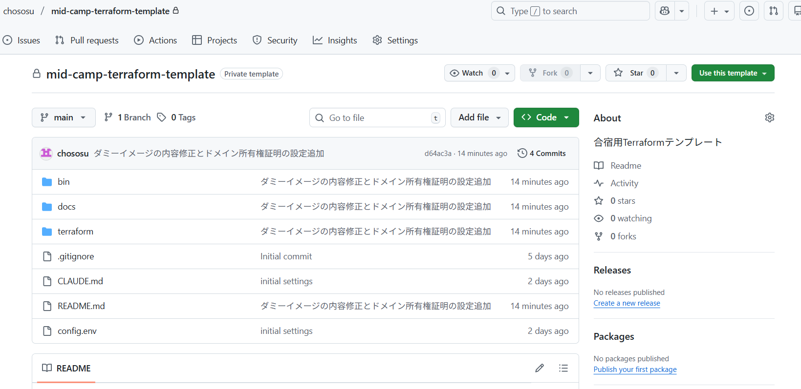
  - Repository name に任意のリポジトリ名を入力し、Create repository をクリック
    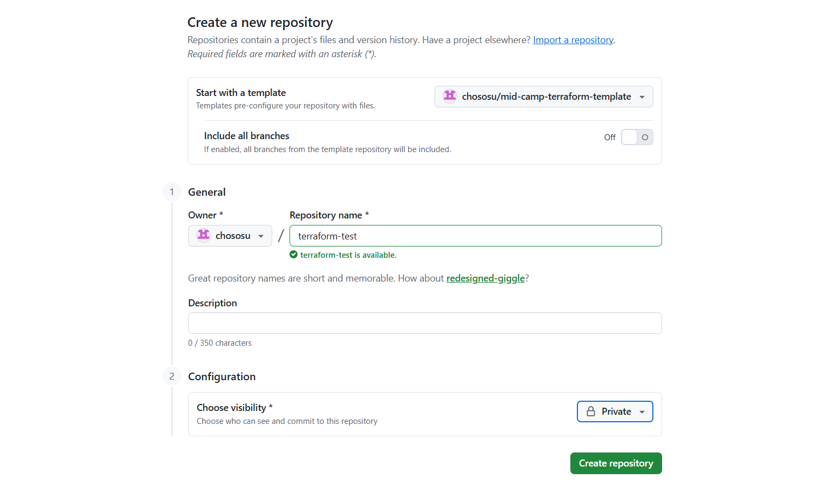
  - 作成したリポジトリをクローンし、作業を行う

- [Docker](https://www.docker.com/ja-jp/get-started/) のインストール

- [お名前.com](https://www.onamae.com/) などでのドメイン取得

- （任意）Windows の場合、[WSL のインストール](https://zenn.dev/ap_com/articles/install-wsl2-on-windows)

  - コマンド操作は WSL で行うようにすると、この README で記載しているコマンドはすべて実行できるはず
  - 参考：https://hassiweb.gitlab.io/memo/docs/memo/vs-code/vscode-wsl-terminal/

## 以下の順番でセットアップを行う

## 1. GCP の設定

### 1.1. プロジェクトの設定

- [GCP](https://cloud.google.com/) にアクセスし、画面右上のコンソールをクリック

  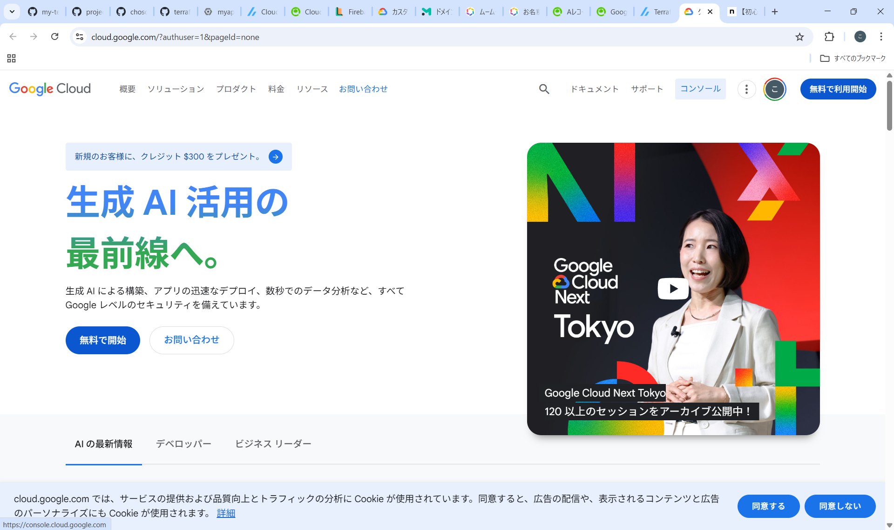

- 画面左上のプロジェクトが表示されている箇所をクリック

  

- [新しいプロジェクト]をクリック

  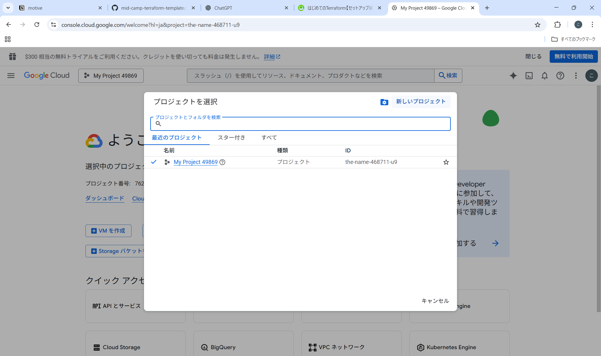

- 適当なプロジェクト名とプロジェクト ID を設定して作成
  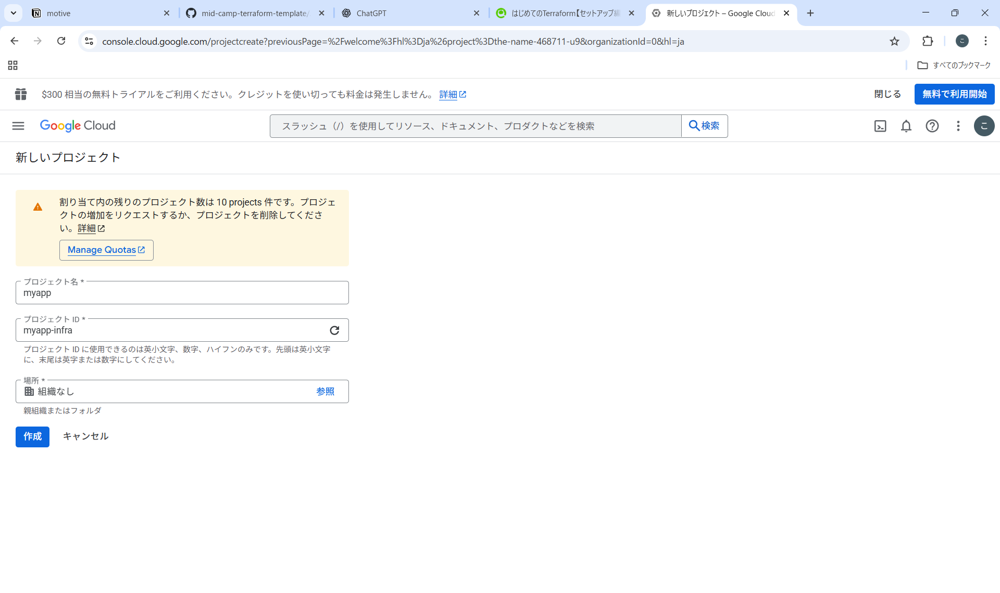

### 1.2. （登録していない人のみ）請求に関する設定

- コンソール画面の右上、[無料で利用開始]をクリック

  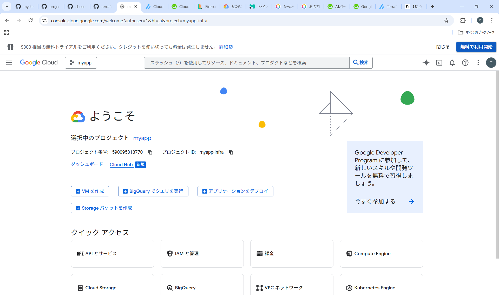

- [同意して続行]をクリック

  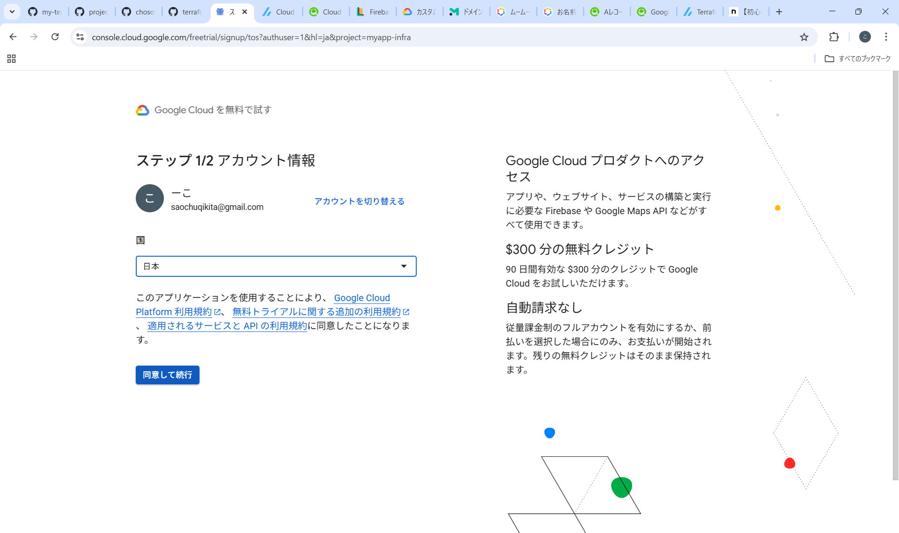

- 支払方法を登録して[無料で利用開始]をクリック

### 1.3. gcloud CLI のセットアップ

#### Mac 用

- gcloud CLI のインストール

  ```
  $ brew install --cask google-cloud-sdk
  ```

- 認証設定：以下のコマンドで自分の Google アカウントでログインする

  ```
  $ gcloud auth login
  ```

- リソースをプロビジョニングするプロジェクトを選択する：${project_id}には作成したプロジェクト ID を入力

  ```
  # 例：gcloud config set project myapp-infra
  $ gcloud config set project ${project_id}
  ```

#### Windows 用

- Windows PowerShell を右クリック → 管理者として実行

- 以下のコマンドを実行

  ```
  (New-Object Net.WebClient).DownloadFile("https://dl.google.com/dl/cloudsdk/channels/rapid/GoogleCloudSDKInstaller.exe", "$env:Temp\GoogleCloudSDKInstaller.exe")
  & $env:Temp\GoogleCloudSDKInstaller.exe
  ```

- インストールウィザードが起動したら以下のようにインストールを進める

  - [Next >]をクリック
  - [I Agree] をクリック
  - All user を選択し、 [Next >] をクリック
  - インストール先ディレクトリを選択し [Next >] をクリック
  - [Install] をクリック
  - インストールが完了したら [Finish] をクリック

- gcloud CLI が起動された状態になるので、「Y」を入力し、自分の Google アカウントでログインする

- ログイン後、gcloud CLI に戻るとプロジェクトを選択できるので、作成したプロジェクトを選択する
  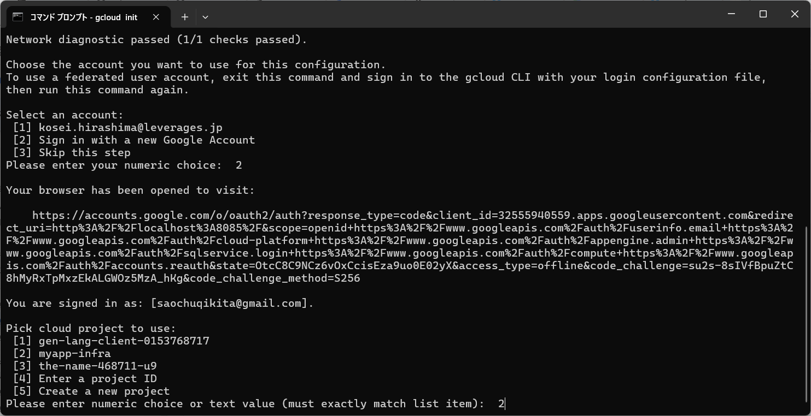

### 共通

- 一括リネーム：プロジェクトのルートディレクトリにて、以下のコマンドを実行

  - config.env に以下の値を設定する

    - PROJECT_ID：指定した GCP のプロジェクト ID（例："myapp-infra"）
    - DOMAIN_NAME：取得したドメイン（例："example.com"）
    - SERVICE_NAME：任意のサービス名（ケバブケース）（例："my-service"）

  - プロジェクトのルートディレクトリにて、以下のコマンドを実行

    ```
    $ chmod +x bin/replace-placeholders.sh
    $ bash ./bin/replace-placeholders.sh
    ```

- API の有効化：プロジェクトのルートディレクトリにて、以下のコマンドを実行

  ```
  $ chmod +x bin/enable-api.sh
  $ bash ./bin/enable-api.sh
  ```

- Artifact Registry の認証：以下のコマンドを実行

  ```
  # ログインできていない場合は、 gcloud auth login を実行
  $ gcloud auth configure-docker asia-northeast1-docker.pkg.dev
  $ gcloud auth print-access-token | docker login -u oauth2accesstoken --password-stdin https://asia-northeast1-docker.pkg.dev
  ```

## 2. Terraform の設定

ここでは Terraform バージョン 1.14.3 のインストール手順を説明している

### Mac 用

- tfenv のインストール

  ```
  # インストール用コマンド
  $ brew install tfenv
  # 確認用コマンド
  $ tfenv -v
  ```

- 特定のバージョンの Terraform コマンドをインストール

  ```
  # Terraformコマンドのインストール
  $ tfenv install 1.14.3
  # インストールしたTerraformコマンドを使用
  $ tfenv use 1.14.3
  # バージョンの適用を確認
  $ terraform version
  ```

### Windows 用

- [公式サイト](https://developer.hashicorp.com/terraform/install#windows) から zip ファイルをダウンロード（バージョンは 1.14.3）

- ダウンロードした zip ファイルを解凍

- terraform.exe を C:\terraform に移動

- 環境変数を設定

  - コントロールパネルを開き、システムとセキュリティ → システム → システムの詳細設定 → 環境変数
  - システム環境変数の Path を選択して「編集」をクリック
  - 「環境変数名の編集」画面で「新規」をクリック
  - terraform.exe があるパス（C:\terraform）を追加
  - OK をクリックして、設定を保存

- 以下のコマンドを実行して Terraform が正しくインストールされていることを確認

  ```
  $ terraform --version
  ```

  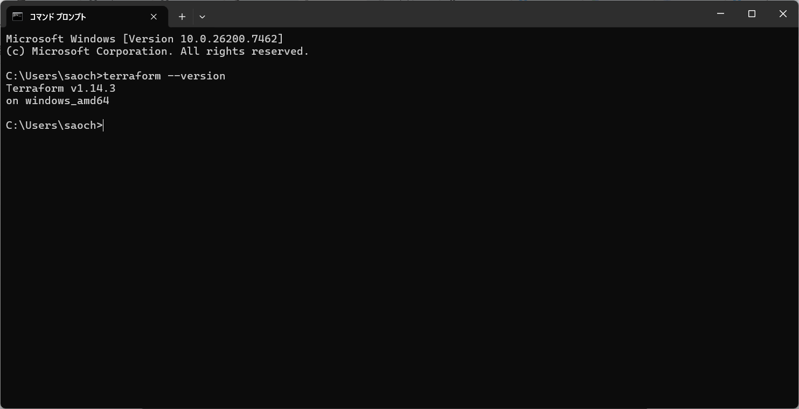

## 3. Terraform プロジェクトのセットアップおよびプロビジョニング

### 3.1. Artifact Registry

- 以下の手順で Artifact Registry のセットアップを行う

  - terraform ディレクトリに移動する

    ```
    $ cd ./terraform
    ```

  - terraform init の実行

    ```
    $ terraform init
    ```

  - Artifact Registry にリポジトリを作成

    ```
    $ terraform apply -target=module.artifact-registry
    ```

    - Enter a value を求められるので、「yes」を入力

- ダミーイメージの push

  - Docker Desktop を起動する

  - app-frontend イメージの build/push：以下のコマンドを実行

    ```
    $ docker build -t asia-northeast1-docker.pkg.dev/<project_id>/<service_name>-app-repository-docker/app-frontend ./docker/app-frontend
    $ docker push asia-northeast1-docker.pkg.dev/<project_id>/<service_name>-app-repository-docker/app-frontend
    ```

  - app-backend イメージの build/push：以下のコマンドを実行

    ```
    $ docker build -t asia-northeast1-docker.pkg.dev/<project_id>/<service_name>-app-repository-docker/app-backend ./docker/app-backend
    $ docker push asia-northeast1-docker.pkg.dev/<project_id>/<service_name>-app-repository-docker/app-backend
    ```

  - nginx イメージの build/push：以下のコマンドを実行

    ```
    $ docker build -t asia-northeast1-docker.pkg.dev/<project_id>/<service_name>-app-repository-docker/nginx-proxy ./docker/nginx
    $ docker push asia-northeast1-docker.pkg.dev/<project_id>/<service_name>-app-repository-docker/nginx-proxy
    ```

- 補足：
  - コンテナ から他のコンテナへの通信は http://127.0.0.1:ポート番号 で行われる
  - Nginx は Cloud Run の受け口（port: 8080）で待ち、サイドカーコンテナ（フロントエンド／バックエンド）へプロキシする
- 参考：
  - https://zenn.dev/taiyou/articles/d07983a189a6cc
  - https://zenn.dev/jj/articles/cloudrun-v2-with-nginx

### 3.2. Secret Manager の設定（必須）

Cloud Run デプロイ前に、以下のシークレットに値を設定する必要があります。

#### 3.2.1. Supabase プロジェクトの準備

1. [Supabase](https://supabase.com/) でプロジェクトを作成
2. Project Settings > API から以下の値を取得：
   - **Project URL** → `SUPABASE_URL` 用
   - **service_role key** → `SUPABASE_SERVICE_KEY` 用

#### 3.2.2. JWT シークレットの生成

以下のコマンドで安全なランダム文字列を生成：

```bash
openssl rand -base64 32
```

#### 3.2.3. Secret Manager に値を設定

terraform apply で secrets モジュールを適用後、以下のコマンドでシークレットの値を設定：

```bash
# Supabase URL
echo -n "https://xxxxx.supabase.co" | \
  gcloud secrets versions add <service_name>-supabase-url --data-file=-

# Supabase Service Key
echo -n "eyJhbGciOiJIUzI1NiIs..." | \
  gcloud secrets versions add <service_name>-supabase-service-key --data-file=-

# JWT Secret
echo -n "your-generated-jwt-secret" | \
  gcloud secrets versions add <service_name>-jwt-secret --data-file=-
```

**注意**: `<service_name>` は `config.env` で設定した `SERVICE_NAME` に置き換えてください。

#### 3.2.4. 設定確認

```bash
# シークレット一覧を確認
gcloud secrets list

# バージョンが作成されていることを確認
gcloud secrets versions list <service_name>-supabase-url
gcloud secrets versions list <service_name>-supabase-service-key
gcloud secrets versions list <service_name>-jwt-secret
```

### 3.3. Cloud Run および Cloud DNS

- terraform ディレクトリにて terraform apply を実行

  ```
  $ terraform plan
  $ terraform apply
  ```

  - Enter a value を求められるので、「yes」を入力

- 取得したドメインを Cloud DNS で管理できるようにする

  - terraform apply 実行後、Cloud DNS の NS レコード（4 つの FQDN ）が コンソールに出力されていることを確認する

    例）

    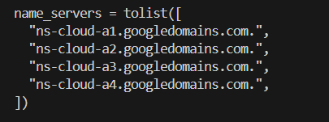

  - [お名前.com](https://www.onamae.com/)に移動する

    [この記事](https://dev.classmethod.jp/articles/20241028-clouddns-con/#%25E3%2581%258A%25E5%2590%258D%25E5%2589%258D.com%25E3%2581%25A7%25E3%2583%258D%25E3%2583%25BC%25E3%2583%25A0%25E3%2582%25B5%25E3%2583%25BC%25E3%2583%2590%25E6%2583%2585%25E5%25A0%25B1%25E3%2582%2592Cloud%2520DNS%25E3%2581%25AE%25E6%2583%2585%25E5%25A0%25B1%25E3%2581%25AB%25E6%259B%25B8%25E3%2581%258D%25E6%258F%259B%25E3%2581%2588%25E3%2582%258B)を参考に以下の設定を行う

    - ネームサーバー設定 > ネームサーバーの変更をクリック
    - その他のサービス > その他のネームサーバを使うをクリック
    - ネームサーバー 1 ～ 4 にコピーした Cloud DNS の NS レコードを設定する
    - 確認を押下
    - OK を押下

  - NS レコードが反映されたことを以下のコマンドで確認する（数分で終わるはずだが反映までに数日掛かる可能性もある、、）

    ```
    $ dig <domain_name> NS
    ```

    - 以下のように表示されたら反映完了

      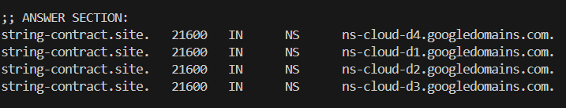

- NS レコードが反映された後、プロジェクトのルートディレクトリにて、以下のコマンドを実行する

  ```
  $ chmod +x bin/enable-all-terraform.sh
  $ bash ./bin/enable-all-terraform.sh
  ```

- ドメインの所有権を証明するための設定を行う

  - 以下の URL にアクセス

    https://www.google.com/webmasters/verification/verification?domain=<domain_name>

  - 以下の画面が表示されるので、取得したドメイン（<domain_name>）を入力して続行をクリック
    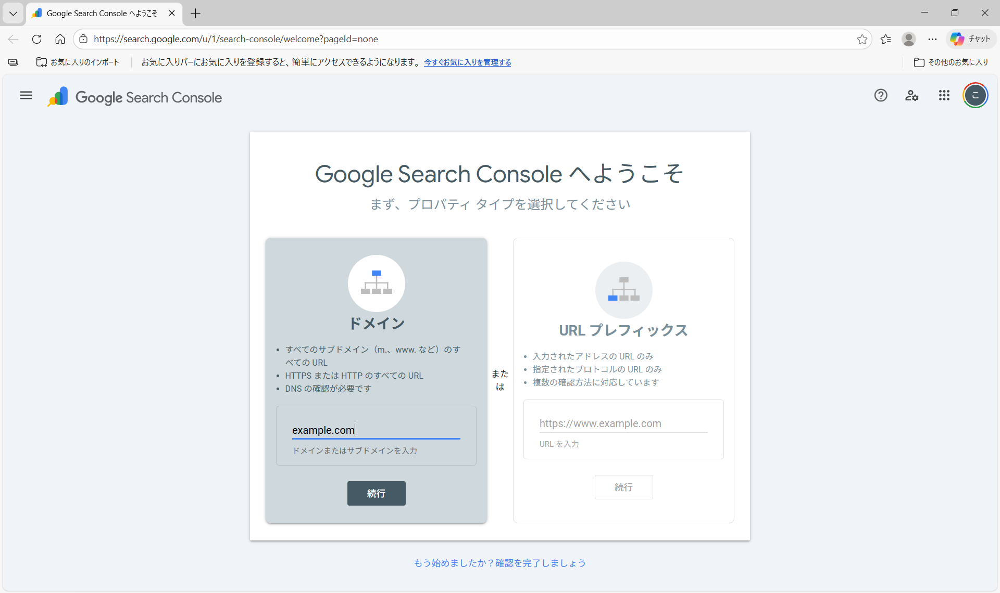

  - TXT レコードが表示される（**この画面はそのまま閉じない**）
    

  - 表示された TXT レコードをコピーし、以下のように貼り付ける（terraform/locals.tf）

    ```
    locals {
      project      = "<project_id>"
      domain_name  = "<domain_name>"
      service_name = "<service_name>" # 任意のサービス名
      location     = "asia-northeast1"
      certification_txt = "google-site-verification=xxx..." <-- ここに貼り付ける
    }
    ```

- terraform ディレクトリにて terraform apply を実行する

  ```
  $ terraform plan
  $ terraform apply
  ```

  - Enter a value を求められるので、「yes」を入力

- エラーが出た場合は、まだドメインの所有権を確認できていないので、以下の画面で[確認]をクリックし、確認が完了できた後に再度 terraform apply を実行する
  

- [コンソール](https://console.cloud.google.com/run/domains) に移動し、ドメインマッピングが完了するまで待つ

  （処理中）
  
  （完了）
  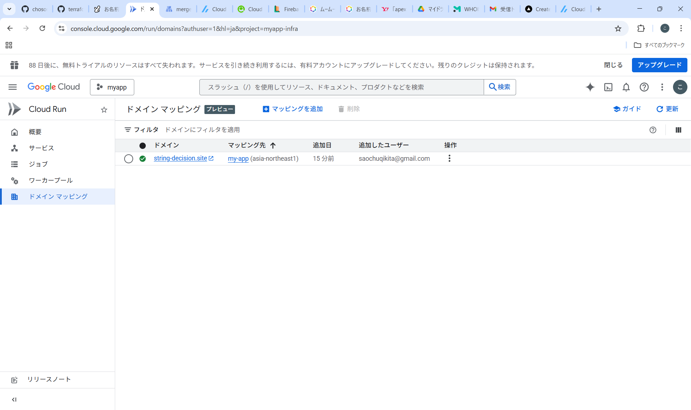

- ドメインマッピングが完了した後、実際に URL にアクセスして確認を行う

### 4. アプリのデプロイ

アプリのデプロイは以下の手順で行う

#### 4.1. イメージの build/push

- フロントエンドのイメージ build/push
  ```
  # フロントエンドのDockerfileがあるディレクトリにて
  $ docker build -t asia-northeast1-docker.pkg.dev/<project_id>/<service_name>-app-repository-docker/app-frontend .
  $ docker push asia-northeast1-docker.pkg.dev/<project_id>/<service_name>-app-repository-docker/app-frontend
  ```
- バックエンドのイメージ build/push
  ```
  # バックエンドのDockerfileがあるディレクトリにて
  $ docker build -t asia-northeast1-docker.pkg.dev/<project_id>/<service_name>-app-repository-docker/app-backend .
  $ docker push asia-northeast1-docker.pkg.dev/<project_id>/<service_name>-app-repository-docker/app-backend
  ```
- Nginx のイメージ build/push
  ```
  # nginxのDockerfileがあるディレクトリにて
  $ docker build -t asia-northeast1-docker.pkg.dev/<project_id>/<service_name>-app-repository-docker/nginx-proxy .
  $ docker push asia-northeast1-docker.pkg.dev/<project_id>/<service_name>-app-repository-docker/nginx-proxy
  ```

#### 4.2. Cloud Run サービスで新しいリビジョンをデプロイ

- [コンソール](https://console.cloud.google.com/run/services)から 今回作成した Cloud Run サービスの名前をクリック

  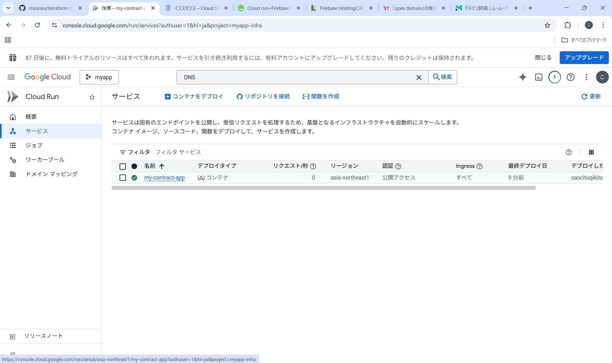

- [新しいリビジョンの編集とデプロイ] をクリック

  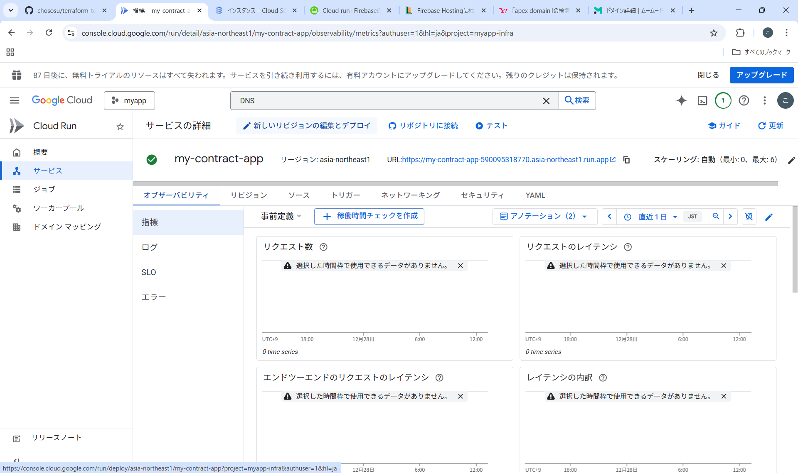

- [デプロイ] をクリック

  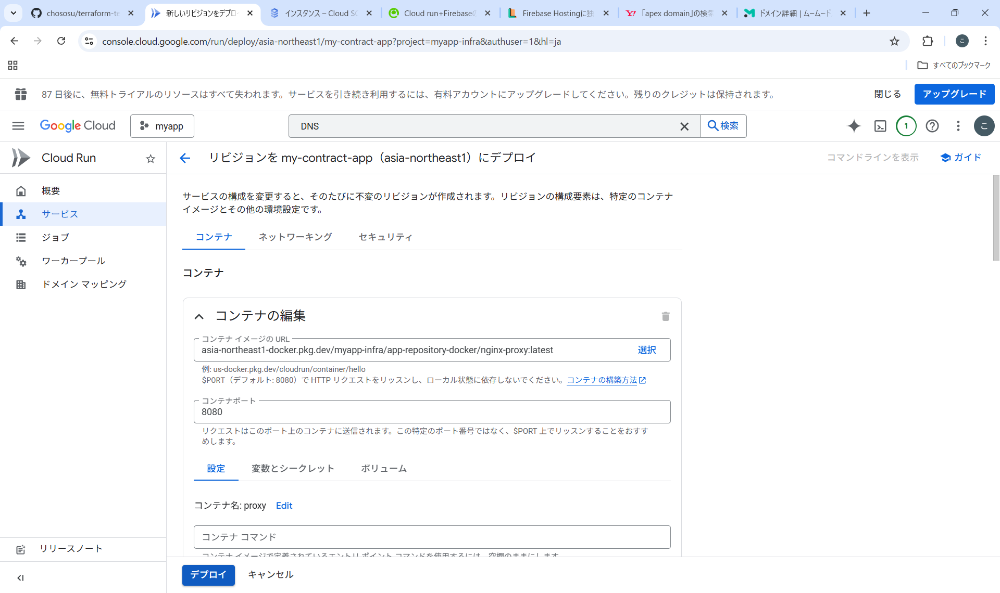

### 5. 環境変数一覧

Cloud Run に設定される環境変数の一覧：

| 環境変数 | 設定方法 | 説明 |
|---------|---------|------|
| `PORT` | 自動（固定値） | アプリケーションのリッスンポート |
| `GCS_BUCKET_NAME` | 自動（Terraform） | 音声ファイル保存用GCSバケット名 |
| `SUPABASE_URL` | 手動（Secret Manager） | Supabase プロジェクトURL |
| `SUPABASE_SERVICE_KEY` | 手動（Secret Manager） | Supabase サービスロールキー |
| `JWT_SECRET` | 手動（Secret Manager） | JWT署名用シークレット |

### 6. Cloud Scheduler（定期実行ジョブ）

Terraform で以下の定期実行ジョブが作成されます：

| ジョブ名 | スケジュール | エンドポイント | 説明 |
|---------|------------|---------------|------|
| `<service_name>-delete-expired-posts` | 毎時0分 | `POST /jobs/cleanup` | 期限切れ投稿の削除 |

**注意**: Cloud Run の `/jobs/cleanup` エンドポイントを実装する必要があります。

### 7. 備考

#### 7.1. 請求額の確認

- [このリンク](https://console.cloud.google.com/billing) から請求先アカウント一覧に飛ぶ
- 該当の請求先アカウントのアカウント名 をクリックすると詳細を確認できる

#### 7.2. インフラリソースが不要になった場合

- 以下のコマンドを実行する

  ```
  $ cd ./terraform
  $ terraform destroy
  ```

※ （今後ドメインを使う予定がある場合）ドメインは GCP で管理するように設定しているため、以下の手順で切り替えを行う

- 新しい DNS 先にゾーンを作成し、レコードをすべてコピーする
- Cloud DNS 側で、ネームサーバーの設定を新しい先に書き換える
- DNS の浸透を待つ
- 完全に切り替わったことを確認してから、terraform destroy を実行する
