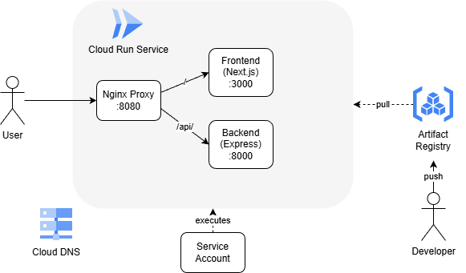

### 環境概要

- Cloud Run v2 サービスを使用したマルチコンテナ構成
  - **Nginx Proxy** (:8080) - エントリポイント、リクエストをルーティング
    - `/` → Frontend
    - `/api/` → Backend
  - **Frontend** (:3000) - Next.js アプリケーション（ダミーイメージ）
  - **Backend** (:8000) - Express API サーバー
- Cloud Run は Artifact Registry からイメージを pull して利用する
- 権限を限定したサービスアカウントで Cloud Run を実行する
- ドメインマッピングには[Cloud Run のカスタムドメインマッピング](https://cloud.google.com/run/docs/mapping-custom-domains?hl=ja)を使用
  - [Firebase hosting を使用する方法](https://qiita.com/StrayDog/items/db38597a782f0b2ca6fa)もあったが、管理が分散するので上記を選択
  - Cloud Run のカスタムドメインマッピングはプレビュー版のため、本来であればグローバル外部アプリケーション ロードバランサを使うのが理想
- Cloud DNS によってドメインを GCP 上 で管理する

### GCP リソース コスト概算（月額）

---

料金概算

環境構成サマリー

| サービス          | 構成                                                 |
| ----------------- | ---------------------------------------------------- |
| Cloud Run         | 3 コンテナ（nginx, frontend, backend）各 1vCPU/512Mi |
| Artifact Registry | Docker リポジトリ 1 つ（asia-northeast1）            |
| Cloud DNS         | マネージドゾーン 1 つ                                |

---

1. Cloud Run

課金モード: リクエストベース（cpu_idle = true, min_instance_count = 0）

| 項目   | 単価                | 無料枠             |
| ------ | ------------------- | ------------------ |
| CPU    | $0.00002400/vCPU-秒 | 180,000 vCPU-秒/月 |
| メモリ | $0.00000250/GiB-秒  | 360,000 GiB-秒/月  |

月間アクセス数別の概算:

| アクセス規模 | 想定リクエスト数 | 月額概算       |
| ------------ | ---------------- | -------------- |
| 個人/開発用  | ~30,000 件/月    | $0（無料枠内） |
| 小規模       | ~100,000 件/月   | $0〜5          |
| 中規模       | ~500,000 件/月   | $10〜30        |

---

2. Artifact Registry

| 項目             | 単価               | 概算                                   |
| ---------------- | ------------------ | -------------------------------------- |
| ストレージ       | $0.10/GiB/月       | Docker イメージ 3 つ（約 1.5GiB 想定） |
| 下りネットワーク | 同一リージョン無料 | $0                                     |

月額概算: 約$0.10〜0.15

※クリーンアップポリシー設定済み（7 日以上古いものを自動削除）のため、ストレージ肥大化を抑制

---

3. Cloud DNS

| 項目             | 単価               |
| ---------------- | ------------------ |
| マネージドゾーン | $0.20/月/ゾーン    |
| クエリ           | $0.40/100 万クエリ |

月額概算: 約$0.20〜0.30

---

月額料金まとめ

| 利用規模    | Cloud Run | Artifact Registry | Cloud DNS | 合計       |
| ----------- | --------- | ----------------- | --------- | ---------- |
| 開発/検証用 | $0        | $0.15             | $0.25     | 約$0.40/月 |
| 小規模運用  | $0〜5     | $0.15             | $0.25     | 約$5/月    |
| 中規模運用  | $10〜30   | $0.15             | $0.30     | 約$30/月   |

---

ポイント

1. min_instance_count = 0 かつ cpu_idle = true の設定により、アクセスがない時は課金されない
2. 無料枠が適用されるため、小規模なら月額$1 未満も可能（無料枠は毎月リセットされる）
3. データ転送料（$0.12/GiB、アジア間）は別途発生する可能性あり
4. コールドスタート（起動遅延）は発生するため、レスポンス重視なら min_instance_count = 1 も検討（その場合は月額+$7〜10 程度）
5. 実際のコストはトラフィック量に大きく依存
